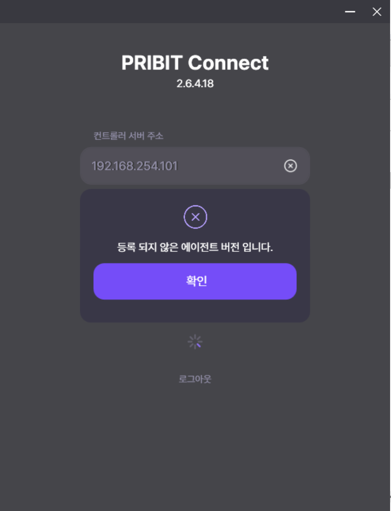
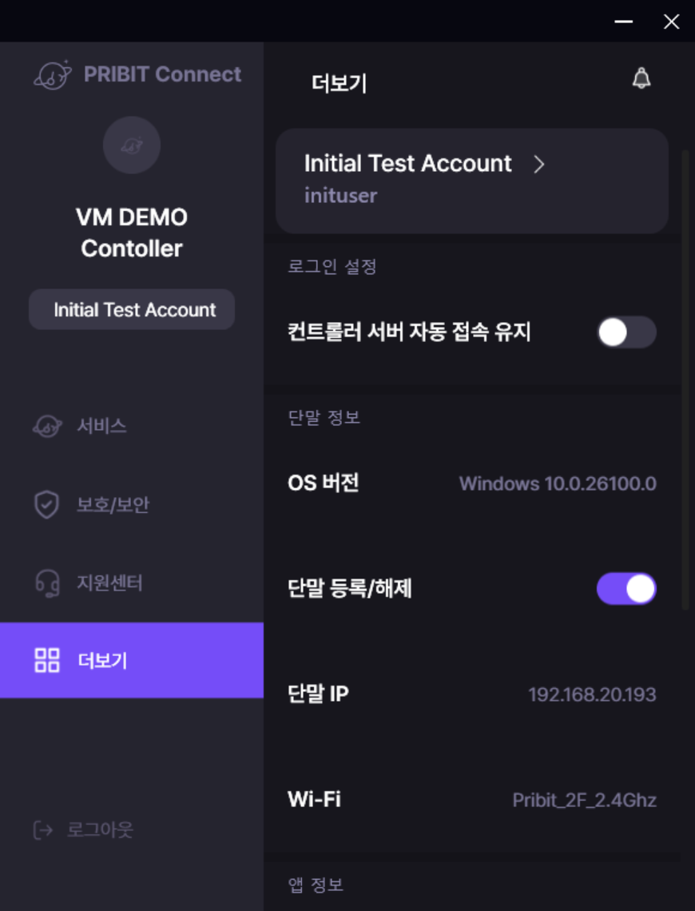
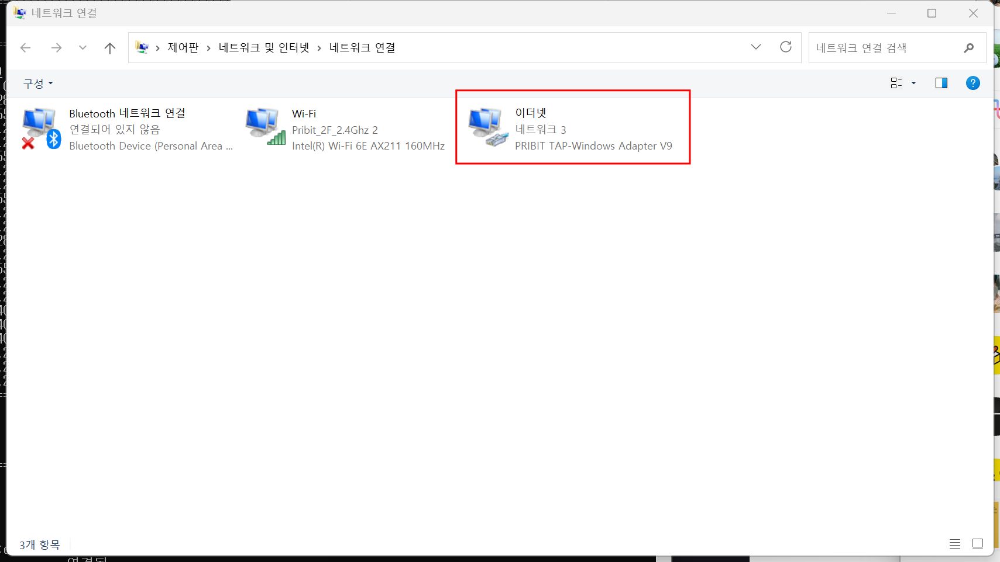

# PRIBIT Connect Agent를 통한 PCC 및 PCG 접속 안내

아래 단계에 따라 PRIBIT Connect Agent로 PCC에 로그인하고 PCG에 접속할 수 있습니다.

## 1. **PRIBIT Connect Agent 실행**
- 설치된 PRIBIT Connect Agent 프로그램을 실행합니다.

<br>

## 2. **PCC 로그인 정보 입력**  
PCC 사용자 ID와 비밀번호를 입력하여 로그인합니다. 
  
  - 컨트롤러 서버 주소 : PCC Server 주소를 입력합니다.   
  - 입력된 주소로 TLS(TCP 443 Port)통신을 통해 컨트롤러와 인증처리를 수행합니다.  
  - ex) 10.0.30.156  
  - 컨트롤러 아이디 : PCC 에 설정한 컨트롤러 ID를 입력합니다.  
  - 컨트롤러 아이디를 확인하려면 [Controller_InitalSetup>2. 컨트롤러 등록](/Documents/Connect%20Controller/Controller_InitialSetup.md)을 참고하세요.  
  - ex) vm demo   

<br> 

>[!NOTE] 
> "등록되지 않은 에이전트 버전입니다." 라는 문구 발생 시 아래와 같이 컨트롤러에서 에이전트를 추가해야 합니다. 



<br>

접속할 사용자 아이디와 비밀번호를 입력합니다.  
  
  - 사용자 아이디 : PCC 에 등록된 사용자 아이디를 입력합니다.  
  - ex) inituser  
  - 사용자 비밀번호 : 로그인 할 사용자의 비밀번호를 입력합니다.  
  - ex) *******  

로그인이 정상적으로 완료되면 다음과 같은 화면으로 이동합니다.  
  

<br>

## 3. **PCA 에 할당된 주소 확인**
- 접속 완료 후 할당 받은 주소를 확인합니다.  
  
  - **"더보기"**에서 단말 IP 를 확인합니다.  
  - Agent는 PCG에 설정된 VIP 대역 중 하나의 IP를 할당 받을 수 있습니다.  

<br>

## 4. **Local Network 확인**  
- 사용자 PC 의 네트워크 연결을 확인합니다. 
```
(Windows + R)
ncpa.cpl 
(Enter)
```

**이더넷 네트워크 3 PRIBIT TAP-Windows Adapter V9**이 정상적으로 연결되어 있는지 확인합니다. 

- 사용자 PC 의 Routing Table 을 확인합니다. 
```
C:\> route print 
===========================================================================
인터페이스 목록
  6...00 ff 16 dc 8f c4 ......PRIBIT TAP-Windows Adapter V9
 13...e8 62 be 30 d3 1b ......Microsoft Wi-Fi Direct Virtual Adapter #3
 14...ea 62 be 30 d3 1a ......Microsoft Wi-Fi Direct Virtual Adapter #4
  4...e8 62 be 30 d3 1a ......Intel(R) Wi-Fi 6E AX211 160MHz
  9...e8 62 be 30 d3 1e ......Bluetooth Device (Personal Area Network)
  1...........................Software Loopback Interface 1
===========================================================================

IPv4 경로 테이블
===========================================================================
활성 경로:
네트워크 대상          네트워크 마스크         게이트웨이         인터페이스    메트릭
          0.0.0.0          0.0.0.0     192.168.20.1   192.168.20.193     45
          0.0.0.0        128.0.0.0        172.0.0.1        10.21.0.2      1
        10.0.30.0    255.255.255.0        10.21.0.1        10.21.0.2      1
      10.0.30.156  255.255.255.255     192.168.20.1   192.168.20.193     46
      10.0.30.157  255.255.255.255     192.168.20.1   192.168.20.193     46
        10.21.0.0    255.255.255.0             연결됨         10.21.0.2    257
        10.21.0.2  255.255.255.255             연결됨         10.21.0.2    257
      10.21.0.255  255.255.255.255             연결됨         10.21.0.2    257
        127.0.0.0        255.0.0.0             연결됨         127.0.0.1    331
        127.0.0.1  255.255.255.255             연결됨         127.0.0.1    331
  127.255.255.255  255.255.255.255             연결됨         127.0.0.1    331
        128.0.0.0        128.0.0.0        172.0.0.1        10.21.0.2      1
  175.123.184.132  255.255.255.255     192.168.20.1   192.168.20.193     46
     192.168.20.0    255.255.255.0             연결됨    192.168.20.193    301
   192.168.20.193  255.255.255.255             연결됨    192.168.20.193    301
   192.168.20.255  255.255.255.255             연결됨    192.168.20.193    301
        224.0.0.0        240.0.0.0             연결됨         127.0.0.1    331
        224.0.0.0        240.0.0.0             연결됨         10.21.0.2    257
        224.0.0.0        240.0.0.0             연결됨    192.168.20.193    301
  255.255.255.255  255.255.255.255             연결됨         127.0.0.1    331
  255.255.255.255  255.255.255.255             연결됨         10.21.0.2    257
  255.255.255.255  255.255.255.255             연결됨    192.168.20.193    301
===========================================================================
영구 경로:
  없음

IPv6 경로 테이블
===========================================================================
활성 경로:
 IF  메트릭 네트워크 대상                   게이트웨이
  1    331 ::1/128                        연결됨
  6    291 fe80::/64                      연결됨
  4    301 fe80::/64                      연결됨
  6    291 fe80::cfea:c59d:dacc:433a/128  연결됨
  4    301 fe80::efa8:4975:7096:5b53/128  연결됨
  1    331 ff00::/8                       연결됨
  6    291 ff00::/8                       연결됨
  4    301 ff00::/8                       연결됨
===========================================================================
영구 경로:
  없음
```

<br>

## 5. **정책 확인**
- PCC에 설정된 단말의 접속 정책이 정상적으로 작동하는지 확인합니다.  
- 내부망 접속을 우선 확인합니다.  

```
C:\>tracert 10.0.30.156

최대 30홉 이상의 10.0.30.156(으)로 가는 경로 추적

  1     3 ms     1 ms     1 ms  192.168.20.1
  2     5 ms     2 ms     5 ms  10.0.30.156

추적을 완료했습니다.
```

내부 업무 서비스에 접속하여 접속 정책을 확인합니다. 

<br>

*** 

<br>

> 접속 과정에서 문제가 발생할 경우 관리자에게 문의하세요.
