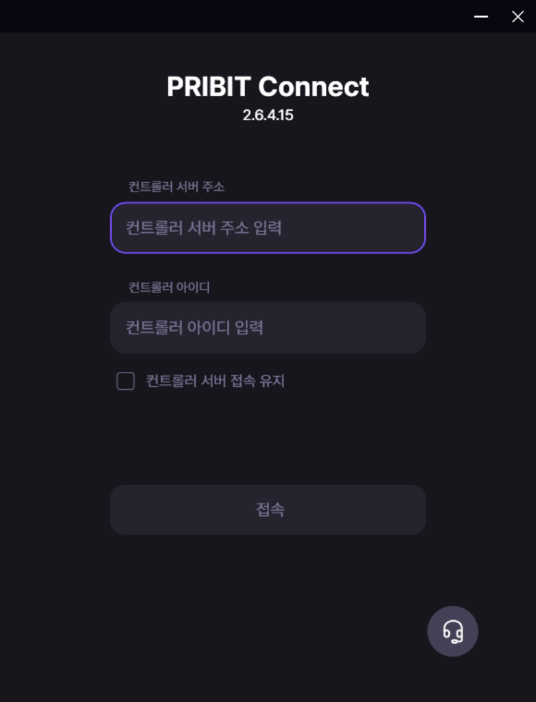
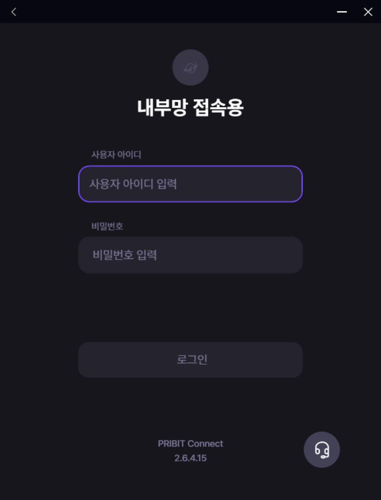
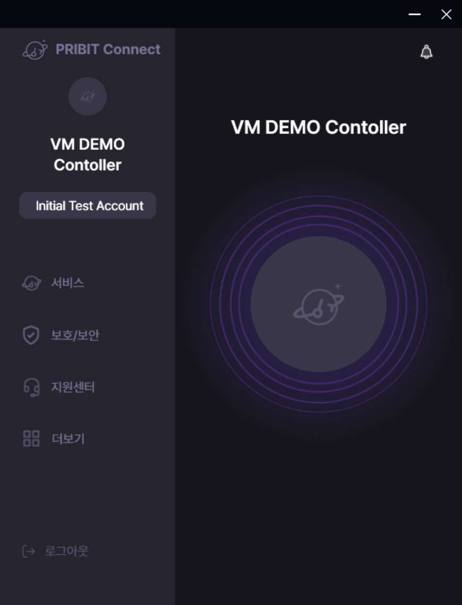

# PRIBIT Connect Agent를 통한 PCC 및 PCG 접속 안내

아래 단계에 따라 PRIBIT Connect Agent로 PCC에 로그인하고 PCG에 접속할 수 있습니다.

## 1. **PRIBIT Connect Agent 실행**
- 설치된 PRIBIT Connect Agent 프로그램을 실행합니다.

<br>

## 2. **PCC 로그인 정보 입력**  
PCC 사용자 ID와 비밀번호를 입력하여 로그인합니다. 
  
  - 컨트롤러 서버 주소 : PCC Server 주소를 입력합니다.   
  - 입력된 주소로 TLS(TCP 443 Port)통신을 통해 컨트롤러와 인증처리를 수행합니다.  
  - ex) 10.0.30.156  
  - 컨트롤러 아이디 : PCC 에 설정한 컨트롤러 ID를 입력합니다.  
  - 컨트롤러 아이디를 확인하려면 [Controller_InitalSetup>2. 컨트롤러 등록](/Documents/Connect%20Controller/Controller_InitialSetup.md)을 참고하세요.  
  - ex) vm demo   

접속할 사용자 아이디와 비밀번호를 입력합니다.  
  
  - 사용자 아이디 : PCC 에 등록된 사용자 아이디를 입력합니다.  
  - ex) inituser  
  - 사용자 비밀번호 : 로그인 할 사용자의 비밀번호를 입력합니다.  
  - ex) *******  

로그인이 정상적으로 완료되면 다음과 같은 화면으로 이동합니다.  
  

<br>

## 3. **PCA 에 할당된 주소 확인**
- 접속 완료 후 할당 받은 주소를 확인합니다.  
  
  - **"더보기"**에서 단말 IP 를 확인합니다.  
  - Agent는 PCG에 설정된 VIP 대역 중 하나의 IP를 할당 받을 수 있습니다.  

<br>

## 4. **Routing Table 확인**  
  - 사용자 PC 에 할당 받은 라우팅 테이블을 확인합니다.  

<br>

## 5. **정책 확인**
  - PCC에 설정된 단말의 접속 정책이 정상적으로 작동하는지 확인합니다.  
  - 내부망 접속을 우선 확인합니다.  

<br>


## 6. FAQ 

#### Agent 에서 VIP 를 할당 받지 못하는 경우 

```
1. 사용자가 어플리케이션 플로우 정책에 포함되어 있는지 확인
2. 
```


*** 

<br>

> 접속 과정에서 문제가 발생할 경우 관리자에게 문의하세요.
