<!-- TOC start (generated with https://github.com/derlin/bitdowntoc) -->

**TOC (Table Of Contents)**

- [**1. 관리자 페이지 접속**](#1-관리자-페이지-접속)
- [**2. 관리자 계정 생성**](#2-관리자-계정-생성)
- [**3. 컨트롤러 등록**](#3-컨트롤러-등록)
- [**4. 사용 메뉴 설정 및 시스템 환경 설정**](#4-사용-메뉴-설정-및-시스템-환경-설정)
    - [SYSTEM \> 컨트롤러 관리 \> 메뉴 권한](#system--컨트롤러-관리--메뉴-권한)
    - [SYSTEM \> 시스템 환경 설정 \> 콘솔 정보 \> 관리자 웹콘솔 세션 타임 아웃(분)](#system--시스템-환경-설정--콘솔-정보--관리자-웹콘솔-세션-타임-아웃분)
- [**5. 최초 사용자 생성**](#5-최초-사용자-생성)
    - [사용자 생성](#사용자-생성)
    - [OBJECT \> 사용자](#object--사용자)
    - [사용자 그룹 생성](#사용자-그룹-생성)
    - [OBJECT \> 사용자 그룹](#object--사용자-그룹)
- [**6. FLOW 설정**](#6-flow-설정)
  - [네트워크 경계 설정](#네트워크-경계-설정)
    - [FLOW \> 네트워크 경계](#flow--네트워크-경계)
    - [네트워크 경계 장치 등록 (게이트웨이 등록)](#네트워크-경계-장치-등록-게이트웨이-등록)
  - [플로우 제어 영역 설정](#플로우-제어-영역-설정)
    - [FLOW \> 플로우 제어 영역](#flow--플로우-제어-영역)
  - [애플리케이션 플로우 설정](#애플리케이션-플로우-설정)
- [**7. 초기 설정에 따른 시스템 구성도(참고)**](#7-초기-설정에-따른-시스템-구성도참고)


<!-- TOC end -->

<br>  

Controller 설치와 라이선스 적용을 모두 완료하셨다면, 초기 설정을 진행해야 합니다.  
*(설치가 완료되지 않았다면 [Controller_Installation](/Documents/Connect%20Controller/Controller_Installation.md) 페이지를 참고하세요.*  
Controller의 기본적인 운영을 위해 필요한 초기 설정 과정입니다.  
아래 안내에 따라 순서대로 진행해 주세요.

<br>

## **1. 관리자 페이지 접속**

컨트롤러 설치 완료 후 관리자 PC에서 Controller Console 에 접속합니다. 

Web Browser
```
http://[설치한 Controller IP 주소]:5996 
```

<br><br>

## **2. 관리자 계정 생성**

최초 로그인 시 사용할 관리자 계정을 생성합니다.

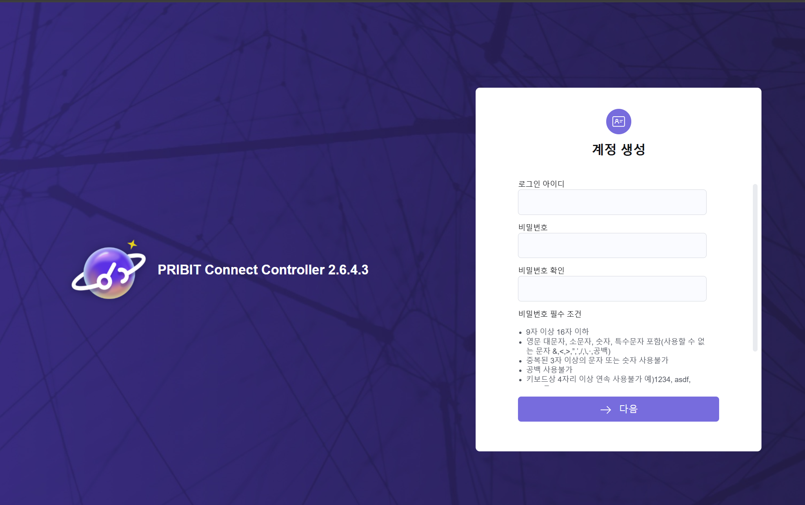 

로그인 아이디 : 관리자가 접속할 초기 아이디를 입력합니다. 

비밀번호 / 비밀번호 확인 : 아래 필수 조건에 만족하는 비밀번호를 입력합니다. 

>[!NOTE] 비밀번호 필수 조건
> - 9자 이상 16자 이하
> - 영문 대문자, 소문자, 숫자, 특수문자 포함(사용할 수 없는 문자 &,<,>,”,’,/,\,·,공백)
> - 중복된 3자 이상의 문자 또는 숫자 사용불가
> - 공백 사용불가
> - 키보드상 4자리 이상 연속 사용불가 예)1234, asdf, zxcv 등
> - 아이디의 연속 4자리 이상 포함 불가
> - 이전 비밀번호 사용 불가(수정인 경우만 해당)
> 

<br>

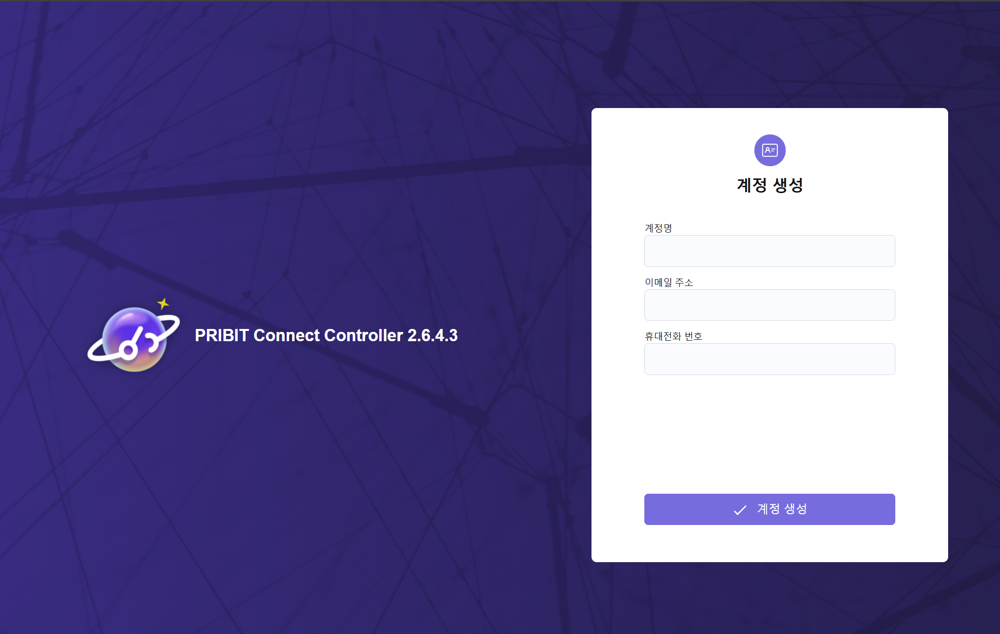

- 계정명(필수) : 관리자 계정의 이름을 입력합니다. 

- 이메일 주(필수) : 관리자 계정의 이메일 주소를 입력합니다. 

- 휴대전화 번호(필수) : 관리자의 휴대전화 번호를 입력합니다. 

<br><br>

## **3. 컨트롤러 등록**  

관리자 계정으로 최초 로그인 시 "*컨트롤러를 등록해주세요.*" 라는 Alert 메시지를 확인할 수 있습니다. 

"확인" 버튼을 누르게 되면 컨트롤러 관리 페이지로 이동합니다. 

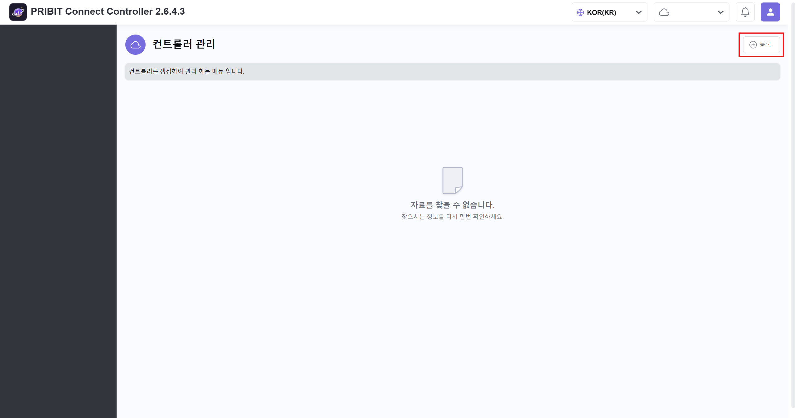

"등록" 버튼을 클리하여 Controller 를 등록합니다. 

<br>

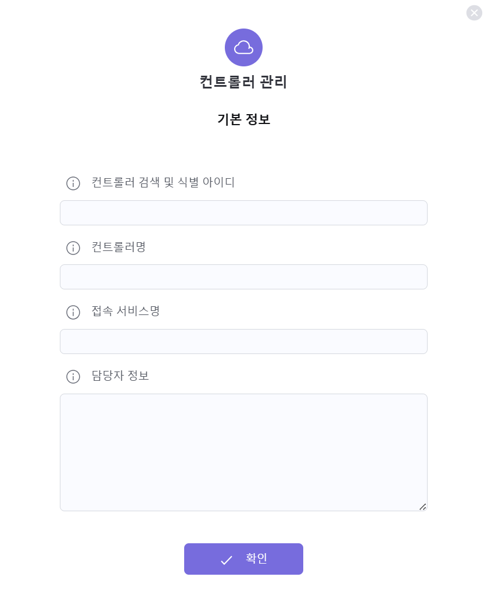

- 컨트롤러 검색 및 식별 아이디 : 등록하는 Controller 를 Agent 에서 식별하기 위한 아이디를 입력합니다. 
    - Connect Agent 가 Controller 에 로그인 할 때 사용하는 아이디 입니다.

- 컨트롤러명 : Console 에서 관리하는 Controller 를 구분하기 위한 Controller 별칭입니다. 
    - ex) 클라우드 접속용

- 접속 서비스명 : 서비스를 구분하기 위한 별칭입니다. 

- 담당자 정보 : 관리자 정보를 입력합니다. 

정보를 입력하고 "확인" 버튼을 누르면 컨트롤러가 등록됩니다. 

<br><br>

## **4. 사용 메뉴 설정 및 시스템 환경 설정**  

#### SYSTEM > 컨트롤러 관리 > 메뉴 권한  

컨트롤러 관리 화면에서 [2. 컨트롤러 등록](#2-컨트롤러-등록) 과정 후 생성된 Controller 를 클릭하고 **메뉴 권한**을 클릭하여 아래 설정과 같이 메뉴를 등록합니다. 

- [x] OBJECT
  - [x] 사용자 
  - [x] 사용자 그룹 
  - [x] 접속 단말
  - [x] 통신 어플리케이션 
  - [x] 사용자 계정 동기화 
- [x] FLOW 
  - [x] 네트워크 경계
  - [x] 차단 플로우 간편 등록 
  - [x] 플로우 제어 영역 
  - [ ] 애드온 플로우 
  - [x] 애플리케이션 플로우 
  - [ ] 노드 플로우 
- [x] POLICY
  - [x] 단말 상태 확인 및 행위 제어 
  - [ ] 접속 거절 
  - [ ] 접속 해제 
  - [ ] 행위 통제 
  - [ ] 위험 제어 조건 관리
  - [ ] 서약서 
- [x] LOG 
  - [x] 전자 증거
  - [ ] 일자별 사용 로그 
  - [ ] 일자별 사용 로그 
  - [x] 감사 로그 
  - [x] 알림 로그 
  - [ ] 레포트 로그 
  - [ ] 이벤트 로그 
  - [ ] 오류 로그 
  - [x] API 서비스 로그 
- [x] MONITORING 
  - [x] 접속중인 사용자 및 단말 
  - [x] 프로토콜 성능 모니터링 
  - [ ] 재택 근무자 통계 
  - [ ] 리스크 분석 
  - [x] 고정 IP 현황 
  - [ ] 시스템 관리 
- [x] SYSTEM
  - [ ] 사용자 승인
  - [x] 단말 승인 
  - [x] 에이전트 메시지 설정 
  - [x] 에이전트 배포 관리
  - [x] 플랫폼 버전 관리
  - [x] 라이선스 관리
  - [x] SMTP 
  - [x] 알림 설정
  - [ ] 레포트 설정 
  - [x] 컨트롤러 관리 
  - [x] 관리자 계정 관리 
  - [ ] 백업/복원 
  - [ ] 메뉴 설정
  - [x] 시스템 환경 설정 


"컨트롤러 메뉴 권한 변경" 을 클릭하여 설정을 저장해줍니다. 

<br>

컨트롤러 관리자 웹콘솔 세션 타임아웃을 설정합니다. (기본 5분) 

>[!NOTE] 
> 관리자 웹콘솔 세션 타임아웃을 설정하기 위해서는 API 통신 IP를 먼저 설정해야 합니다. (개선필요) 
> 관리자 웹콘솔 세션 타임아웃은 Web Browser Idle time 으로 세션을 체크하지 않습니다. (테스트 필요합니다)  

#### SYSTEM > 시스템 환경 설정 > 콘솔 정보 > 관리자 웹콘솔 세션 타임 아웃(분) 

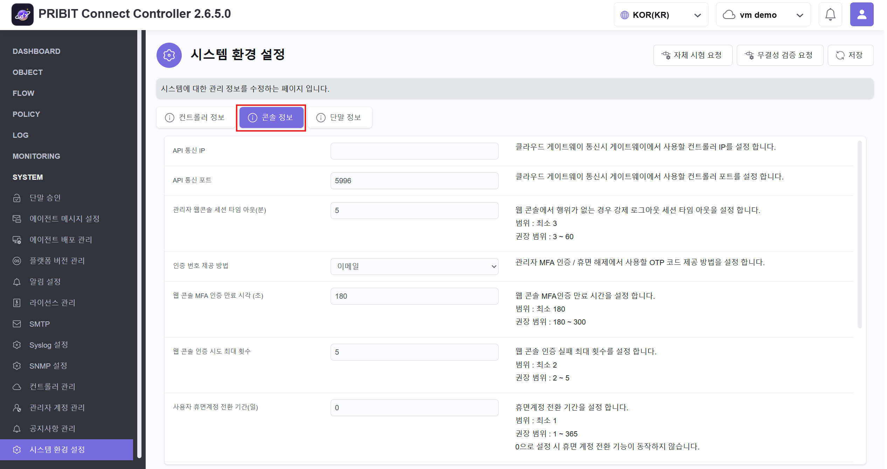

- 관리자 웹콘솔 세션 타임 아웃(분) : 
  - ex) *60*  

<br><br>

## **5. 최초 사용자 생성**  

#### 사용자 생성 

>[!NOTE] 
> VPN 정책을 등록하기 위해서는 최초 사용자를 반드시 등록해야 합니다.  

#### OBJECT > 사용자  

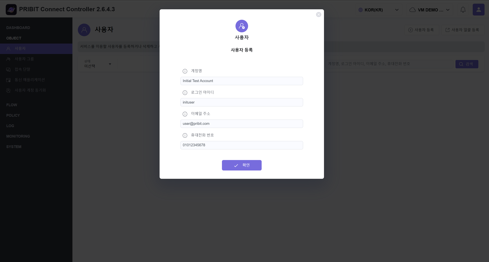

- 계정명 : 
  - ex) *Inital Test Account*
- 로그인 아이디 : 
  - ex) *inituser*
- 이메일 주소 : 
  - ex) *user@pribit.com*
- 휴대전화 번호 : 
  - ex) *010\*\*\*\*\*\*\*8*

정보 입력 후 "확인"을 눌러 사용자를 생성합니다. 

<br>

#### 사용자 그룹 생성 

사용자를 관리할 그룹을 생성합니다. 

#### OBJECT > 사용자 그룹  

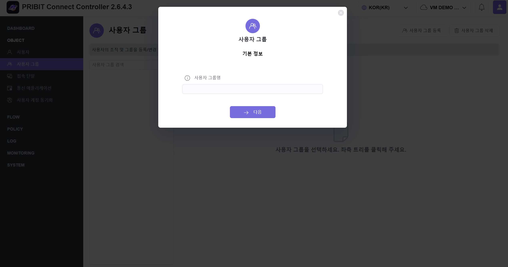 

- 사용자 그룹명 : 
  - ex) *InitUserGroup* 

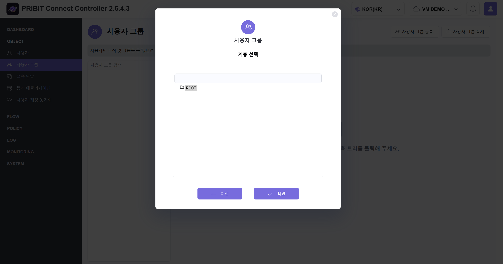

- 계층 선택 : 생성하려는 그룹의 위치를 지정합니다.  
  - ex) *ROOT 를 선택합니다.*  

사용자 그룹 생성이 완료되었습니다. 

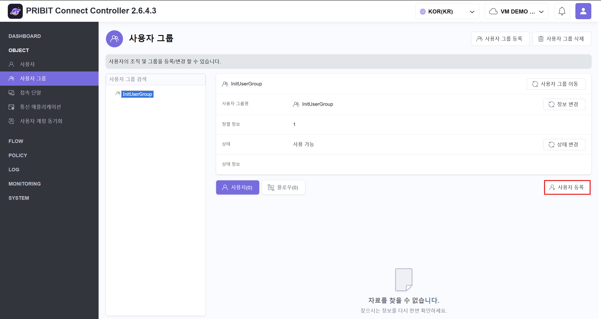  

생성한 사용자 그룹에 *사용자 등록* 버튼으로 생성된 사용자를 등록할 수 있습니다.  

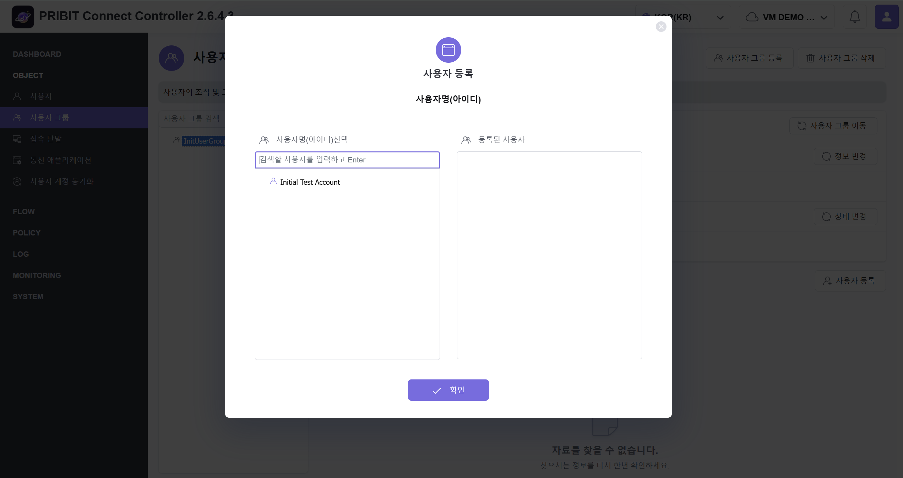
- 사용자명(아이디)선택 리스트에서 사용자를 검색(조회)하여 등록된 사용자로 추가합니다. 

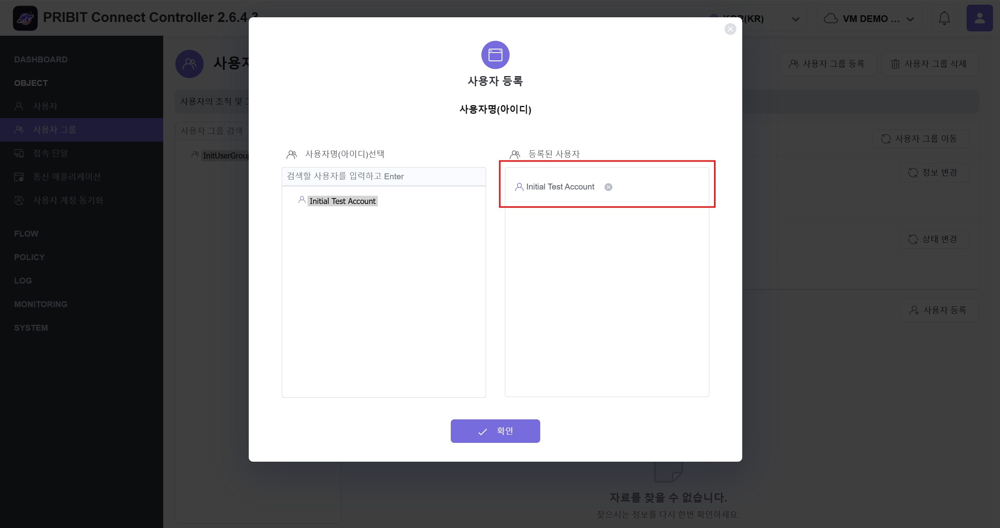

사용자 추가는 해당 사용자를 더블 클릭합니다. 

<br><br>

## **6. FLOW 설정**

FLOW 메뉴에서 **네트워크 경계**, **플로우 제어**, **어플리케이션 플로우**를 설정하여 Agent 접속에 대한 기본적인 정책을 설정합니다. 

### 네트워크 경계 설정 

#### FLOW > 네트워크 경계  

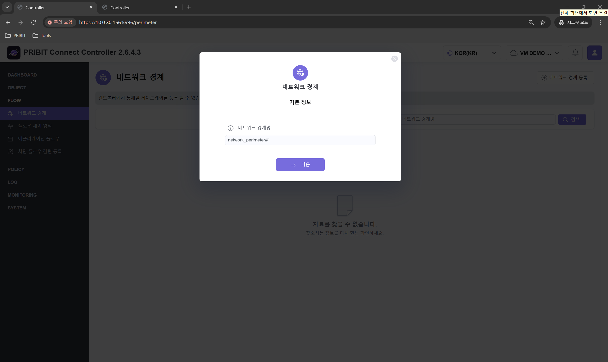
- 네트워크 경계명 : 네트워크 경계명을 설정합니다. 
  - ex) *network_perimeter#1*

<br>

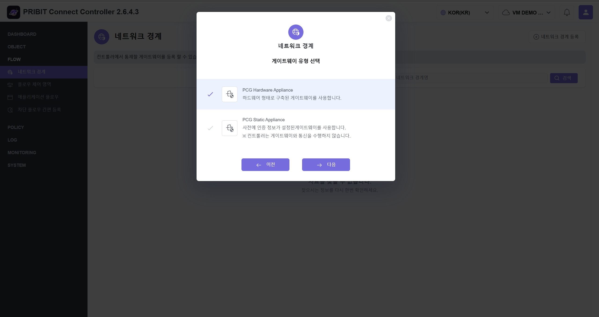
구축된 형태에 따라 게이트웨이 유형을 선택합니다. (다중 선택 가능)

기본적인 구축 형태는 "**PCG Hardware Appliance**" 유형을 선택합니다.

- [x] PCG Hardware Appliance 
- [ ] PGC Static Appliance 

<br>

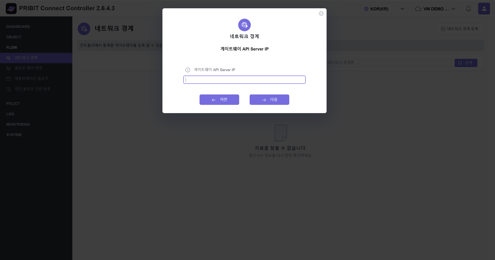
- 게이트웨이 API Server IP : Gateway IP Address 를 입력합니다. 
  - ex) *10.20.0.1*

<br>

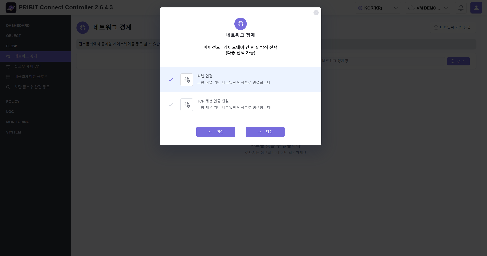 
에이전트와 게이트웨이간의 연결 방식에 대해 설정합니다. 

기본 설정인 터널 연결로 체크 합니다.  

- [x] 터널 연결  
- [ ] TCP 세션 인증 연결 

<br>

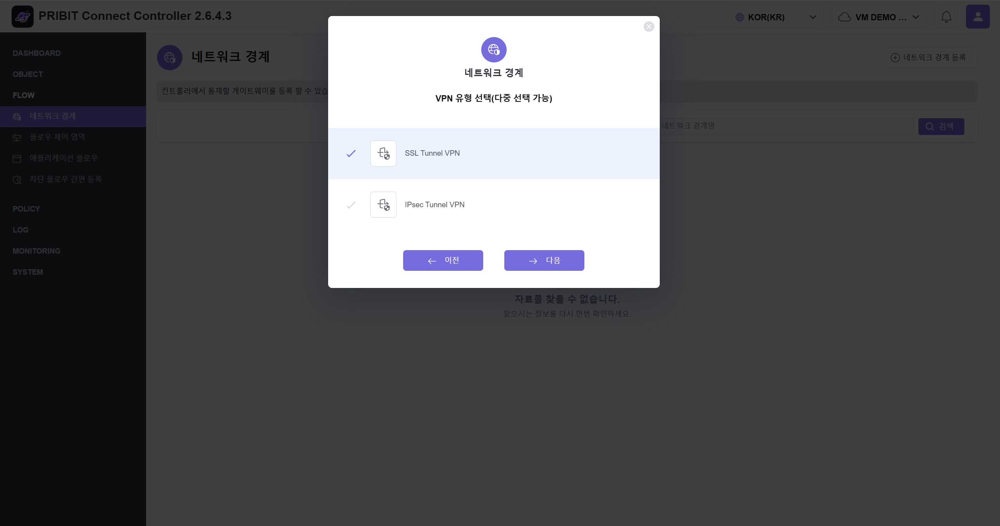
VPN 연결 유형을 선택합니다. (다중 선택 가능)

기본 설정인 SSL Tunnel VPN 으로 체크합니다. 

- [x] SSL Tunnel VPN 
- [ ] IPsec Tunnel VPN 

<br>

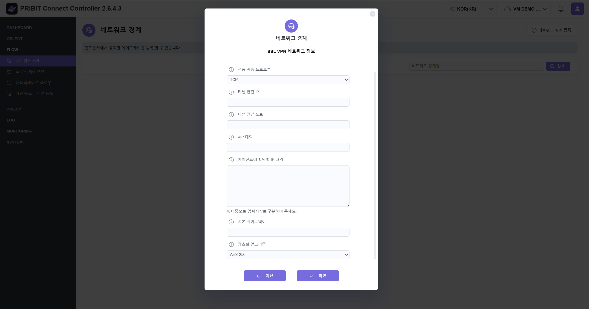
- 전송 계층 프로토콜 
  - [x] TCP 
  - [ ] UDP 
- 터널 연결 IP : 에이전트에서 게이트웨이에 접속하는 IP 정보 
  - Agent가 외부에서 접근 시 게이트웨이로 접근 가능하도록 설정된 외부 IP 주소가 필요합니다. ([네트워크 경계에서 게이트웨에 IP 주소 설정](/Documents/SystemArchitecture.md#네트워크-경계-설정에서-게이트웨이-ip-주소-지정))
  - ex) *10.0.30.157*
- 터널 연결 PORT : 에이전트에서 게이트웨이에 접속하는 PORT 정보
  - ex) *443* 
- VIP 대역 : 게이트웨이의 [server.conf](/Documents/Connect%20Gateway/Gateway_Configuration.md)의 설정에서 `server` 의 설정값
  - ex) *10.21.0.0/24*
- 에이전트에 할당할 IP 대역 : 사용자가 접근 할 목적지의 IP 주소 또는 IP 주소 범위 
  - ex) (Full Tunnel로 설정 시) *0.0.0.0/0* 
- 기본 게이트웨이 : 게이트웨이의 tun0 I/F 의 IP 주소 
  - ex) *10.21.0.1* 
- 암호화 알고리즘 
  - [ ] ARIA-256(한국형 암호화 검증 제도) 
  - [x] AES-256 

필요한 설정을 입력 또는 선택 후 "확인"을 눌러 설정을 마무리 합니다. 

<br>

#### 네트워크 경계 장치 등록 (게이트웨이 등록) 

[네트워크 경계 설정](#네트워크-경계-설정)에서 등록한 네트워크 경계에 장치(게이트웨이)를 등록합니다. 

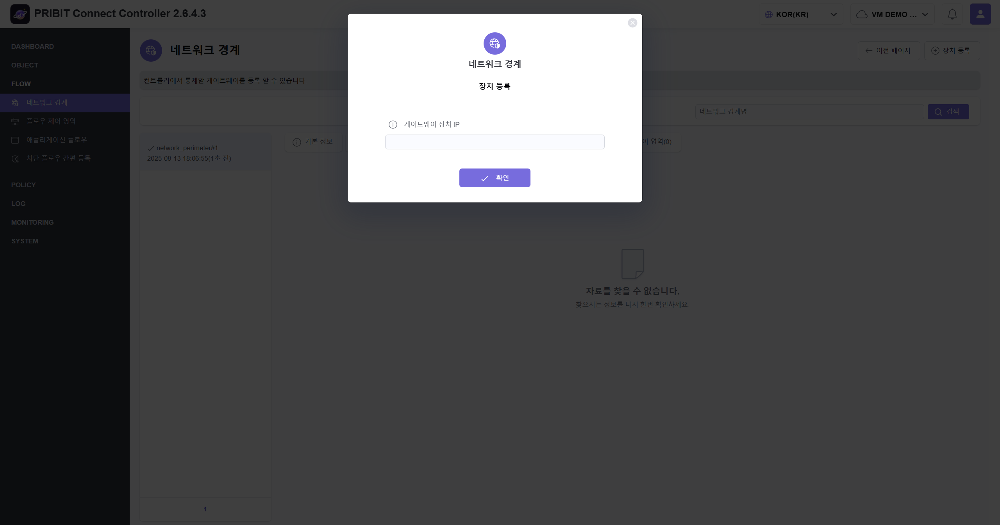
- 게이트웨이 장치 IP : 게이트웨이 장치의 IP 주소 
  - Controller가 내부가 아닌 외부에서 접근 시 게이트웨이로 접근 가능하도록 설정된 외부 IP 주소가 필요합니다. ([네트워크 경계에서 게이트웨에 IP 주소 설정](/Documents/SystemArchitecture.md#네트워크-경계-설정에서-게이트웨이-ip-주소-지정))
  - ex) *10.0.30.157* 

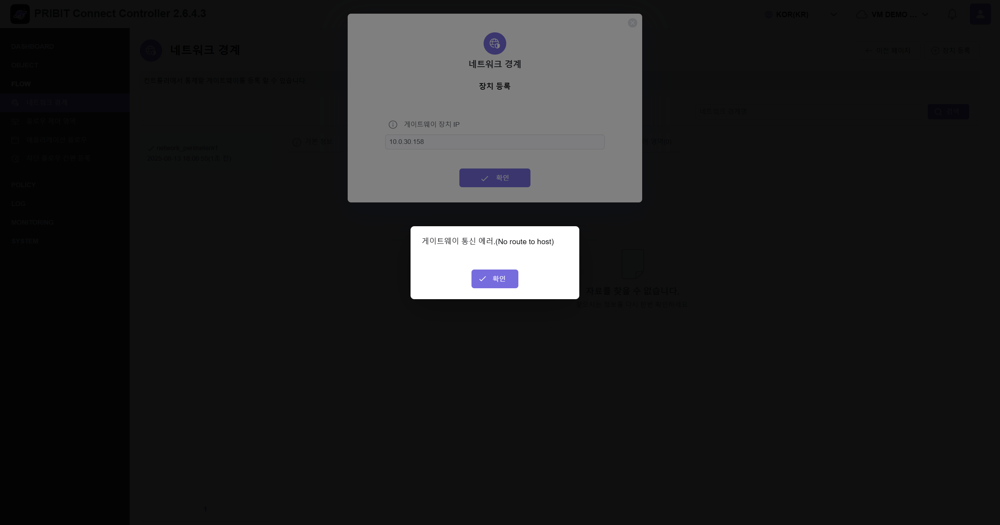
장치 등록 시 컨트롤러와 게이트웨이간 통신 오류 시 해당 오류가 발생하고 등록이 불가합니다. 

<br>

### 플로우 제어 영역 설정

차단하려는 설정을 플로우 제어 영역에서 입력합니다. 

#### FLOW > 플로우 제어 영역  

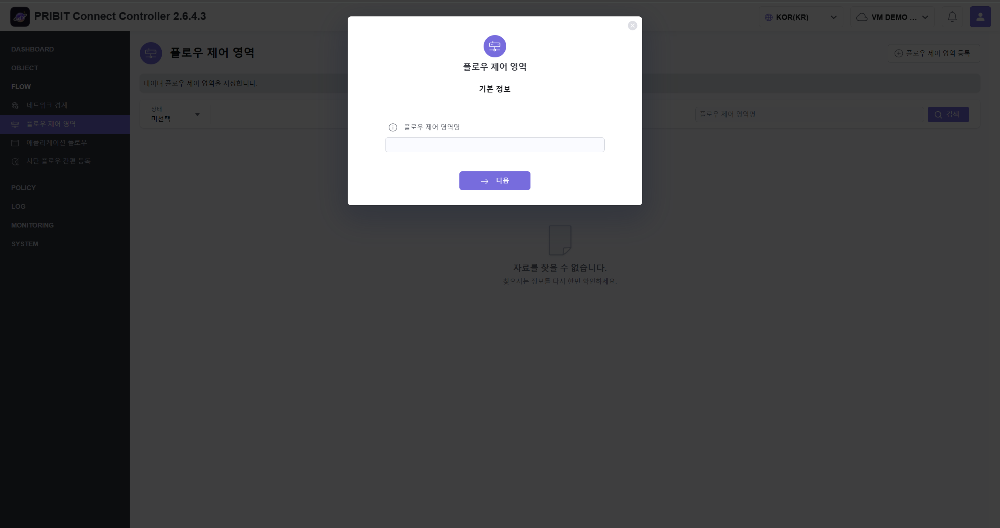

- 플로우 제어 영역명 : 플로우 제어 정책명 입력
  - ex) *flow_control#1*

<br>

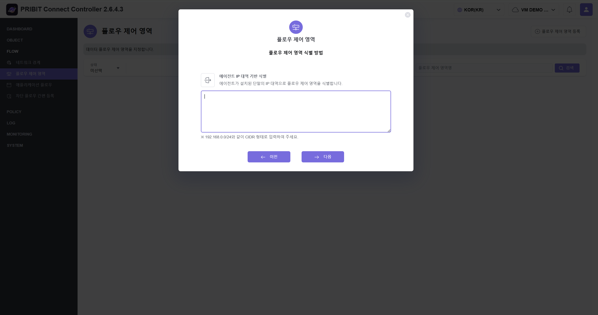  

- 에이전트 IP 대역 기반 식별 : 에이전트의 Real IP의 주소 또는 IP 주소 범위
  - ex) *0.0.0.0/0*

<br>

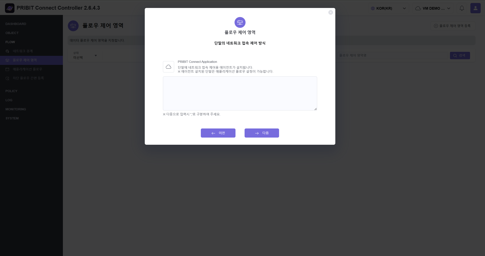

- 단말의 네트워크 접속 제어 방식 : 차단되어야 하는 목적지의 IP 주소 또는 IP 주소 범위
  - ex) *0.0.0.0/24* 

<br>

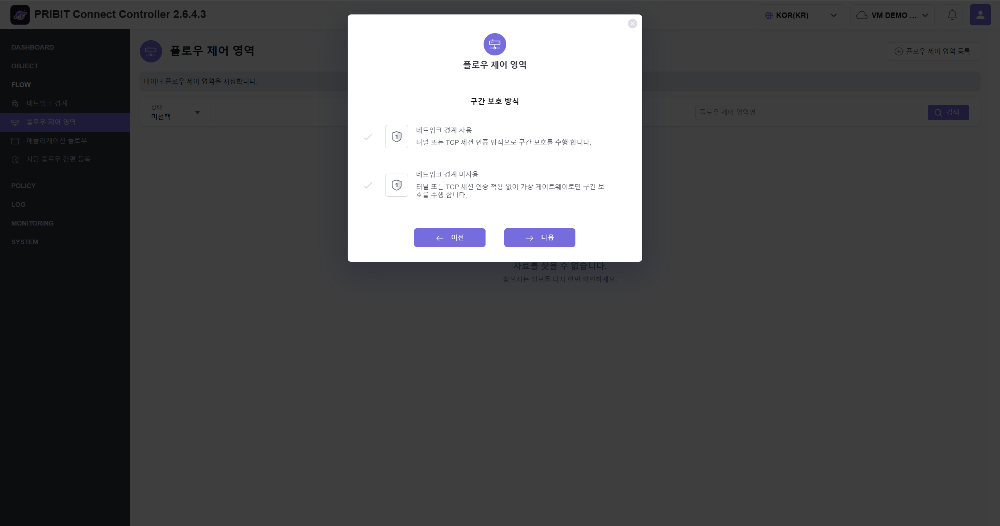  

기본 설정으로 네트워크 경계 사용으로 설정합니다. 

- [x] 네트워크 경계 사용 
- [ ] 네트워크 경계 미사용 

<br>

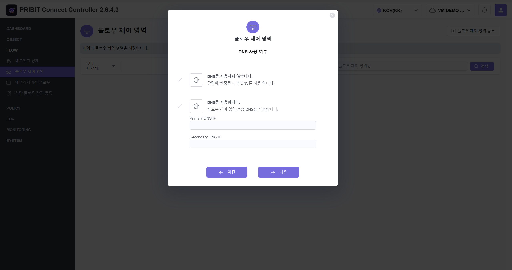  

DNS 사용 여부를 설정합니다.  

*(기본 설정으로 사용하지 않음으로 설정합니다.)*  

- [x] DNS를 사용하지 않습니다.   
단말에 설정된 기본 DNS를 사용합니다. 
- [ ] DNS를 사용합니다.  
플로우 제어 영역 전용 DNS를 사용합니다. 

- Primary DNS IP  
`<blank>`
- Secondary DNS IP  
`<blank>`

<br>

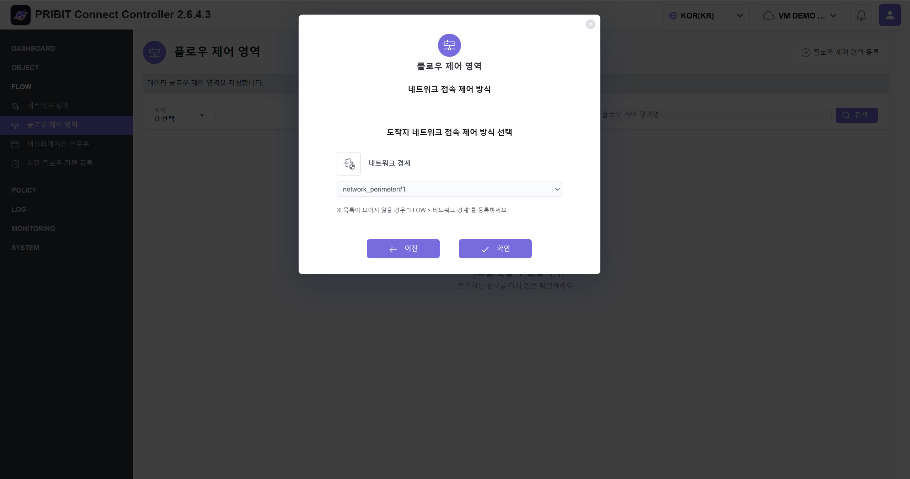  

도착지의 네트워크 접속 제어 방식을 선택합니다.   

[네트워크 경계 설정](#네트워크-경계-설정)에서 생성한 네트워크 경계를 선택합니다. 
- ex) *network_perimeter#1*  

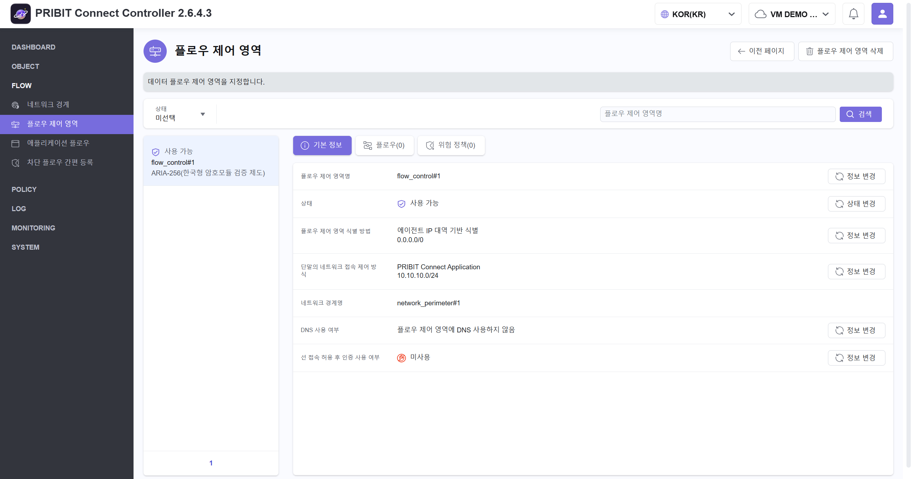
다음과 같이 생성이 완료됩니다. 

<br> 

### 애플리케이션 플로우 설정 

FLOW > 애플리케이션 플로우  

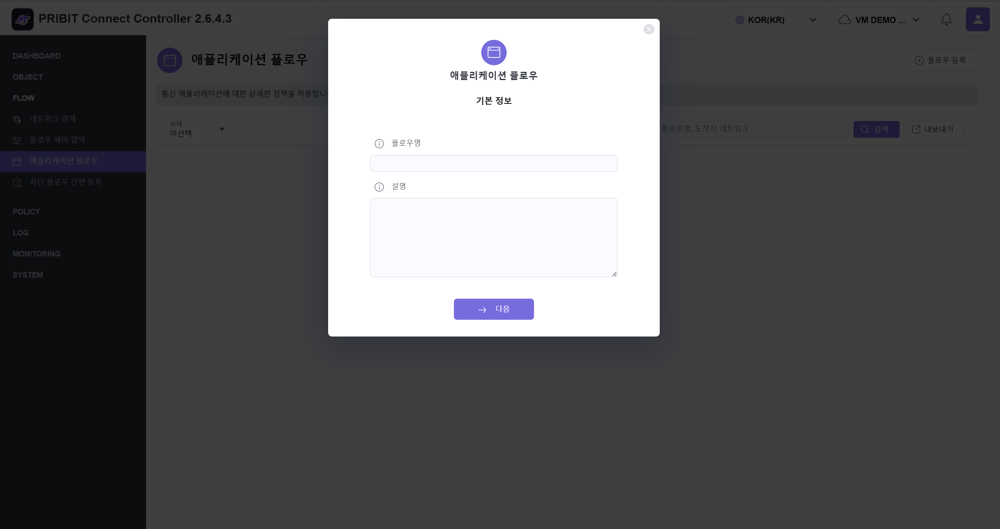 

애플리케이션의 플로우를 설정합니다. 

- 플로우 명 : 애플리케이션 플로우 명 입력  
  - ex) *app_flow_#1*  
- 설명 : 애플리케이션 플로우 정책에 대한 설명    
  - ex) *Description_#1*  

<br>

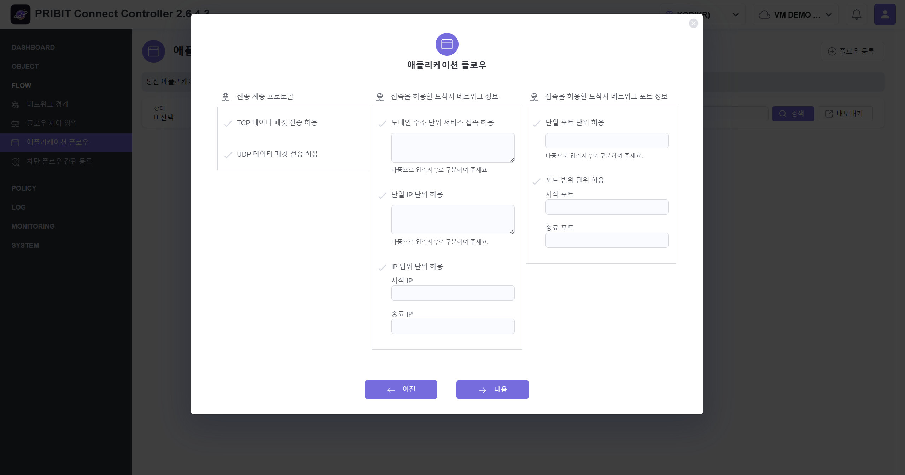  

전송 계층(TCP, UDP), 접속을 허용할 도착지 네트워크 및 포트 정보를 설정합니다. 

- 전송 계층 프로토콜 
  - TCP, UDP 타입 중 하나를 선택 할 수 있습니다. 
  - ex) 
    - [x] TCP 데이터 패킷 전송 허용
    - [ ] UDP 데이터 패킷 전송 허용 

- 접속을 허용할 도착지 네트워크 정보 
  - 도메인 또는 단일 IP 그리고 IP Range 세 가지 타입으로 입력할 수 있습니다.  
    - 도메인 주소 단위 서비스 접속 허용   
    - 단일 IP 단위 허용  
    - IP 범위 단위 허용  

  - ex) IP 범위 단위 허용  
    - 시작 IP : 10.0.30.1  
    - 종료 IP : 10.0.30.255  

- 접속을 허용할 도착지 네트워크 정보 
  - 단일 또는 Port Range 두 가지 타입으로 입력할 수 있습니다.  
    - 단일 포트 단위 허용
    - 포트 범위 단위 허용
  
  - ex) 단일 포트 단위 허용
    - 22,80,443 

<br>

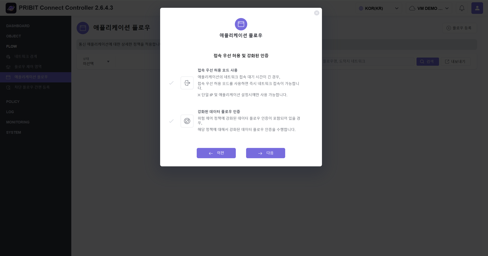 

우선 접속 허용 기능과 강화 인증 모드를 설정할 수 있습니다. (중복 선택 가능)

- ex) 
  - [ ] 접속 우선 허용 모드 사용  
  - [ ] 강화된 데이터 플로우 인증  

<br>

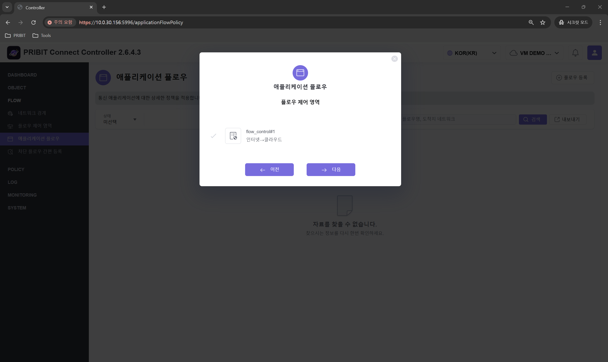

**플로우 제어 영역**에서 생성된 플로우 제어 설정을 선택할 수 있습니다. (필수 선택)  

- ex) 
  - [x] flow_control#1 인터넷 -> 클라우드  

<br>

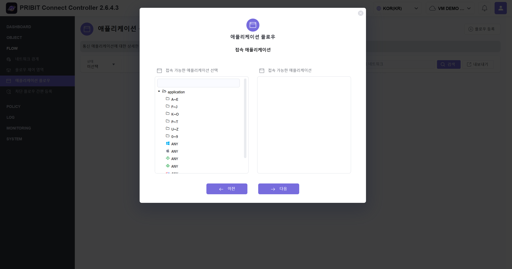

접속 가능한 애플리케이션을 설정합니다. 

- ex) 
  - ANY 를 선택합니다.  

<br>

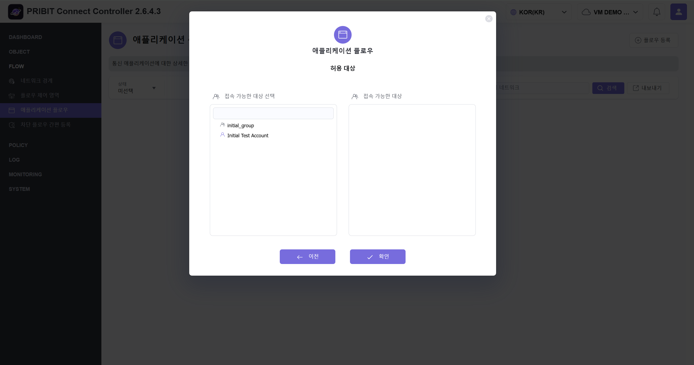  

정책 적용 대상(사용자 또는 그룹)을 지정합니다. 

- ex) *애플리케이션 플로우 설정 전 초기 사용자 또는 그룹을 생성했습니다.*
  - Initial Test Account 선택합니다.  

<br>

기본적인 설정이 모두 완료 되었습니다. 

##  **7. 초기 설정에 따른 시스템 구성도(참고)** 

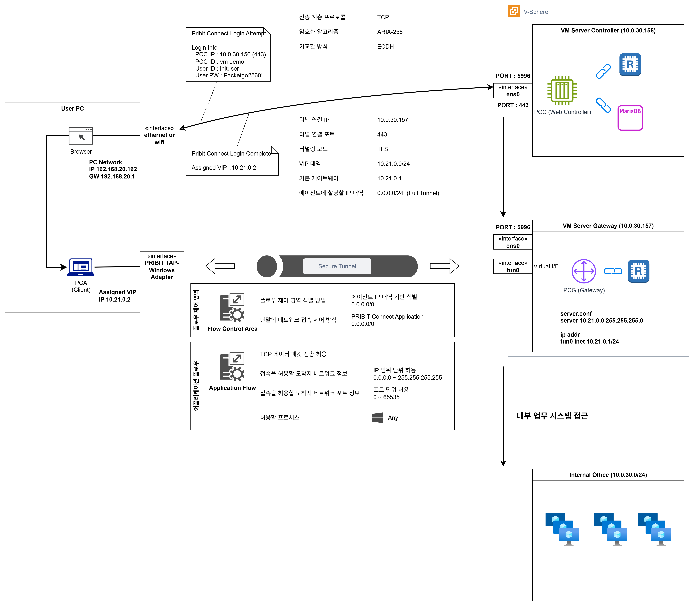

