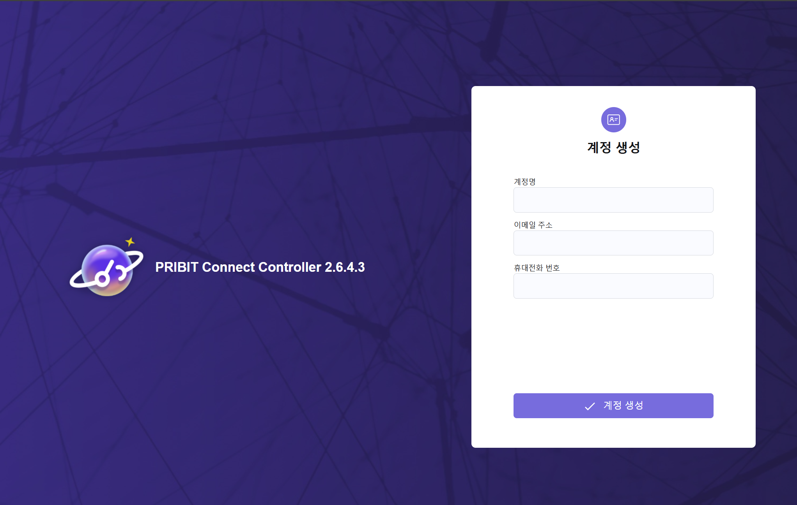

# Controller 초기 설정 안내

Controller 설치와 라이선스 적용을 모두 완료하셨다면, 초기 설정을 진행해야 합니다. 
Controller의 기본적인 운영을 위해 필요한 초기 설정 과정입니다. 아래 안내에 따라 순서대로 진행해 주세요.

## 초기 설정 단계

### **1. 관리자 계정 생성**

최초 로그인 시 사용할 관리자 계정을 생성합니다.

 

로그인 아이디 : 관리자가 접속할 초기 아이디를 입력합니다. 

비밀번호 / 비밀번호 확인 : 아래 필수 조건에 만족하는 비밀번호를 입력합니다. 

>[!NOTE] 비밀번호 필수 조건
> - 9자 이상 16자 이하
> - 영문 대문자, 소문자, 숫자, 특수문자 포함(사용할 수 없는 문자 &,<,>,”,’,/,\,·,공백)
> - 중복된 3자 이상의 문자 또는 숫자 사용불가
> - 공백 사용불가
> - 키보드상 4자리 이상 연속 사용불가 예)1234, asdf, zxcv 등
> - 아이디의 연속 4자리 이상 포함 불가
> - 이전 비밀번호 사용 불가(수정인 경우만 해당)
> 

 

- 계정명(필수) : 관리자 계정의 이름을 입력합니다. 

- 이메일 주(필수) : 관리자 계정의 이메일 주소를 입력합니다. 

- 휴대전화 번호(필수) : 관리자의 휴대전화 번호를 입력합니다. 

  

## 2. **컨트롤러 등록**  

관리자 계정으로 최초 로그인 시 "*컨트롤러를 등록해주세요.*" 라는 Alert 메시지를 확인할 수 있습니다. 

"확인" 버튼을 누르게 되면 컨트롤러 관리 페이지로 이동합니다. 

"등록" 버튼을 클리하여 Controller 를 등록합니다. 

 

- 컨트롤러 검색 및 식별 아이디 : 등록하는 Controller 를 Agent 에서 식별하기 위한 아이디를 입력합니다. 
    - Connect Agent 가 Controller 에 로그인 할 때 사용하는 아이디 입니다.

- 컨트롤러명 : Console 에서 관리하는 Controller 를 구분하기 위한 Controller 별칭입니다. 
    - 예) 클라우드 접속용

- 접속 서비스명 : 서비스를 구분하기 위한 별칭입니다. 

- 담당자 정보 : 관리자 정보를 입력합니다. 

정보를 입력하고 "확인" 버튼을 누르면 컨트롤러가 등록됩니다. 

  

3. **사용 메뉴 설정**  

컨트롤러 관리 화면에서 [2. 컨트롤러 등록](#2-컨트롤러-등록) 과정 후 생성된 Controller 를 클릭하고 메뉴 권한을 클릭하여 아래 설정과 같이 메뉴를 등록합니다. 

- [x] OBJECT
  - [x] 사용자 
  - [x] 사용자 그룹 
  - [x] 접속 단말
  - [x] 통신 어플리케이션 
  - [x] 사용자 계정 동기화 
- [x] FLOW 
  - [x] 네트워크 경계
  - [x] 차단 플로우 간편 등록 
  - [x] 플로우 제어 영역 
  - [ ] 애드온 플로우 
  - [x] 애플리케이션 플로우 
  - [ ] 노드 플로우 
- [x] POLICY
  - [x] 단말 상태 확인 및 행위 제어 
  - [ ] 접속 거절 
  - [ ] 접속 해제 
  - [ ] 행위 통제 
  - [ ] 위험 제어 조건 관리
  - [ ] 서약서 
- [x] LOG 
  - [x] 전자 증거
  - [ ] 일자별 사용 로그 
  - [ ] 일자별 사용 로그 
  - [x] 감사 로그 
  - [x] 알림 로그 
  - [ ] 레포트 로그 
  - [ ] 이벤트 로그 
  - [ ] 오류 로그 
  - [x] API 서비스 로그 
- [x] MONITORING 
  - [x] 접속중인 사용자 및 단말 
  - [x] 프로토콜 성능 모니터링 
  - [ ] 재택 근무자 통계 
  - [ ] 리스크 분석 
  - [x] 고정 IP 현황 
  - [ ] 시스템 관리 
- [x] SYSTEM
  - [ ] 사용자 승인
  - [x] 단말 승인 
  - [x] 에이전트 메시지 설정 
  - [x] 에이전트 배포 관리
  - [x] 플랫폼 버전 관리
  - [x] 라이선스 관리
  - [x] SMTP 
  - [x] 알림 설정
  - [ ] 레포트 설정 
  - [x] 컨트롤러 관리 
  - [x] 관리자 계정 관리 
  - [ ] 백업/복원 
  - [ ] 메뉴 설정
  - [x] 시스템 환경 설정 

"컨트롤러 메뉴 권한 변경" 을 클릭하여 설정을 저장해줍니다. 

  

1. **설정 저장 및 완료**  
    모든 설정을 확인한 후 저장하여 초기 설정을 완료합니다.

---

초기 설정이 완료되면 Controller를 정상적으로 사용할 수 있습니다.  
설정 과정에서 문제가 발생할 경우, 기술 지원팀에 문의해 주세요.
