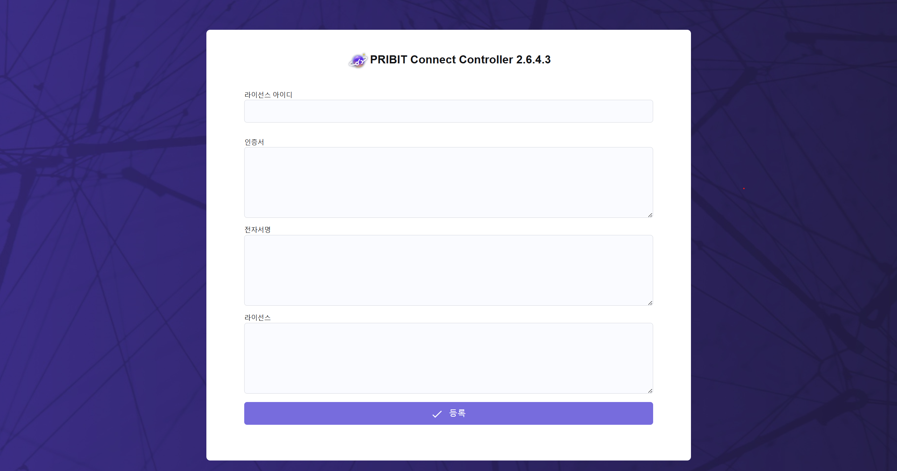

# PCC Console 라이선스 등록 가이드

이 문서는 PCC Console에서 라이선스를 등록하는 방법을 안내합니다.

## 1. PCC Console 접속

- 웹 브라우저를 열고 PCC Console 주소로 접속합니다. 
   _http://192.168.0.10:5996_

  

## 2. 라이선스 등록 화면 

  

## 3. 라이선스 정보 입력

- 발급받은 라이선스 정보를 입력란에 정확히 입력합니다.

> 라이선스 아이디 : 
> 
> 인증서 : 
> 
> 전자서명 : 
> 
> 라이선스 : 

  

## 4. 라이선스 등록 완료

1. **등록** 버튼을 클릭합니다.
2. 등록이 완료되면, 라이선스 상태가 갱신된 것을 확인할 수 있습니다.

 

>[!NOTE]
>
>라이선스 등록 중 오류가 발생하면, 입력한 정보를 다시 확인하거나 PRIBIT 에게 문의하세요. 