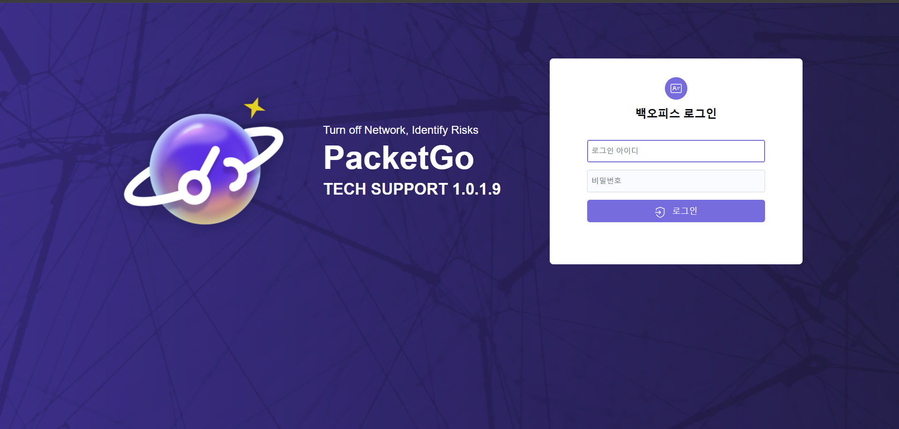
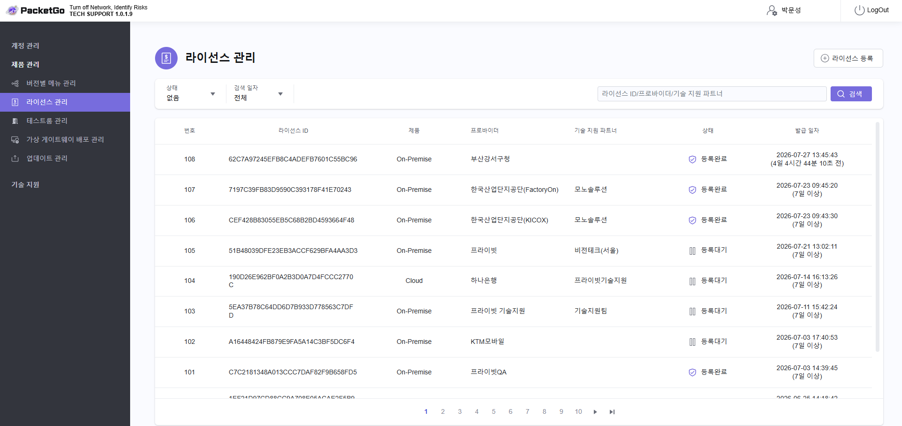
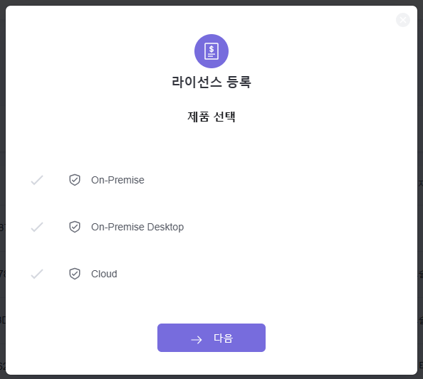
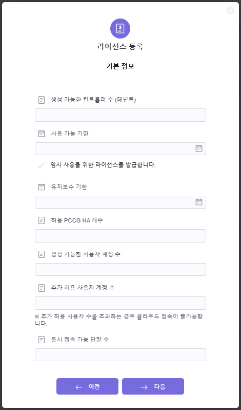
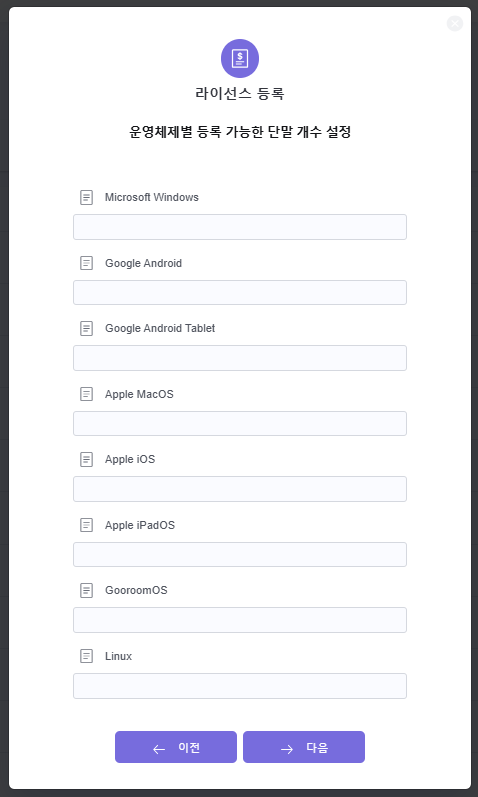
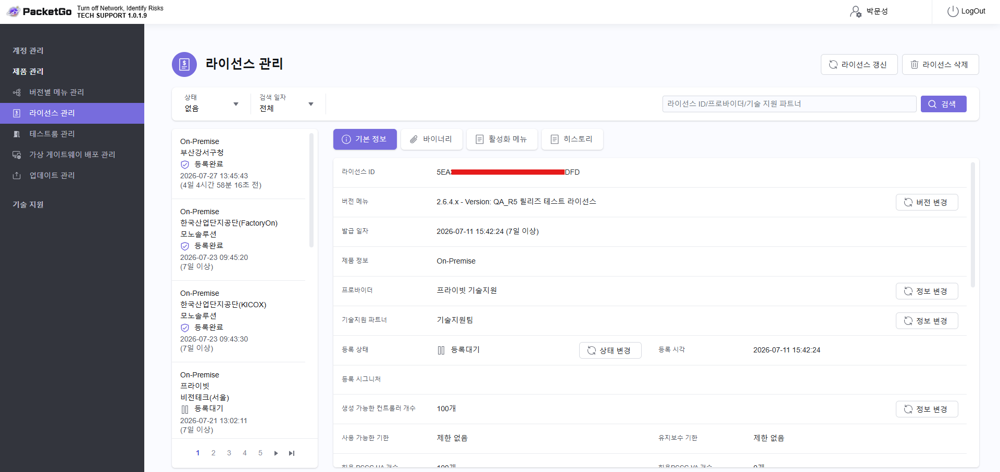
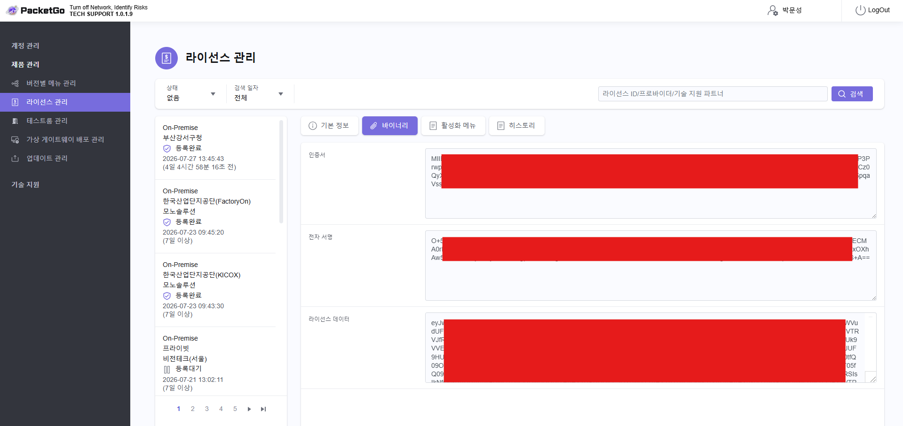

# License (라이선스 발급)

라이선스 등록/관리 (백오피스)  
```
https://support.packetgo.com/backOffice/login 
```

 

- 로그인 아이디: 
- 비밀번호: 

*** 

제품 관리 > 라이선스 관리  

  

- 라이선스 등록 버튼 클릭 

  
- [x] On-Premise  
- [ ] On-Premise Desktop 
- [ ] Cloud  


> [!NOTE]  
> 각 설정에 대한 차이는 개발팀에 문의 필요  



- 생성 가능한 컨트롤러 수 (테넌트)
```
1  
```
- 사용 가능 기한 
```
제한 없음  
```
- 유지보수 기한 
```
제한 없음  
```
- 허용 PCCG HA 개수 
```
1  
```
- 생성 가능한 사용자 계정 수 
고객사에서 구매한 사용자 수에 따라 설정합니다. 
```
1000  
```
- 추가 허용 사용자 계정 수 
추가 허용 될 수 있는 사용자 계정 수를 설정합니다. 
```
0  
```
- 동시 접속 가능 단말 수 
동시 접속 가능한 단말 수를 설정합니다. (일반적으로 생성 가능한 사용자 수와 동일하게 설정합니다.)
```
1000  
```

운영체제별 등록 가능한 단말 수 설정 
  
- Microsoft Windows 
```
1000  
``` 
- Google Android  
```
1000  
``` 
- Google Android Tablet  
```
1000  
``` 
- Apple Mac OS  
```
1000  
``` 
- Apple iOS  
```
1000  
``` 
- Apple iPad OS  
```
1000  
``` 
- Gooroom OS 
```
1000  
``` 
- Linux  
```
1000  
``` 

라이선스 등록 완료  
  
- 라이선스 ID 
```
5E ... FD
``` 

- 인증서  
```
MII ... AB
```
- 전자 서명   
```
O+5f ... +A==
```
- 라이선스 데이터     
```
eyJwc ... RCJdfX0=
```

위 라이선스 데이터를 PCC에 등록합니다. 
