# PCC 보안 정책 (Security Policy)

<!-- TOC start  -->
- [PCC 보안 정책 (Security Policy)](#pcc-보안-정책-security-policy)
  - [인증 관련 정책](#인증-관련-정책)
    - [LDAP 인증 수행 (Enforce LDAP Authentication)](#ldap-인증-수행-enforce-ldap-authentication)
    - [RADIUS 서버 인증 수행 (Enforce RADIUS Authentication)](#radius-서버-인증-수행-enforce-radius-authentication)
    - [연계 시스템 인증 수행 (Enforce Integrated System Authentication)](#연계-시스템-인증-수행-enforce-integrated-system-authentication)
  - [MFA(다중 인증) 정책](#mfa다중-인증-정책)
    - [로그인 시 MFA 인증 요구 (Require MFA At Login)](#로그인-시-mfa-인증-요구-require-mfa-at-login)
    - [데이터 플로우 접속 시 MFA 인증 요구 (Require MFA For Data Flow Access)](#데이터-플로우-접속-시-mfa-인증-요구-require-mfa-for-data-flow-access)
  - [OS 보안 정책](#os-보안-정책)
    - [OS 로그인 비밀번호 비활성화 시 접속 차단 (Block Access If OS Login Password Disabled)](#os-로그인-비밀번호-비활성화-시-접속-차단-block-access-if-os-login-password-disabled)
    - [OS 방화벽 비활성화 시 접속 차단 (Block Access If OS Firewall Disabled)](#os-방화벽-비활성화-시-접속-차단-block-access-if-os-firewall-disabled)
    - [OS 화면 보호기 비활성화 시 접속 차단 (Block Access If OS Screen Saver Disabled)](#os-화면-보호기-비활성화-시-접속-차단-block-access-if-os-screen-saver-disabled)
    - [지정 OS 버전 사용 시 접속 차단 (Block Access When Using Specific OS Version)](#지정-os-버전-사용-시-접속-차단-block-access-when-using-specific-os-version)
    - [지정 OS 외 접속 차단 (Block Access On Non-Approved OS)](#지정-os-외-접속-차단-block-access-on-non-approved-os)
    - [윈도우 관리자 계정 사용 시 접속 차단 (Block Access When Using Windows Administrator Account)](#윈도우-관리자-계정-사용-시-접속-차단-block-access-when-using-windows-administrator-account)
    - [윈도우 지정 보안 업데이트 미수행 시 접속 차단 (Block Access If Required Windows Security Updates Not Applied)](#윈도우-지정-보안-업데이트-미수행-시-접속-차단-block-access-if-required-windows-security-updates-not-applied)
  - [백신 및 악성코드 정책](#백신-및-악성코드-정책)
    - [백신 미설치 시 접속 차단 (Block Access If Antivirus Not Installed)](#백신-미설치-시-접속-차단-block-access-if-antivirus-not-installed)
    - [백신 실시간 감지 비활성화 시 접속 차단 (Block Access If Antivirus Real-Time Protection Disabled)](#백신-실시간-감지-비활성화-시-접속-차단-block-access-if-antivirus-real-time-protection-disabled)
    - [백신 패턴 업데이트 미수행 시 접속 차단 (Block Access If Antivirus Definitions Outdated)](#백신-패턴-업데이트-미수행-시-접속-차단-block-access-if-antivirus-definitions-outdated)
    - [바이러스 탐지 시 접속 차단 (Block Access On Virus Detection)](#바이러스-탐지-시-접속-차단-block-access-on-virus-detection)
    - [미치료 바이러스 존재 시 접속 차단 (Block Access If Untreated Virus Detected)](#미치료-바이러스-존재-시-접속-차단-block-access-if-untreated-virus-detected)
  - [네트워크 정책](#네트워크-정책)
    - [WiFi 사용 접속 시 접속 차단 (Block Access On WiFi Connection)](#wifi-사용-접속-시-접속-차단-block-access-on-wifi-connection)
    - [WiFi 변경 시 접속 차단 (Block Access On WiFi Change)](#wifi-변경-시-접속-차단-block-access-on-wifi-change)
    - [비인가 WiFi 사용 시 접속 차단 (Block Access On Unauthorized WiFi Use)](#비인가-wifi-사용-시-접속-차단-block-access-on-unauthorized-wifi-use)
    - [인가된 WiFi 외 사용 시 접속 차단 (Block Access Outside Approved WiFi)](#인가된-wifi-외-사용-시-접속-차단-block-access-outside-approved-wifi)
    - [미승인 WiFi 사용 시 승인 요청 및 접속 차단 (Require Approval And Block Access For Unapproved WiFi)](#미승인-wifi-사용-시-승인-요청-및-접속-차단-require-approval-and-block-access-for-unapproved-wifi)
    - [모바일 네트워크 사용 시 접속 차단 (Block Access On Mobile Network Use)](#모바일-네트워크-사용-시-접속-차단-block-access-on-mobile-network-use)
    - [모바일 캐리어 변경 시 접속 차단 (Block Access On Mobile Carrier Change)](#모바일-캐리어-변경-시-접속-차단-block-access-on-mobile-carrier-change)
    - [테더링 사용 접속 시 접속 차단 (Block Access When Tethering Is Used)](#테더링-사용-접속-시-접속-차단-block-access-when-tethering-is-used)
    - [다중 네트워크 인터페이스(NIC) 사용 시 접속 차단 (Block Access When Multiple NICs Are Used)](#다중-네트워크-인터페이스nic-사용-시-접속-차단-block-access-when-multiple-nics-are-used)
    - [단말의 IP 변경 시 접속 차단 (Block Access On Device IP Change)](#단말의-ip-변경-시-접속-차단-block-access-on-device-ip-change)
    - [인가된 IP 대역 외 접속 차단 (Block Access Outside Approved IP Ranges)](#인가된-ip-대역-외-접속-차단-block-access-outside-approved-ip-ranges)
    - [미승인 IP 접속 시 승인 요청 및 접속 차단 (Require Approval And Block Access For Unapproved IPs)](#미승인-ip-접속-시-승인-요청-및-접속-차단-require-approval-and-block-access-for-unapproved-ips)
    - [비인가 네트워크 포트 사용 시 접속 차단 (Block Access When Unauthorized Network Ports Used)](#비인가-네트워크-포트-사용-시-접속-차단-block-access-when-unauthorized-network-ports-used)
  - [USB 및 외부 장치 정책](#usb-및-외부-장치-정책)
    - [USB 저장 장치 사용 시 접속 차단 (Block Access When USB Storage Device Used)](#usb-저장-장치-사용-시-접속-차단-block-access-when-usb-storage-device-used)
    - [USB 네트워크 어댑터 사용 시 접속 차단 (Block Access When USB Network Adapter Used)](#usb-네트워크-어댑터-사용-시-접속-차단-block-access-when-usb-network-adapter-used)
  - [애플리케이션 정책](#애플리케이션-정책)
    - [비인가 애플리케이션 설치 시 접속 차단 (Block Access If Unauthorized Application Installed)](#비인가-애플리케이션-설치-시-접속-차단-block-access-if-unauthorized-application-installed)
    - [비인가 애플리케이션 실행 시 접속 차단 (Block Access When Unauthorized Application Is Running)](#비인가-애플리케이션-실행-시-접속-차단-block-access-when-unauthorized-application-is-running)
    - [비인가 애플리케이션 실행 방지 및 강제 종료 (Prevent And Force-Stop Unauthorized Application Execution)](#비인가-애플리케이션-실행-방지-및-강제-종료-prevent-and-force-stop-unauthorized-application-execution)
    - [필수 애플리케이션 미설치 시 접속 차단 (Block Access If Required Applications Not Installed)](#필수-애플리케이션-미설치-시-접속-차단-block-access-if-required-applications-not-installed)
    - [필수 애플리케이션 미실행 시 접속 차단 (Block Access If Required Applications Not Running)](#필수-애플리케이션-미실행-시-접속-차단-block-access-if-required-applications-not-running)
    - [애플리케이션 무결성 훼손 시 애플리케이션 접속 차단 (Block Access To Applications With Tampered Integrity)](#애플리케이션-무결성-훼손-시-애플리케이션-접속-차단-block-access-to-applications-with-tampered-integrity)
    - [플로우 제어 영역 외 애플리케이션 접속 차단 (Block Access To Applications Outside Flow Control Zones)](#플로우-제어-영역-외-애플리케이션-접속-차단-block-access-to-applications-outside-flow-control-zones)
  - [단말 및 접속 관리 정책](#단말-및-접속-관리-정책)
    - [미승인 단말 접속 시 승인 요청 및 접속 차단 (Require Approval And Block Access For Unapproved Devices)](#미승인-단말-접속-시-승인-요청-및-접속-차단-require-approval-and-block-access-for-unapproved-devices)
    - [가상 머신 환경에서의 접속 차단 (Block Access From Virtual Machine Environments)](#가상-머신-환경에서의-접속-차단-block-access-from-virtual-machine-environments)
    - [계정별 최대 동시 접속 단말 수 초과 시 접속 차단 (Block Access When Concurrent Device Limit Exceeded Per Account)](#계정별-최대-동시-접속-단말-수-초과-시-접속-차단-block-access-when-concurrent-device-limit-exceeded-per-account)
    - [단말 유휴 시간 초과 시 접속 차단 (Block Access After Device Idle Timeout)](#단말-유휴-시간-초과-시-접속-차단-block-access-after-device-idle-timeout)
    - [최대 접속 시간 초과 시 접속 차단 (Block Access When Maximum Session Time Exceeded)](#최대-접속-시간-초과-시-접속-차단-block-access-when-maximum-session-time-exceeded)
    - [업무 시간 외 접속 시 접속 차단 (Block Access Outside Working Hours)](#업무-시간-외-접속-시-접속-차단-block-access-outside-working-hours)
  - [권한 관리 정책](#권한-관리-정책)
    - [관리자 권한 상승 불가 (Prevent Administrator Privilege Escalation)](#관리자-권한-상승-불가-prevent-administrator-privilege-escalation)
    - [관리자 권한 상승 시도 시 접속 차단 (Block Access On Administrator Privilege Escalation Attempt)](#관리자-권한-상승-시도-시-접속-차단-block-access-on-administrator-privilege-escalation-attempt)
  - [로그인 보안 정책](#로그인-보안-정책)
    - [로그인 실패 횟수 초과 시 일시적 접속 차단 (Temporarily Block Access After Excessive Login Failures)](#로그인-실패-횟수-초과-시-일시적-접속-차단-temporarily-block-access-after-excessive-login-failures)
    - [비밀번호 주기적 변경 미수행 시 접속 차단 (Block Access If Password Rotation Not Performed)](#비밀번호-주기적-변경-미수행-시-접속-차단-block-access-if-password-rotation-not-performed)
    - [사용자 자동 로그인 접속 허용 (Allow User Auto-Login Access)](#사용자-자동-로그인-접속-허용-allow-user-auto-login-access)
  - [에이전트 무결성 정책](#에이전트-무결성-정책)
    - [에이전트 무결성 훼손 시 접속 차단 (Block Access If Agent Integrity Compromised)](#에이전트-무결성-훼손-시-접속-차단-block-access-if-agent-integrity-compromised)
    - [에이전트 버전 최신 버전 미사용 시 접속 차단 (Block Access If Agent Version Is Outdated)](#에이전트-버전-최신-버전-미사용-시-접속-차단-block-access-if-agent-version-is-outdated)
  - [데이터 보호 정책](#데이터-보호-정책)
    - [화면 캡처 및 프린트스크린 기능 사용 불가 (Disable Screen Capture And PrintScreen)](#화면-캡처-및-프린트스크린-기능-사용-불가-disable-screen-capture-and-printscreen)
    - [스크린 워터마킹 표시 (Display Screen Watermark)](#스크린-워터마킹-표시-display-screen-watermark)
    - [프린터 사용 제한 (Restrict Printer Usage)](#프린터-사용-제한-restrict-printer-usage)
    - [원격 데스크톱 접속 시 파일 전송 및 클립보드 사용 불가 (Disable File Transfer And Clipboard For Remote Desktop)](#원격-데스크톱-접속-시-파일-전송-및-클립보드-사용-불가-disable-file-transfer-and-clipboard-for-remote-desktop)
  - [네트워크 트래픽 및 로깅 정책](#네트워크-트래픽-및-로깅-정책)
    - [전체 네트워크 트래픽 데이터 플로우 검사 (Inspect All Network Traffic For Data Flow)](#전체-네트워크-트래픽-데이터-플로우-검사-inspect-all-network-traffic-for-data-flow)
    - [데이터 플로우 기본 허용 모드 활성화 (Enable Default-Allow Data Flow Mode)](#데이터-플로우-기본-허용-모드-활성화-enable-default-allow-data-flow-mode)
    - [데이터 패킷 드롭 로깅 활성화 (Enable Data Packet Drop Logging)](#데이터-패킷-드롭-로깅-활성화-enable-data-packet-drop-logging)
    - [수신 대기 네트워크 포트 로깅 활성화 (Enable Listening Network Port Logging)](#수신-대기-네트워크-포트-로깅-활성화-enable-listening-network-port-logging)
    - [프로세스 설치 이벤트 로깅 활성화 (Enable Process Install Event Logging)](#프로세스-설치-이벤트-로깅-활성화-enable-process-install-event-logging)
    - [프로세스 실행 이벤트 로깅 활성화 (Enable Process Execution Event Logging)](#프로세스-실행-이벤트-로깅-활성화-enable-process-execution-event-logging)
<!-- TOC end -->

<br><br>

## 인증 관련 정책

### LDAP 인증 수행 (Enforce LDAP Authentication)
설명: 이 설정을 적용하면 사용자는 LDAP(Lightweight Directory Access Protocol) 서버를 통한 인증을 거쳐야만 시스템에 접속할 수 있습니다.

사용자 동기화로 LDAP 동기화를 수행하여, 사용자 정보 동기화가 모두 완료되었다면 해당 설정을 통해 사용자 인증 시 LDAP 인증을 수행할 수 있습니다. 

LDAP 인증을 수행하려면 아래 설정들이 반드시 필요합니다.   

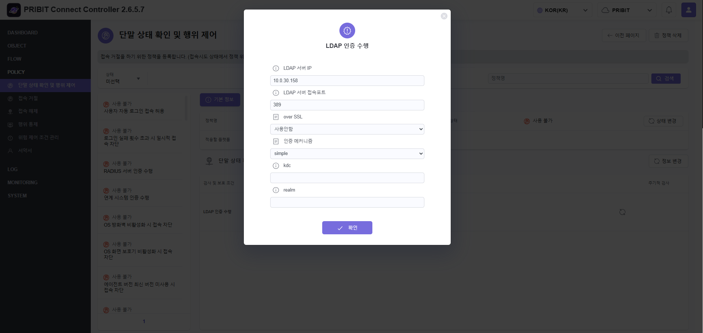  

- LDAP 서버 IP: LDAP(또는 AD 서버) IP 정보를 입력합니다.  
  - ex) 10.0.30.158  
- LDAP 서버 접속포트: LDPA(또는 AD 서버) PORT 정보를 입력합니다. 
  - ex) 389 *(default)*  
- over SSL: over SSL 사용 여부를 체크합니다.  
  - ex) 
    - [x] 사용안함  
- 인증 메커니즘: LDAP 인증 메커니즘을 선택합니다.  
  - ex) 
    - [x] simple *(default)*  
    - [ ] none 
    - [ ] gssapi   
- kdc: KDC(Kerberos Key Distribution Center)서버 정보를 입력합니다. 
  - ex) (blank) *(default)*  
- realm: LDAP 인증 시 논리적 구분 정보를 입력합니다.  
  - ex) (blank) *(default)*  
 
> [!NOTE]  
> **realm 설정의 목적:**  
> - 사용자가 ID만 입력: pribit  
> - 시스템(LDAP 또는 AD서버)이 자동 변환: pribit@pribit.com (UPN 형식)  
> - 이를 위해 realm 값을 'pribit.com'으로 설정  
>   
> LDAP(AD) 사용자 ID가 pribit이고 Domain을 pribit.com으로 사용할 때, 사용자가 LDAP 인증 시 ID만 입력(pribit)하면 시스템이 자동으로 'pribit@pribit.com' 형태로 
변환하여 인증하도록 하려면 realm 값을 'pribit.com'으로 설정하면 됩니다.  

<br>  

인증 서버에 접속 실패하였거나, 인증 정보가 맞지 않을 경우 발생  

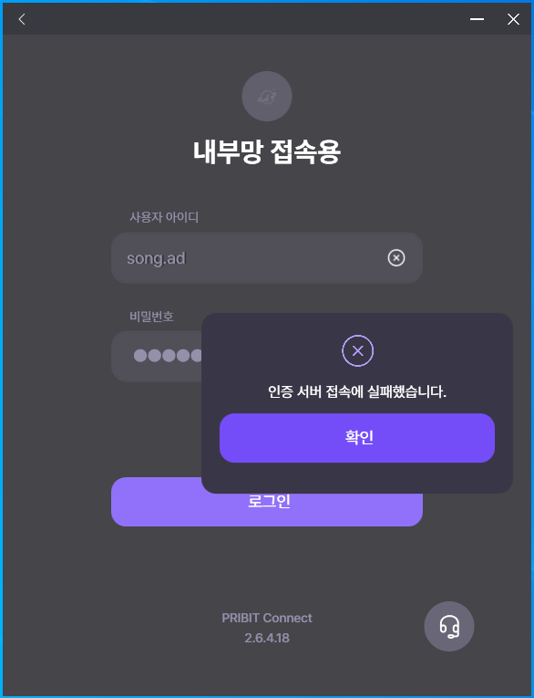  

<br>

### RADIUS 서버 인증 수행 (Enforce RADIUS Authentication)
설명: 이 설정을 적용하면 RADIUS(Remote Authentication Dial-In User Service) 서버를 통한 인증 절차를 거쳐야 접속이 가능합니다.

정책 생성 

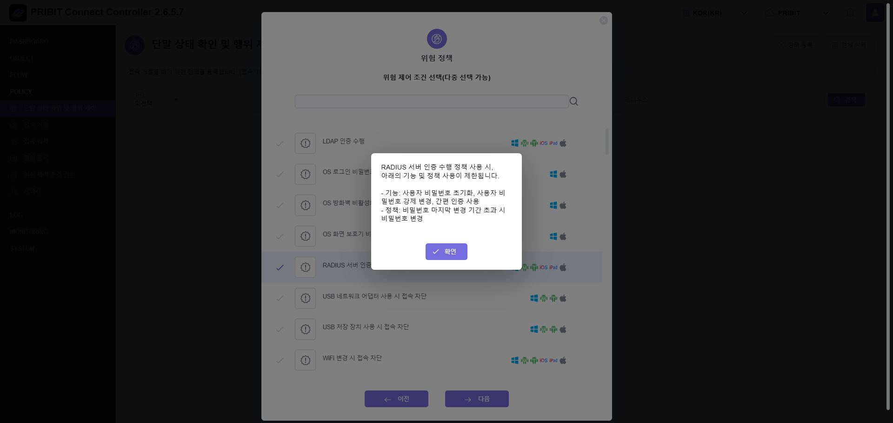  

> [!INFO]  
> RADIUS 서버 인증 수행 정책 사용 시, 아래의 기능 및 정책 사용이 제한됩니다.   
> - 기능: 사용자 비밀번호 초기화, 사용자 비밀번호 강제 변경, 간편 인증 사용   
> - 정책: 비밀번호 마지막 변경 기간 초과 시 비밀번호 변경    

RADIUS 서버 설정 

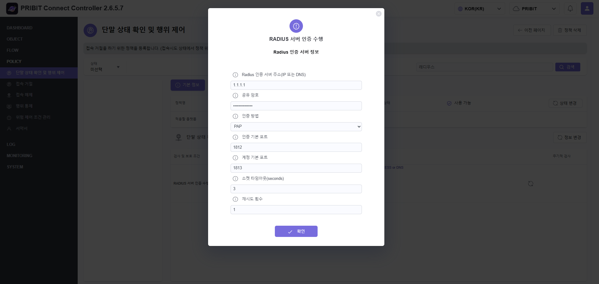  

- Radius 인증 서버 주소 (IP 또는 DNS)   
  - ex) 1.1.1.1 or (domain)  
- 공유 암호  
  - ex) \*\*\*\*\*\*\*\*\*\*\*\*\*  
- 인증 방법  
  - PAP, CHAP, MS-CHAP-v2, EAP-MSCHAP-v2 중 선택  
  - (현재 지원하는 인증 방식은 위 4가지만 지원)  
- 인증 기본 포트
  - Authentication 서버(RADIUS) 포트 정보를 입력  
  - ex) 1812  
- 계정 기본 포트  
  - Accouinting 서버(RADIUS) 포트 정보를 입력  
  - ex) 1813  
- 소켓 타임아웃(seconds)  
  - ex) 3   
- 재시도 횟수  
  - ex) 1  

<br>

### 연계 시스템 인증 수행 (Enforce Integrated System Authentication)
설명: 이 설정을 적용하면 연계된 외부 시스템의 인증을 통과해야만 접속할 수 있습니다.

연계 시스템 정보 입력 화면  

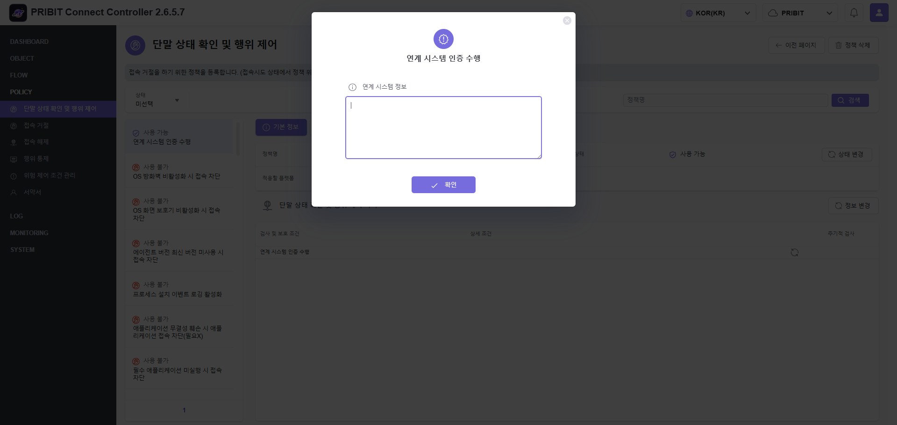  

> [!WARN]  
> 위 기능은 기술지원팀에 문의 하시기 바랍니다.  

---

## MFA(다중 인증) 정책

### 로그인 시 MFA 인증 요구 (Require MFA At Login)
설명: 이 설정을 적용하면 로그인 시 비밀번호 외에 추가 인증 수단(OTP, 생체인증 등)을 요구하여 보안을 강화합니다.

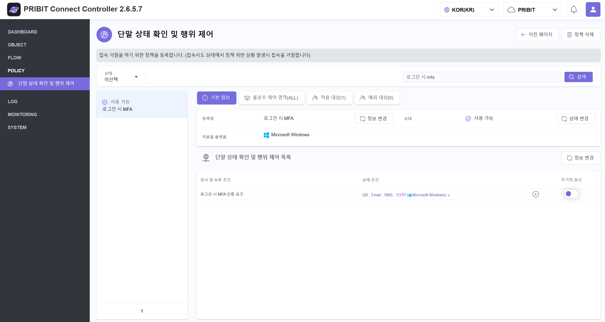  

사용할 인증 방식 설정  

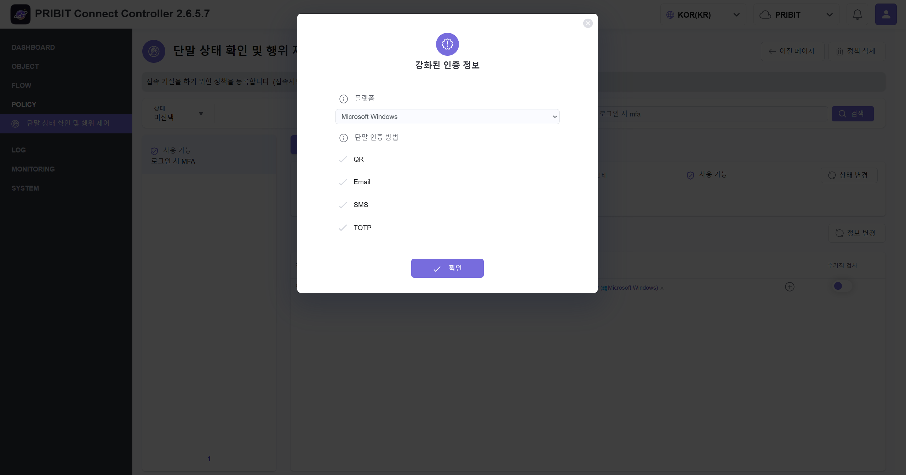  

정책 설정 후 PCA 에서 로그인 수행하면 OTP 인증을 수행할 방식을 선택 할 수 있습니다.  
OTP 인증 방식이 `한 가지`만 설정되어 있을 경우, OTP 코드는 해당 방식으로 바로 전송됩니다.  

<br>

### 데이터 플로우 접속 시 MFA 인증 요구 (Require MFA For Data Flow Access)
설명: 이 설정을 적용하면 데이터 플로우에 접속할 때 다중 인증을 거쳐야 접근이 가능합니다.

---

## OS 보안 정책

### OS 로그인 비밀번호 비활성화 시 접속 차단 (Block Access If OS Login Password Disabled)
설명: 이 설정을 적용하면 운영체제의 로그인 비밀번호가 설정되어 있지 않은 단말의 접속을 차단합니다.  

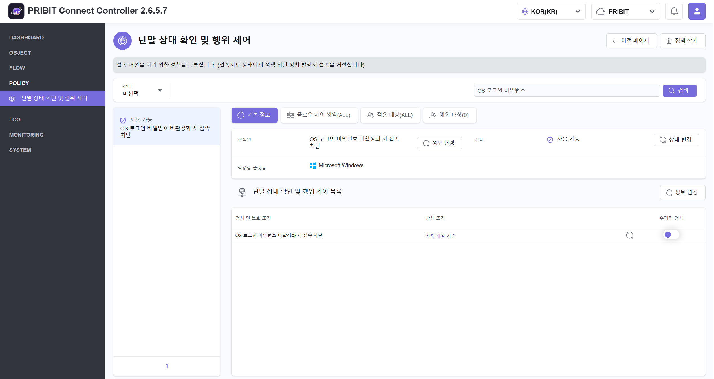  

이 정책에 위배되면 PCA 로그인 시 차단됩니다.  

차단 화면  

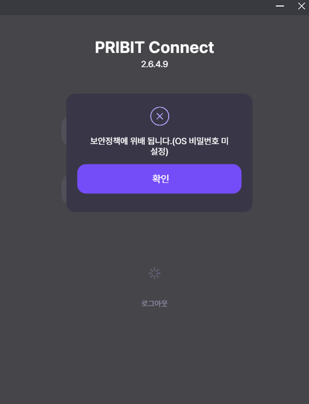  

<br>

### OS 방화벽 비활성화 시 접속 차단 (Block Access If OS Firewall Disabled)
설명: 이 설정을 적용하면 운영체제의 방화벽이 비활성화된 단말의 접속을 차단하여 네트워크 보안을 유지합니다.  

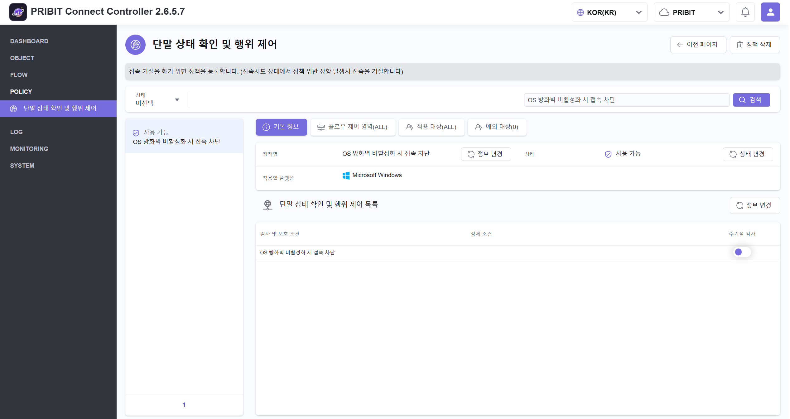

이 정책에 위배되면 PCA 로그인 시 차단됩니다.  

차단 화면  

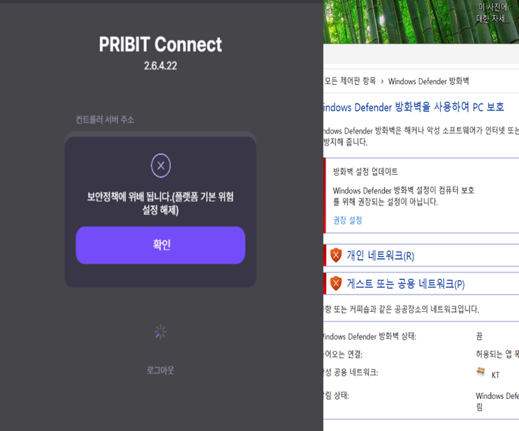  

<br>

### OS 화면 보호기 비활성화 시 접속 차단 (Block Access If OS Screen Saver Disabled)
설명: 이 설정을 적용하면 화면 보호기가 비활성화된 단말의 접속을 차단하여 무단 접근을 방지합니다.  

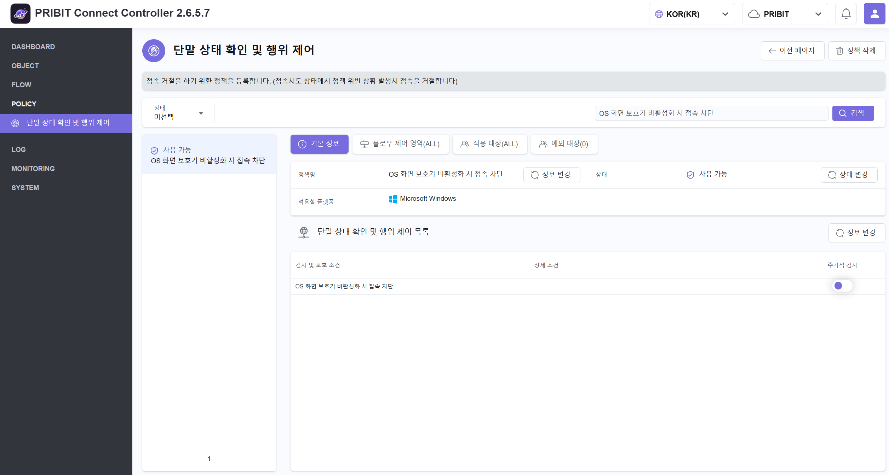  

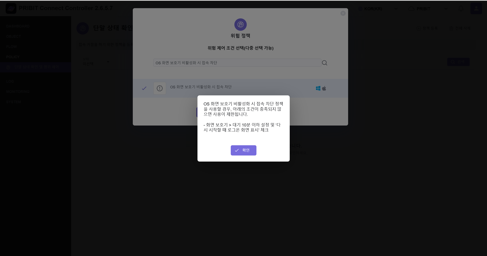  

> [!NOTE]  
> OS 화면 보호기 비활성화 시 접속 차단 정책을 사용할 경우, 아래의 조건이 충족되지 않으면 사용이 제한됩니다.  
> 화면 보호기 > 대기 10분 이하 설정 및 '다시 시작할 때 로그온 화면 표시' 체크  

이 정책에 위배되면 PCA 로그인 시 차단됩니다.  

차단 화면  

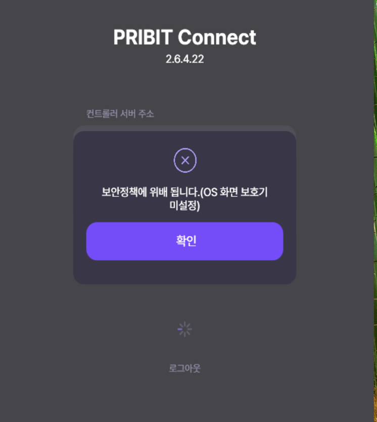  

<br>

### 지정 OS 버전 사용 시 접속 차단 (Block Access When Using Specific OS Version)
설명: 이 설정을 적용하면 보안상 취약하거나 지원이 종료된 특정 OS 버전을 사용하는 단말의 접속을 차단합니다.

지정 OS 버전 사용 시 접속 차단 상세 설정  

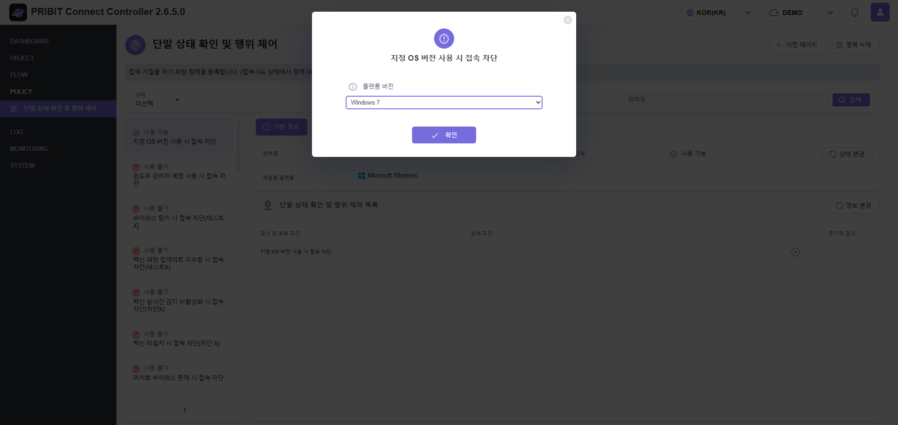  

- 플랫폼 버전:  
  - 현재 지원하는 플랫폼 버전은 `Windows 7`, `Windows 8`, `Windows 8.1`, `Windows 10` 입니다. 

차단 화면 

<br>

### 지정 OS 외 접속 차단 (Block Access On Non-Approved OS)
설명: 이 설정을 적용하면 승인된 운영체제 외의 OS를 사용하는 단말의 접속을 차단합니다.  

이 정책에 위배되면 PCA 로그인 시 차단됩니다.  

정책 상세 설정에서 허용할 OS 플랫폼을 선택  

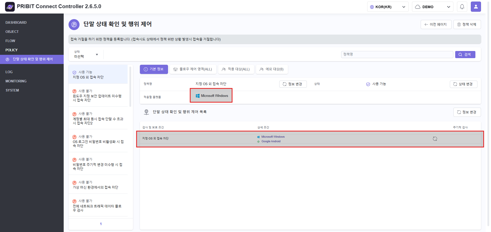  

허용할 플랫폼 선택 목록  
- Microsoft Windows  
- Apple MacOS  
- Google Android  
- Google Android Tablet  
- Apple iOS  
- Apple iPadOS  

단, 정책 생성에서 "적용할 플랫폼"에서 선택한 대상만 정책 상세 설정의 "지정 OS 외 접속 차단" 플랫폼의 영향이 있기 때문에, `차단할 플랫폼`과 `허용할 플랫폼`이 정책 생성 단계에서 반드시 적용할 플랫폼에 모두 포함되어 있어야 합니다.   

차단 화면  

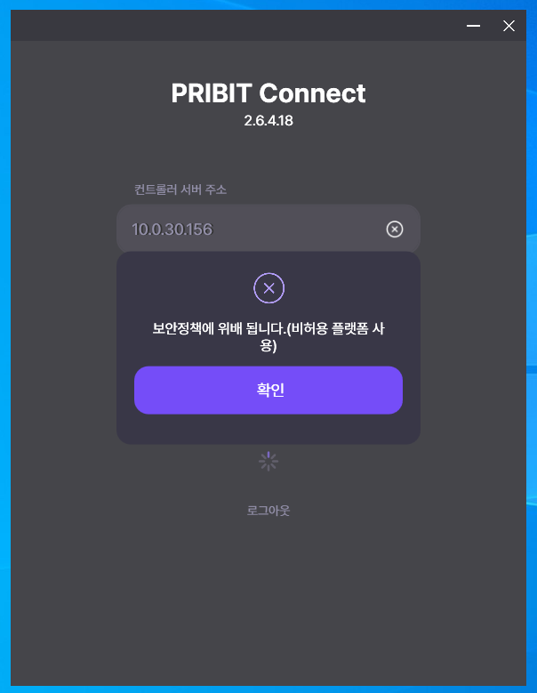  

<br>

### 윈도우 관리자 계정 사용 시 접속 차단 (Block Access When Using Windows Administrator Account)
설명: 이 설정을 적용하면 Windows 관리자 계정으로 로그인한 상태에서의 접속을 차단하여 권한 남용을 방지합니다.

차단 화면  

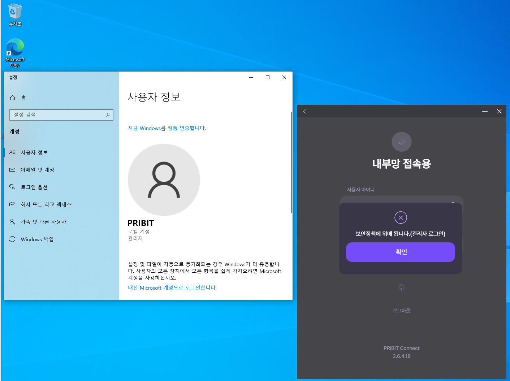

<br>

### 윈도우 지정 보안 업데이트 미수행 시 접속 차단 (Block Access If Required Windows Security Updates Not Applied)
설명: 이 설정을 적용하면 필수 Windows 보안 패치가 설치되지 않은 단말의 접속을 차단합니다.
이 정책에 위배되면 PCA 로그인 시 차단됩니다.  

윈도우 지정 보안 업데이트 미수행 시 접속 차단 정책 상세 조건 설정  


- 플랫폼 버전:  
  - 현재 지원하는 플랫폼 버전은 `Windows 7`, `Windows 8`, `Windows 8.1`, `Windows 10` 입니다. 
- 패치명(HotFixID): 
  - *ex)KB3565453*  


차단 화면  

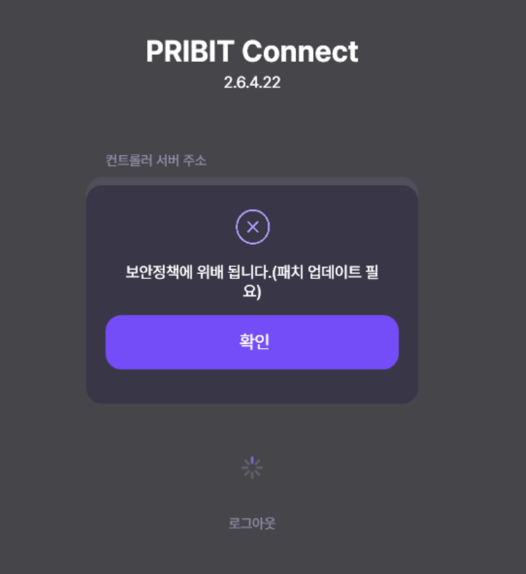

<br> 

---

<br><br>

## 백신 및 악성코드 정책

### 백신 미설치 시 접속 차단 (Block Access If Antivirus Not Installed)
설명: 이 설정을 적용하면 백신 프로그램이 설치되지 않은 단말의 접속을 차단합니다.

차단 화면 

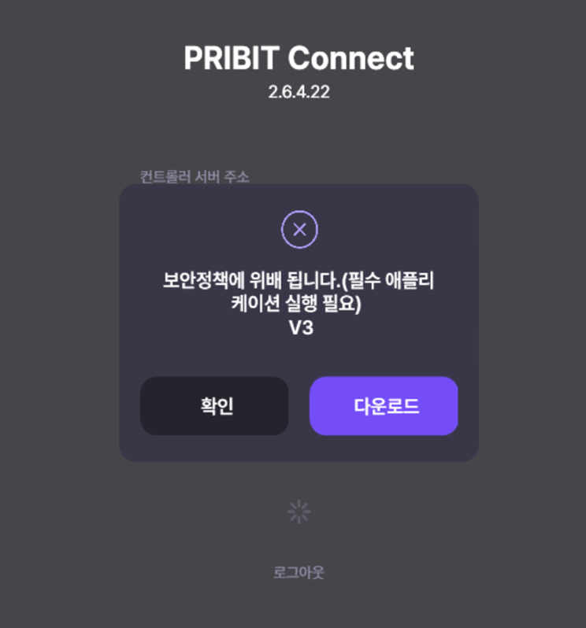

<br>

### 백신 실시간 감지 비활성화 시 접속 차단 (Block Access If Antivirus Real-Time Protection Disabled)
설명: 이 설정을 적용하면 백신의 실시간 감지 기능이 꺼져 있는 단말의 접속을 차단합니다.

> [!NOTE]  
> 차단 동작 없음 확인 필요 

차단 화면  

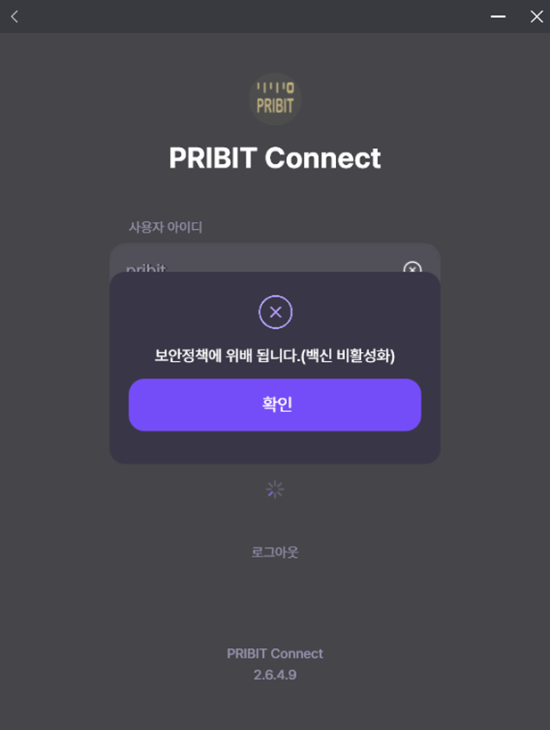

<br>

### 백신 패턴 업데이트 미수행 시 접속 차단 (Block Access If Antivirus Definitions Outdated)
설명: 이 설정을 적용하면 백신 패턴이 최신 상태로 업데이트되지 않은 단말의 접속을 차단합니다.

백신 패턴 업데이트 미수행 시 접속 차단 상세 설정


백신 패턴 업데이트 미수행 시 접속 차단 시간 정보  
- 범위 : 최소 1 (시)  
- 권장 범위 : 1 ~ 2160  

업데이트 만료 시간
- *ex) 0*

차단 화면  

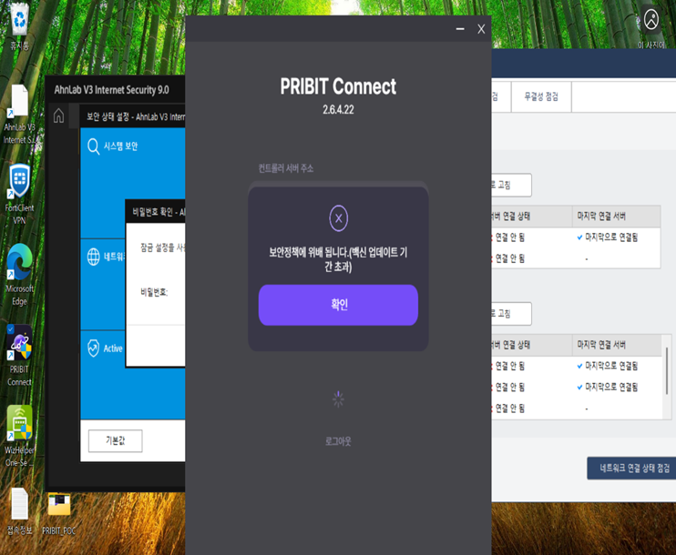

<br>

### 바이러스 탐지 시 접속 차단 (Block Access On Virus Detection)
설명: 이 설정을 적용하면 단말에서 바이러스가 탐지된 경우 즉시 접속을 차단합니다.

> [!NOTE]  
> 테스트용 바이러스 프로그램 만들기  
> 1. 바탕화면에서 [마우스 오른쪽을 클릭] > [새로 만들기] > [텍스트 문서] 를 순서대로 선택합니다.  
> 2. 새로 만들어진 텍스트 문서에 임시로 아무 이름을 지어 줍니다. *ex) inspect_virus_test*
> 3. 새로 만든 텍스트 문서를 열어주고 다음 값을 저장합니다.  
>   X5O!P%@AP[4\PZX54(P^)7CC)7}$EICAR-STANDARD-ANTIVIRUS-TEST-FILE!$H+H*  
> 4. 입력을 마치신 후 [파일] > [다른 이름으로 저장]을 선택합니다. 
> 5. 파일 형식을 `모든 파일`로 하신 후 저장합니다. 
> 6. 백신 프로그램(또는 Windows Defender)에서 실시간으로 파일을 검사하고 있다면, 해당 파일을 감지하여 알림을 발생시킵니다.  

PCA 접속 시 차단 화면   

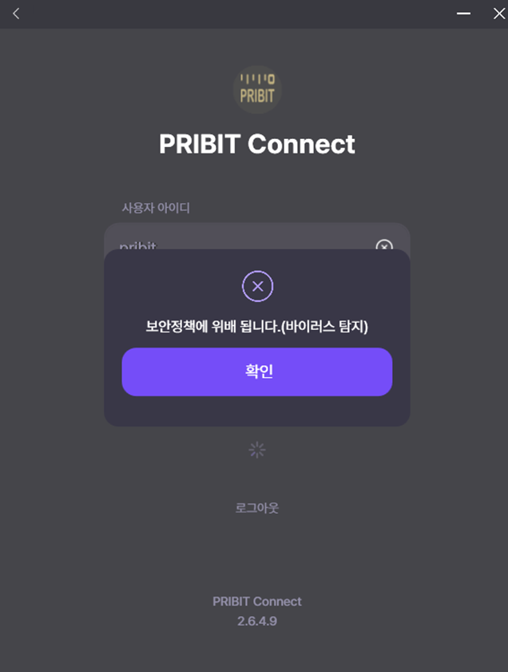

<br>

### 미치료 바이러스 존재 시 접속 차단 (Block Access If Untreated Virus Detected)  
설명: 이 설정을 적용하면 치료되지 않은 바이러스가 단말에 존재하는 경우 접속을 차단합니다.  

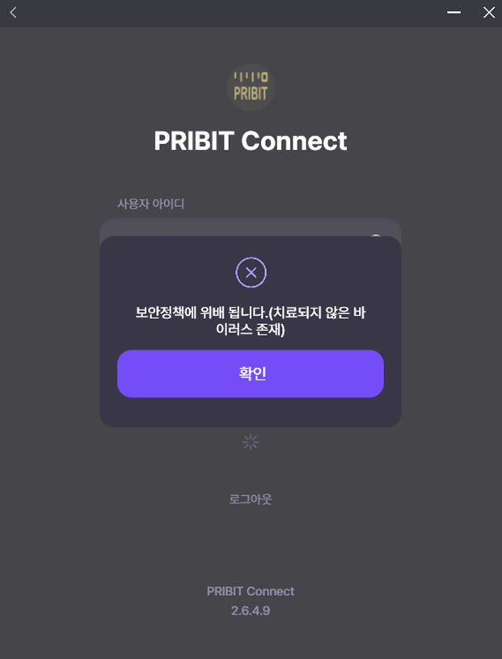  

미치료 바이러스가 Windows Defender 에 탐지되면 일반적인 방법으로는 삭제가 되지 않습니다.  

아래 방법으로 진행합니다.  
윈도우 안전모드로 접속해서 아래 경로로 접근합니다.  
```윈도우 안전모드 접근 방법 Win + R ```   
msconfig 명령 입력 후 부팅 탭에서 안전모드 선택 후 재부팅합니다. 
```
C:/ProgramData/Microsoft/Windows Defender/Scans/History/Service/DetectionHistory  
```
안전모드에 접속하지 않으면 위 경로에 접근이 안됩니다.  
해당 경로로 접근 후 안에 있는 내용들을 모두 깔끔하게 삭제해줍니다.  
그리고, 다시 일반 재부팅하여 접속합니다. 

> [!NOTE]  
> WMI 서비스 활성화  
> WMI 서비스의 상태가 시작됨으로 되어 있어야 합니다.   
> 백신 프로그램에서 해당 영역에 MSFT_MpThreatDetection 값을 주지 않으면 확인이 불가합니다.  

> [!NOTE]  
> WMI란?	
> - Windows Management Instrumentation의 약자.  
> - Windows 운영 체제에서 관리 및 모니터링 데이터를 제공하는 레임워크.  
> - 시스템 구성, 상태, 성능 및 보안 관련 정보를 쿼리하고 관리할 수 있도록 지원.  
> - PowerShell, VBScript, Python 등에서 사용 가능.  

<br>

---

<br><br>

## 네트워크 정책

### WiFi 사용 접속 시 접속 차단 (Block Access On WiFi Connection)
설명: 이 설정을 적용하면 WiFi 네트워크를 통한 접속을 모두 차단합니다.

### WiFi 변경 시 접속 차단 (Block Access On WiFi Change)
설명: 이 설정을 적용하면 접속 중 WiFi 네트워크가 변경될 경우 접속을 차단합니다.

### 비인가 WiFi 사용 시 접속 차단 (Block Access On Unauthorized WiFi Use)
설명: 이 설정을 적용하면 승인되지 않은 WiFi 네트워크를 사용하는 경우 접속을 차단합니다. 

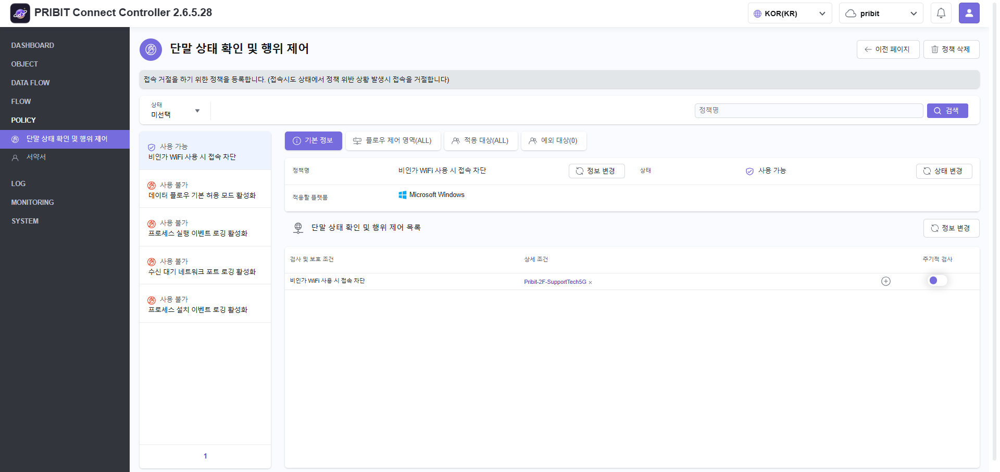

차단할 WiFi SSID 를 입력합니다. 

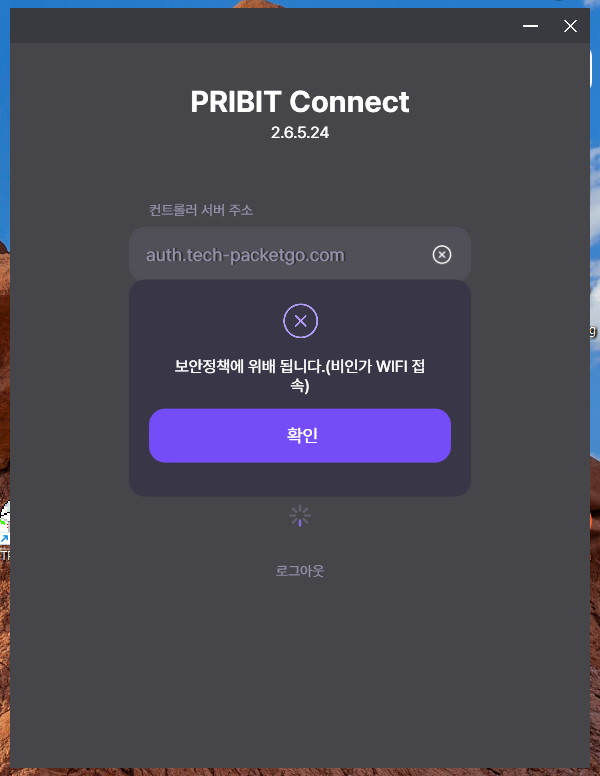  

차단 목록에 있는 SSID 로 에이전트 접속 시 차단합니다. 

<br>  

### 인가된 WiFi 외 사용 시 접속 차단 (Block Access Outside Approved WiFi)
설명: 이 설정을 적용하면 승인된 WiFi 목록에 없는 네트워크 사용 시 접속을 차단합니다.

### 미승인 WiFi 사용 시 승인 요청 및 접속 차단 (Require Approval And Block Access For Unapproved WiFi) 
설명: 이 설정을 적용하면 미승인 WiFi 사용 시 관리자에게 승인 요청을 보내고 승인 전까지 접속을 차단합니다.  

미승인 WiFi(Router)에서 접속 시도 시 관리자에게 승인 요청 화면  

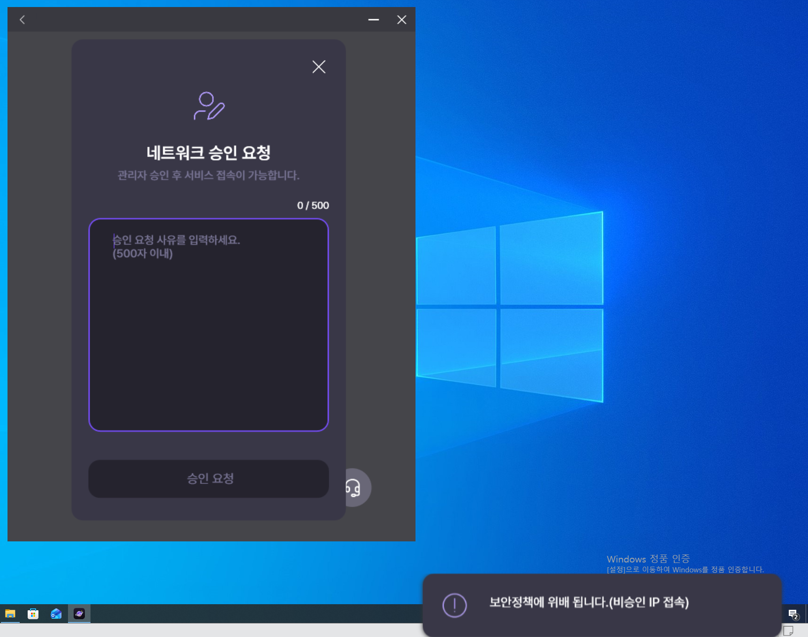  

사유를 입력하고 `승인 요청`을 합니다.  

> [!NOTE]  
> 사유 입력 시 엔터 입력 불가  

관리자가 사유를 확인하고 `사용 승인` 처리 해주면 이 후 사용자가 다시 재 접속 시 정상적으로 접속이 됩니다.  

<br>

### 모바일 네트워크 사용 시 접속 차단 (Block Access On Mobile Network Use)
설명: 이 설정을 적용하면 모바일 데이터 네트워크(LTE, 5G 등)를 통한 접속을 차단합니다.

### 모바일 캐리어 변경 시 접속 차단 (Block Access On Mobile Carrier Change)
설명: 이 설정을 적용하면 모바일 통신사가 변경된 경우 접속을 차단합니다.

### 테더링 사용 접속 시 접속 차단 (Block Access When Tethering Is Used)
설명: 이 설정을 적용하면 테더링을 통한 네트워크 연결 시 접속을 차단합니다.


### 다중 네트워크 인터페이스(NIC) 사용 시 접속 차단 (Block Access When Multiple NICs Are Used)  

설명: 이 설정을 적용하면 여러 개의 네트워크 인터페이스가 동시에 활성화된 경우 접속을 차단하여 데이터 유출 경로를 차단합니다.  

예외) *PRIBIT TAP-Windows Adapter V9 어댑터 제외*

사용자는 윈도우 설정의 네트워크 연결(네트워크 어댑터 설정; ncpa.cpl)에서 필요하지 않은 어댑터들의 상태를 `사용 안 함` 으로 변경해야 합니다. 

여러개의 네트워크 어댑터 사용  

  

<br>

PCA 에서 차단 화면  

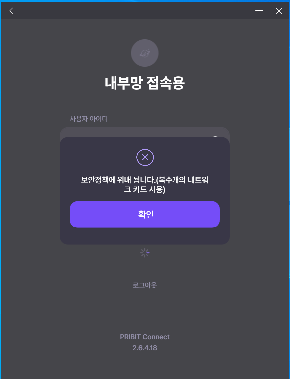  

<br> 

### 단말의 IP 변경 시 접속 차단 (Block Access On Device IP Change)  

설명: 이 설정을 적용하면 PCA 접속 중 단말의 IP주소(**PRIBIT TAP-Windows Adapter V9 어댑터의 IP 주소**)가 변경될 경우 접속을 차단합니다.  

사용자 단말에서 IP를 강제로 변경 시  


<br>

### 인가된 IP 대역 외 접속 차단 (Block Access Outside Approved IP Ranges)
설명: 이 설정을 적용하면 승인된 IP 대역 외의 네트워크에서 접속을 시도할 경우 차단합니다.  

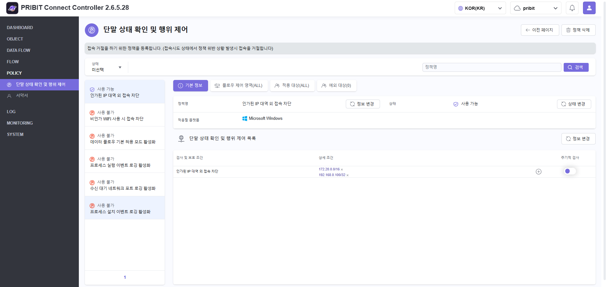 

- ex) 192.168.0.0/24 와 같이 IP 주소 범위로 설정값을 입력해야 합니다. 

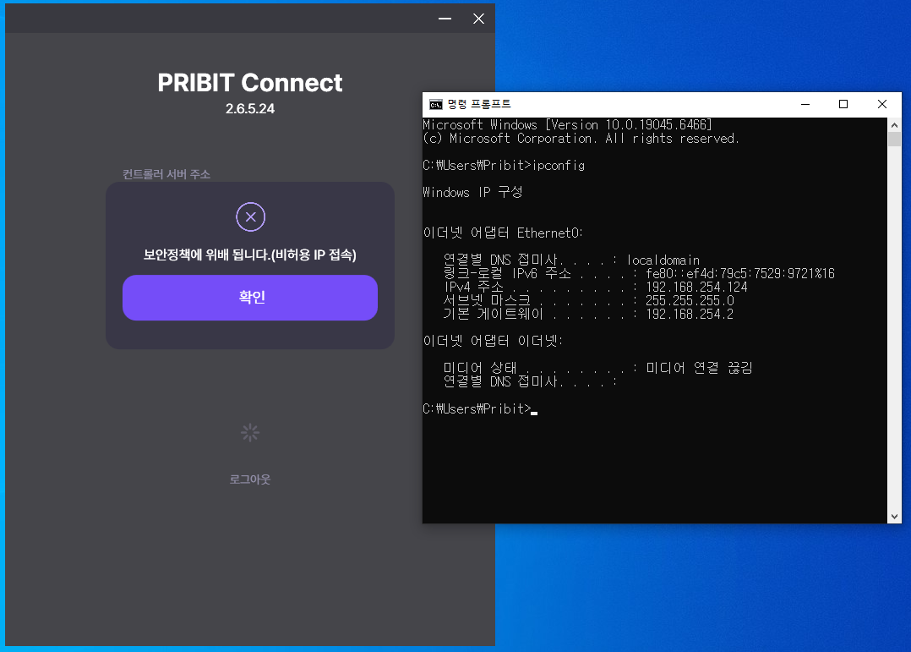 

사용자 PC 의 로컬 IP를 설정값과 비교합니다. 

<br> 

### 미승인 IP 접속 시 승인 요청 및 접속 차단 (Require Approval And Block Access For Unapproved IPs)
설명: 이 설정을 적용하면 미승인 IP에서 접속 시도 시 관리자에게 승인 요청을 보내고 승인 전까지 접속을 차단합니다.

미승인 IP에서 접속 시도 시 관리자에게 승인 요청 화면  

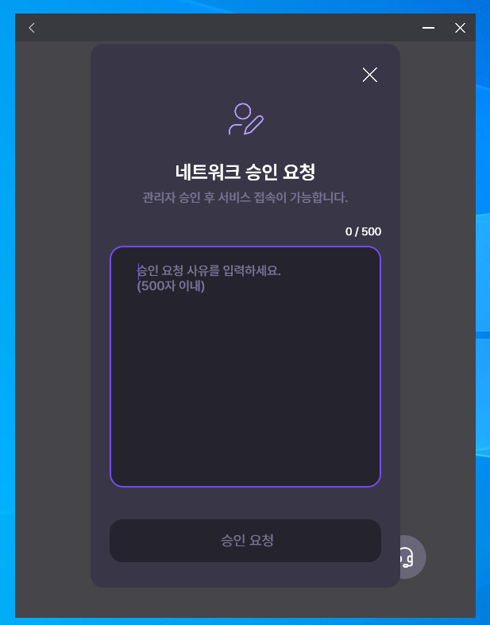   

사유를 입력하고 `승인 요청`을 합니다.  

> [!NOTE]  
> 사유 입력 시 엔터 입력 불가  

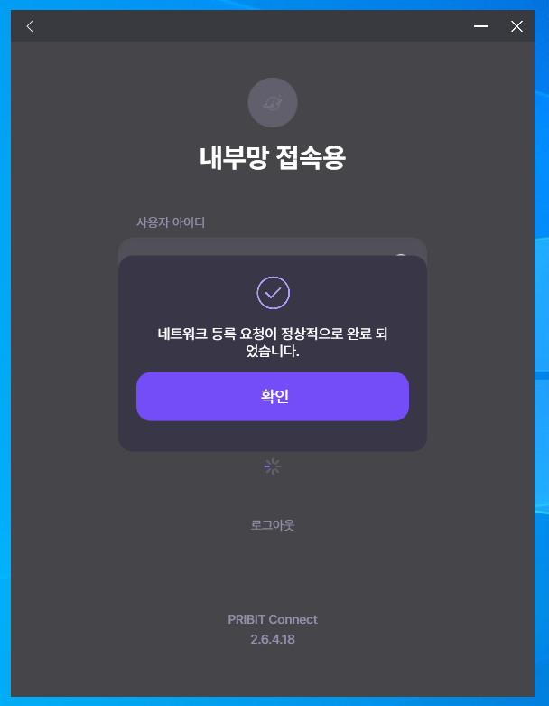  

관리자가 사유를 확인하고 `사용 승인` 처리 해주면 이 후 사용자가 다시 재 접속 시 정상적으로 접속이 됩니다.  

<br>

### 비인가 네트워크 포트 사용 시 접속 차단 (Block Access When Unauthorized Network Ports Used)
설명: 이 설정을 적용하면 승인되지 않은 네트워크 포트를 사용하는 경우 접속을 차단합니다.

상세 설정 

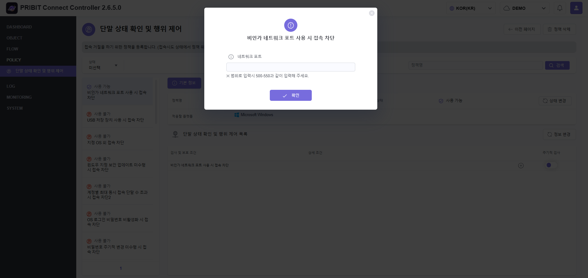

네트워크 포트 입력 
- ex) 80 or 5000-15000

Windows 주요 취약 포트  
- 21 (FTP) - 평문 파일 전송  
- 23 (Telnet) - 암호화되지 않은 원격 접속  
- 135 (RPC) - 취약점 공격 대상  
- 139 (NetBIOS) - 정보 유출 위험  
- 445 (SMB) - 랜섬웨어 주요 경로  
- 3389 (RDP) - 무차별 대입 공격 대상  
- 5900 (VNC) - 원격 제어 프로그램  

차단 화면 

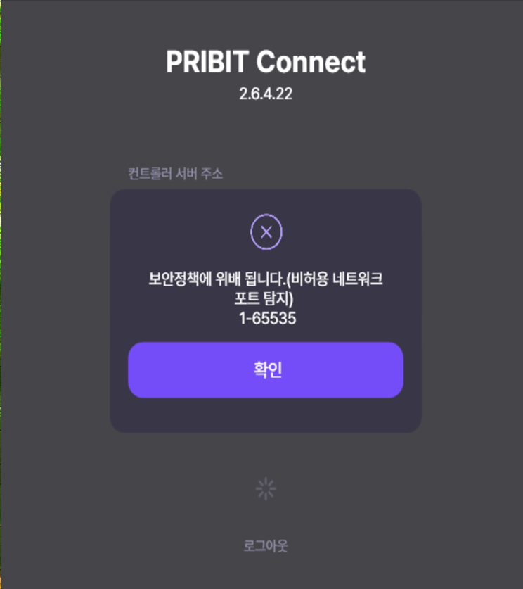

<br>

---

<br><br>

## USB 및 외부 장치 정책

### USB 저장 장치 사용 시 접속 차단 (Block Access When USB Storage Device Used)
설명: 이 설정을 적용하면 USB 메모리, 외장 하드 등 USB 저장 장치가 연결된 단말의 접속을 차단하여 데이터 유출을 방지합니다.  

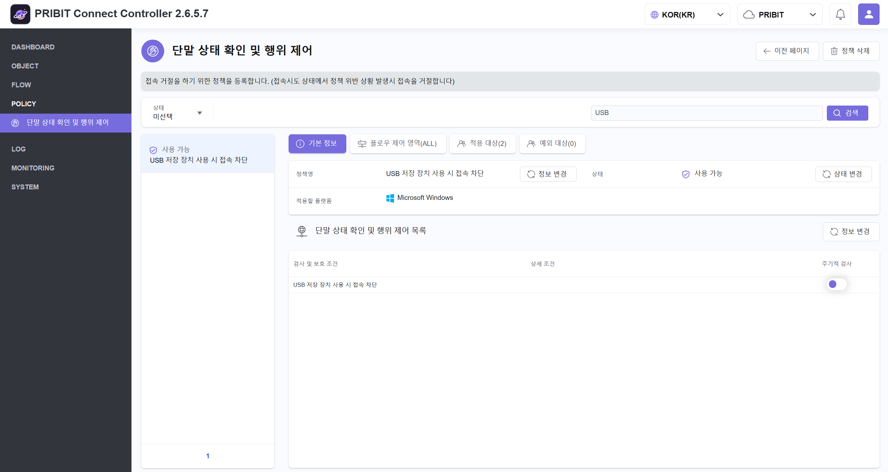  

차단 화면 

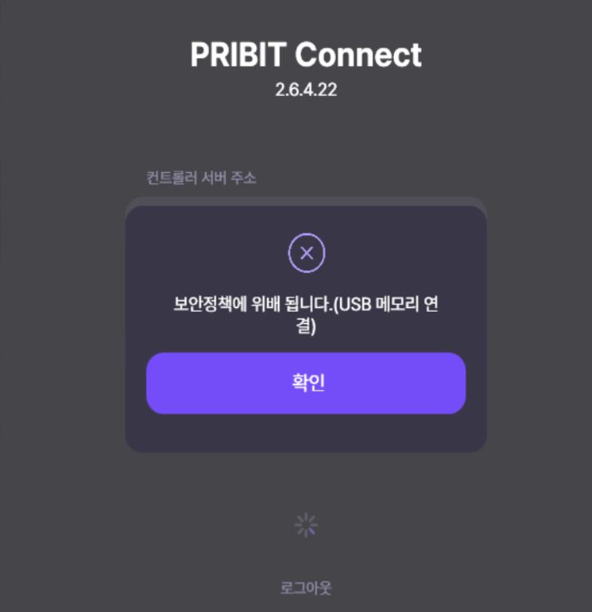  

<br>

### USB 네트워크 어댑터 사용 시 접속 차단 (Block Access When USB Network Adapter Used)
설명: 이 설정을 적용하면 USB 네트워크 어댑터가 연결된 경우 접속을 차단하여 비인가 네트워크 경로 사용을 방지합니다.

<br>

---

<br><br>

## 애플리케이션 정책

### 비인가 애플리케이션 설치 시 접속 차단 (Block Access If Unauthorized Application Installed)
설명: 이 설정을 적용하면 승인되지 않은 애플리케이션이 설치된 단말의 접속을 차단합니다.

비인가 애플리케이션 설치 시 접속 차단 상세 설정  

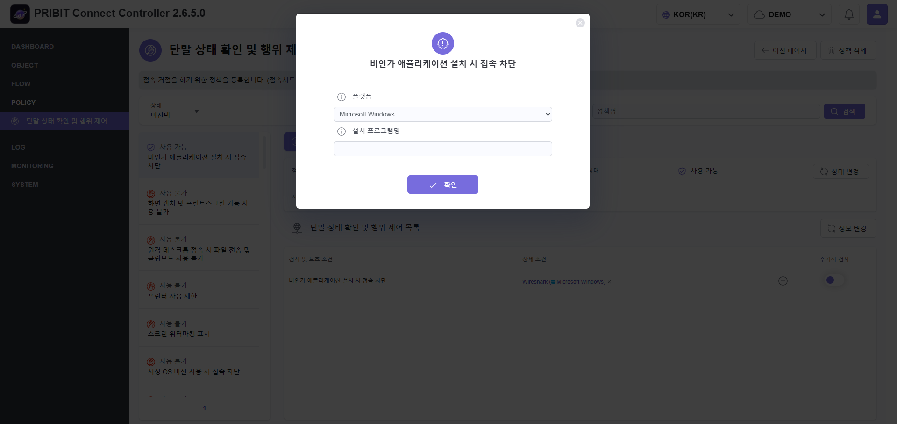

플랫폼 *(Windows 만 지원)*  
- [x] Microsoft Windows  
설치 프로그램명 
- *ex) Wireshark 4.6.0 x64*  

> [!NOTE]  설치 프로그램명 확인 방법  
> Windows 의 설정 > 앱 및 기능 > 설치 목록 확인  
> 반드시 설치 목록에 보이는 설치된 프로그램 명 전체를 입력해야 합니다.  

차단 화면 

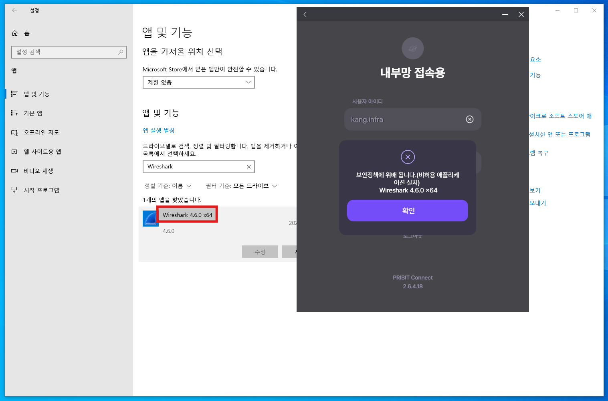

<br>

### 비인가 애플리케이션 실행 시 접속 차단 (Block Access When Unauthorized Application Is Running)
설명: 이 설정을 적용하면 승인되지 않은 애플리케이션이 실행 중인 경우 접속을 차단합니다.  

비인가 애플리케이션 실행 시 접속 차단 상세 설정  

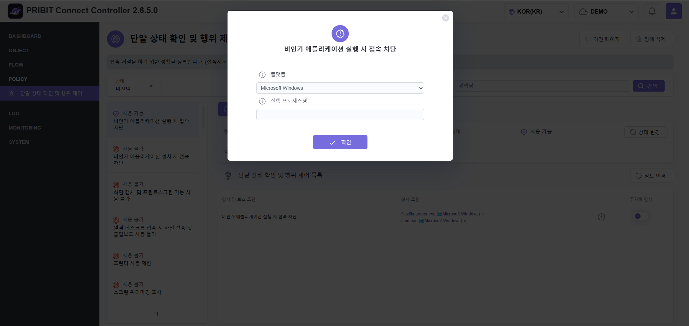

플랫폼 *(Windows, MAC OS 지원)*  
- [x] Microsoft Windows  *`default`*  
- [ ] Apple MacOS  
실행 프로세스명  
- *ex) msedge.exe*  

> [!NOTE]  
> 실행 프로세스명 확인 방법 (Windows)  
> 
> Windows 의 작업관리자를 실행합니다.  
> 실행되고 있는 프로세스의 속성을 열어 실행 파일의 이름을 확인합니다.  
> 예) MS Edge 는 실행파일 이름은 msedge 이고, 파일 형식은 exe 따라서, 실행 프로세스명은 `msedge.exe` 가 됩니다.  
> 반드시 프로그램 실행 파일명 전체를 입력해야 합니다.  

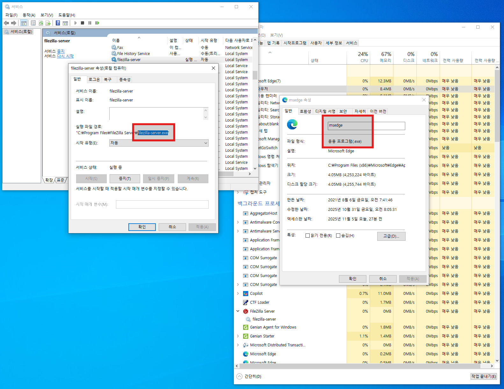  

> [!INFO] 
> Windows 주요 점검 대상 프로세스   
> 
> 1. 원격 접속 및 제어 도구 (합법적이지만 악용 가능한 원격 제어 프로그램) 
> TeamViewer.exe - 원격 데스크톱 제어  
> AnyDesk.exe - 원격 접속 도구  
> vnc.exe, vncserver.exe - VNC 서버  
> RemotePC.exe - 원격 PC 접속  
> LogMeIn.exe - 원격 관리 도구  
> ammyy.exe - Ammyy Admin 원격 제어  
> supremo.exe - Supremo 원격 데스크톱  
> rustdesk.exe - RustDesk 오픈소스 원격 제어  
>   
> 2. FTP/SFTP 서버 프로그램 (파일 전송 서버 (데이터 유출 위험))  
> filezilla-server.exe - FileZilla FTP 서버  
> ftpd.exe - 일반 FTP 데몬  
> wftpd.exe - Windows FTP 서버  
> serv-u.exe - Serv-U FTP 서버  
> gftp.exe - Gene6 FTP 서버  
> 3cdaemon.exe - 3Com FTP 서버  
> winscp.exe - WinSCP (SFTP 클라이언트이지만 자동화 가능)  
>   
> 3. 원격 관리 및 SSH 도구 (터미널 접속 및 원격 셸)  
> sshd.exe - OpenSSH 서버  
> putty.exe - SSH 클라이언트 (스크립트 실행 가능)  
> plink.exe - PuTTY 명령줄 연결 도구  
> psexec.exe - PsExec (원격 명령 실행)  
> psexesvc.exe - PsExec 서비스  
>   
> 4. 네트워크 터널링 및 프록시 (네트워크 우회 도구)  
> ngrok.exe - 로컬 서버를 외부에 노출  
> frpc.exe, frps.exe - FRP 터널링  
> chisel.exe - HTTP 터널링  
> proxifier.exe - 프록시 클라이언트  
> tor.exe - Tor 브라우저/네트워크  
> stunnel.exe - SSL 터널링  
> plink.exe - SSH 터널링  
>   
> 5. 파일 공유 및 동기화 (클라우드 동기화 (데이터 유출 가능))  
> Dropbox.exe - 드롭박스  
> GoogleDriveFS.exe - 구글 드라이브  
> OneDrive.exe - 원드라이브 (회사 정책에 따라)  
> Resilio Sync.exe - P2P 동기화  
> Syncthing.exe - 오픈소스 동기화  
> Nextcloud.exe - Nextcloud 클라이언트  
> rclone.exe - 클라우드 스토리지 동기화 도구  
>   
> 6. 스크린 캡처 및 녹화 (화면 및 키로깅 가능)  
> ShareX.exe - 스크린샷 도구  
> OBS64.exe, obs32.exe - OBS Studio 녹화  
> CamRecorder.exe - 캠 녹화  
> Bandicam.exe - 화면 녹화  
> keylogger.exe - 키로거 (명백한 악성)  
>   
> 7. 개발 도구 및 인터프리터 (스크립트 실행 가능 (악용 가능))  
> python.exe, pythonw.exe - Python 인터프리터  
> powershell.exe - PowerShell (정책 외 사용 시)  
> cmd.exe - 명령 프롬프트 (제한적 사용 시)  
> wscript.exe, cscript.exe - Windows Script Host  
> mshta.exe - HTML Application Host  
> node.exe - Node.js  
> php.exe - PHP 인터프리터  
> ruby.exe - Ruby 인터프리터  
>   
> 8. 웹 서버 프로그램 (내부 서버 실행 (백도어 가능))  
> httpd.exe, apache.exe - Apache 웹 서버  
> nginx.exe - Nginx 웹 서버  
> lighttpd.exe - Lighttpd 서버  
> mongoose.exe - Mongoose 웹 서버  
> python.exe -m http.server - Python HTTP 서버  
>   
> 9. 데이터베이스 서버  (데이터 저장 및 유출 위험)  
> mysqld.exe - MySQL 서버  
> postgres.exe - PostgreSQL  
> mongod.exe - MongoDB 서버  
> redis-server.exe - Redis 서버  
>   
> 10. 네트워크 스캐닝 도구 (네트워크 정찰 도구)  
> nmap.exe - 포트 스캐너  
> wireshark.exe - 패킷 분석기  
> tcpdump.exe - 패킷 캡처  
> angry-ip-scanner.exe - IP 스캐너  
> netcat.exe, nc.exe - 네트워크 유틸리티  
>   
> 11. 암호/복호화 도구 (암호화 우회 가능)  
> mimikatz.exe - 자격 증명 추출 (명백한 해킹 도구)  
> john.exe - 비밀번호 크랙  
> hashcat.exe - 해시 크랙  
>   
> 12. 시스템 관리 도구 (악용 가능)  
> pslist.exe - 프로세스 목록  
> psinfo.exe - 시스템 정보  
> regedit.exe - 레지스트리 편집기 (정책 외 사용)  
> netsh.exe - 네트워크 설정 변경  
> sc.exe - 서비스 제어  

PCA 에서 차단 화면

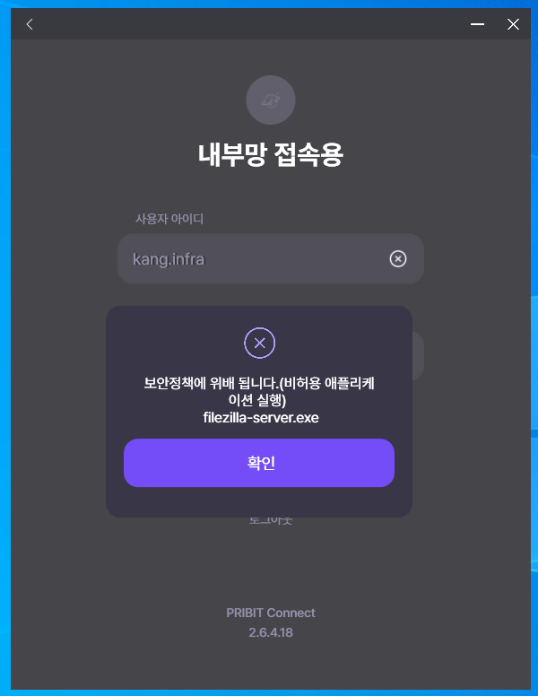

<br>

### 비인가 애플리케이션 실행 방지 및 강제 종료 (Prevent And Force-Stop Unauthorized Application Execution)
설명: 이 설정을 적용하면 비인가 애플리케이션의 실행을 원천적으로 차단하고 이미 실행 중인 경우 강제로 종료시킵니다.

비인가 애플리케이션 실행 방지 및 강제 종료 상세 설정  

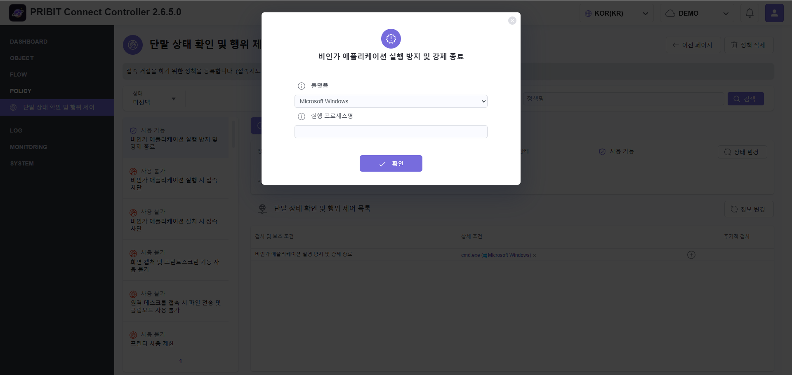

상세 설정 내용은 [비인가 애플리케이션 실행 시 접속 차단](#비인가-애플리케이션-실행-시-접속-차단-block-access-when-unauthorized-application-is-running) 설정과 동일합니다.  

> [!NOTE]  `비인가 애플리케이션 실행 시 접속 차단` VS `비인가 애플리케이션 실행 방지 및 강제 종료`  
> 
> `비인가 애플리케이션 실행 시 접속 차단`  
> - 사용자 로그인 시 비인가 애플리케이션이 실행중이면 접속을 차단하여 사용자의 로그인 자체를 차단합니다.  
> - **주기적 검사** 옵션을 사용할 수 있습니다.  
>   
> `비인가 애플리케이션 실행 방지 및 강제 종료`  
> - 사용자 로그인 시 비인가 애플리케이션을 강제 종료 시키고 로그인을 수행합니다.  

<br>  

### 필수 애플리케이션 미설치 시 접속 차단 (Block Access If Required Applications Not Installed)
설명: 이 설정을 적용하면 필수로 지정된 애플리케이션이 설치되지 않은 단말의 접속을 차단합니다.

필수 애플리케이션 미설치 시 접속 차단 상세 설정  

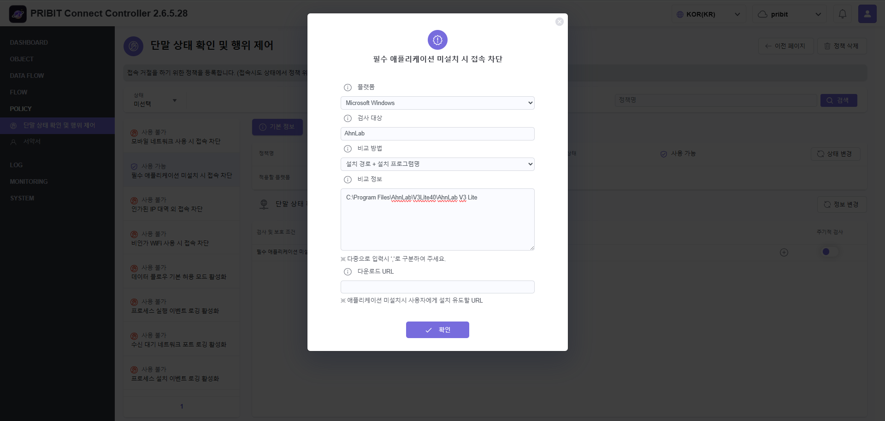

플랫폼 *(Windows, MAC OS, Android 지원)*  
- [x] Microsoft Windows *`default`*  
- [ ] Apple MacOS  
- [ ] Google Android  
- [ ] Google Android Tablet  
검사 대상  
- *ex) AhnLab V3 Lite*  
비교 방법  
- [x] 설치 경로 + 설치 프로그램명 *`default`*  
- [ ] 설치 프로그램명  
비교 정보  
- *ex) C:\Program Files\AhnLab\V3Lite40\AhnLab V3 Lite*  
다운로드 URL  
- *ex) (blank)*  

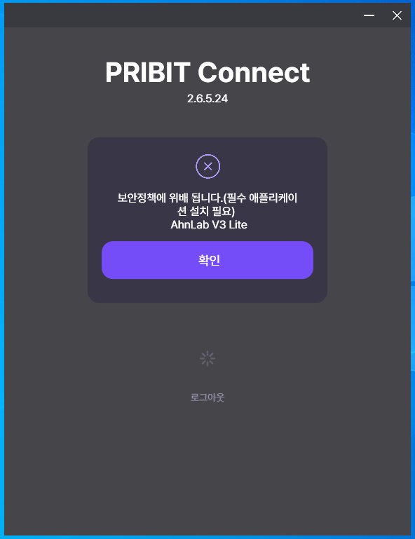  

> [!INFO]  
> 검사 대상  
> - 화면에 표시될 필수 프로그램 이름을 입력합니다.  
>  
> 비교 방법  
> - 설치 경로 + 설치 프로그램명 선택  
>   설치 프로그램이 설치된 경로 + 시스템 설정의 프로그램 추가 제거에서 표시되는 프로그램명을 입력합니다.  
> - 설치 프로그램명 선택  
>   시스템 설정의 프로그램 추가 제거에서 표시되는 프로그램명만 입력합니다.  
>  
> 다운로드 URL  
> - 설치되어야 하는 필수 프로그램의 설치 파일을 다운로드 할 수 있는 URL 정보를 입력합니다.  

<br> 

### 필수 애플리케이션 미실행 시 접속 차단 (Block Access If Required Applications Not Running)  
설명: 이 설정을 적용하면 필수 애플리케이션이 실행되지 않은 상태에서의 접속을 차단합니다.  

필수 애플리케이션 미실행 시 접속 차단 상세 설정  

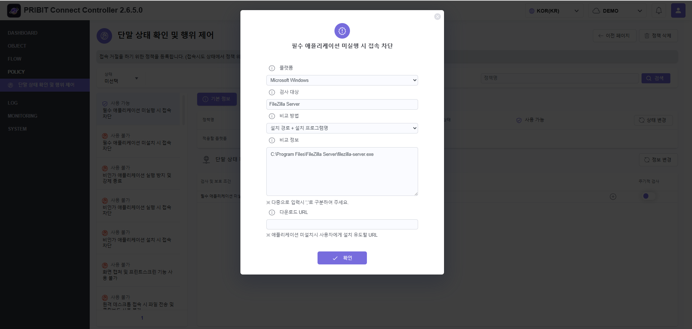  

플랫폼 *(Windows, MAC OS 지원)*  
- [x] Microsoft Windows *`default`*  
- [ ] Apple MacOS  
검사 대상  
- *ex) FileZilla Server*  
비교 방법  
- [x] 설치 경로 + 설치 프로그램명 *`default`*  
- [ ] 설치 프로그램명  
비교 정보  
- *ex) C:\Program Files\FileZilla Server\filezilla-server.exe*   
다운로드 URL  
- *ex) (blank)*  

> [!INFO]  
> 검사 대상  
> - 화면에 표시될 필수 프로그램 이름을 입력합니다.  
>  
> 비교 방법  
> - 설치 경로 + 설치 프로그램명 선택  
>   설치 프로그램이 설치된 경로 + 실행 프로그램명(확장자 포함)을 입력합니다.  
> - 설치 프로그램명 선택  
>   실행 프로그램명(확장자 포함)을 입력합니다.  
>  
> 다운로드 URL  
> - 설치되어야 하는 필수 프로그램의 설치 파일을 다운로드 할 수 있는 URL 정보를 입력합니다.  

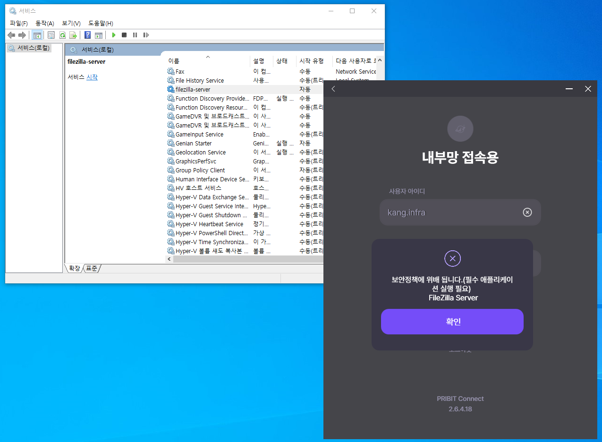  

<br>

### 애플리케이션 무결성 훼손 시 애플리케이션 접속 차단 (Block Access To Applications With Tampered Integrity)
설명: 이 설정을 적용하면 PCA 애플리케이션 파일이 변조되거나 무결성이 훼손된 경우 해당 애플리케이션 접속을 차단합니다.

> [!INFO] 통신 애플리케이션에 실행 위치 비교 값 등록  
> Object > 통신 애플리케이션 > 애플리케이션 유효성 검사 정보 > 실행 위치 비교 값을 등록해주어야 해당 정책을 적용할 수 있습니다.  

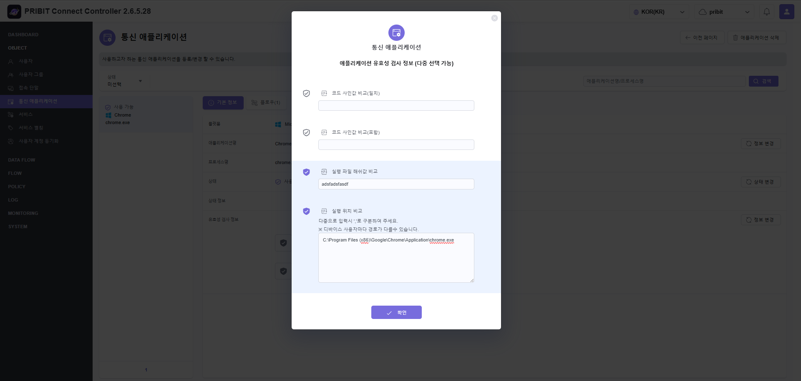

- 실행 파일 해쉬값 비교
  ex) Chrome.exe -> b430638d ... 63b756b0d  

> [!INFO] 실행 해쉬값 비교 방법 
>  ApplicationInfo_v2.1_dotnet 에서 프로그램 실행파일을 지정하고 Hash, Signature 값을 추출하여 사용합니다.  

PCA 에서 접속 차단 화면  

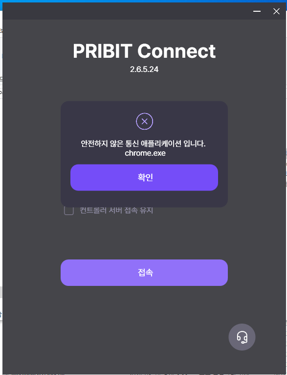

<br>

### 플로우 제어 영역 외 애플리케이션 접속 차단 (Block Access To Applications Outside Flow Control Zones)

설명: 이 설정을 적용하면 플로우 제어 영역으로 지정되지 않은 애플리케이션(또는 IP 대역)에 대한 접속을 차단합니다.

플로우 제어 영역 외 애플리케이션 접속 차단 및 알람 화면  


<br>

---

## 단말 및 접속 관리 정책

### 미승인 단말 접속 시 승인 요청 및 접속 차단 (Require Approval And Block Access For Unapproved Devices)
설명: 이 설정을 적용하면 승인되지 않은 단말에서 접속 시도 시 관리자에게 승인 요청을 보내고 승인 전까지 접속을 차단합니다.

미승인 단말(Device)의 허용(인증) 방법 및 모바일 단말의 옵션들을 설정합니다. 

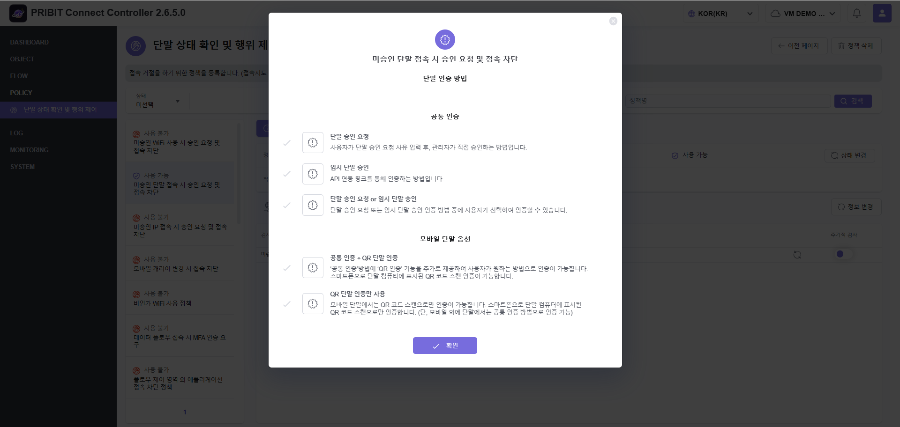

[공통 인증]  
- [x] 단말 승인 요청  *`default`*
- [ ] 임시 단말 승인  
- [ ] 단말 승인 요청 or 임시 단말 승인  

[모바일 단말 옵션]  
- [ ] 공통 인증 + QR 단말 인증  
- [ ] QR 단말 인증만 사용  

<br>

**[공통 인증]** 사용 시 미승인 단말(Device)에서 접속 시도 시 관리자에게 승인 요청 화면  

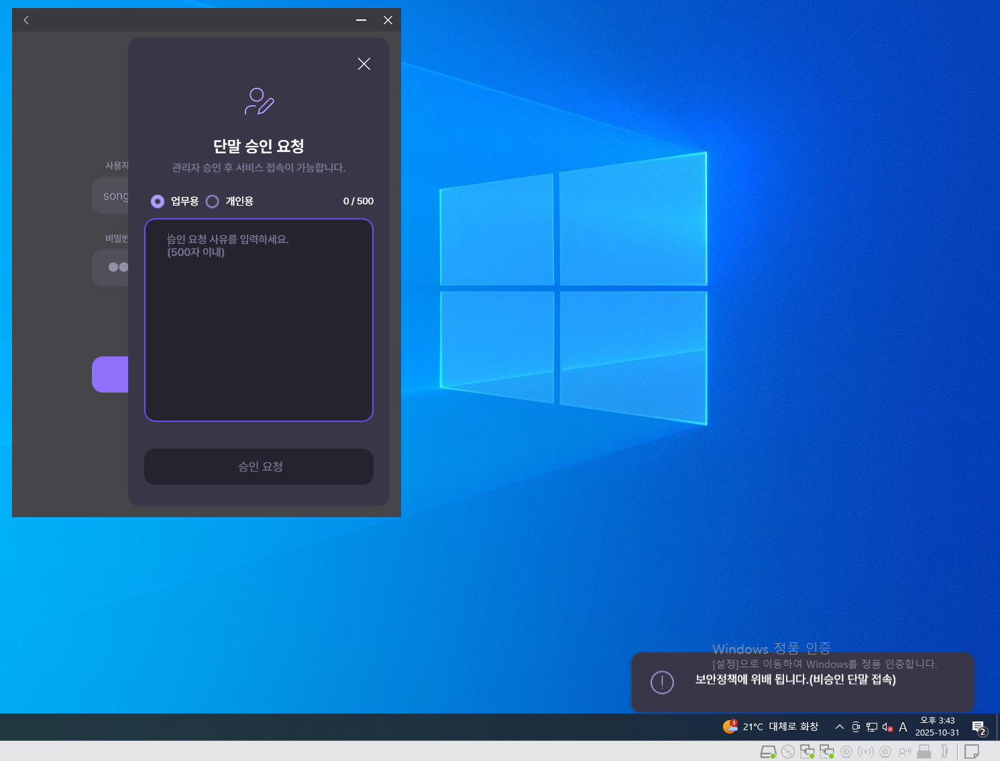  

사유를 입력하고 `승인 요청`을 합니다.  

> [!NOTE]  
> 사유 입력 시 엔터 입력 불가  

관리자가 사유를 확인하고 `사용 승인` 처리 해주면 이 후 사용자가 다시 재 접속 시 정상적으로 접속이 됩니다.  

<br>

### 가상 머신 환경에서의 접속 차단 (Block Access From Virtual Machine Environments)
설명: 이 설정을 적용하면 가상 머신(VM) 환경에서의 접속을 차단하여 보안 위험을 줄입니다.


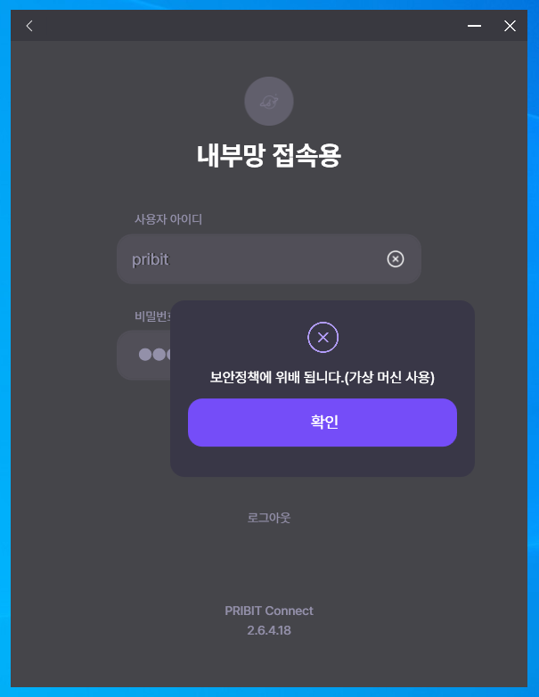

<br>

### 계정별 최대 동시 접속 단말 수 초과 시 접속 차단 (Block Access When Concurrent Device Limit Exceeded Per Account)
설명: 이 설정을 적용하면 한 계정이 동시에 접속할 수 있는 단말 수를 제한하고 초과 시 접속을 차단합니다.

지원 플랫폼: `Windows`, `macOS`, `iOS`, `Android`, `iPad`, `Android Tablet`
동작 방식:  
- 기본적으로 각 플랫폼마다 1개씩만 동시 접속이 가능합니다  
- 정책 생성 시 제한할 플랫폼들을 선택할 수 있습니다  
- **"접속 단말 최대 개수"**는 선택한 플랫폼들 중 동시에 접속 가능한 플랫폼의 개수를 의미합니다  
- **"접속 단말 최대 개수"**의 최대 설정 값은 정책 생성 시 선택한 플랫폼의 수  

상세 설정 화면 
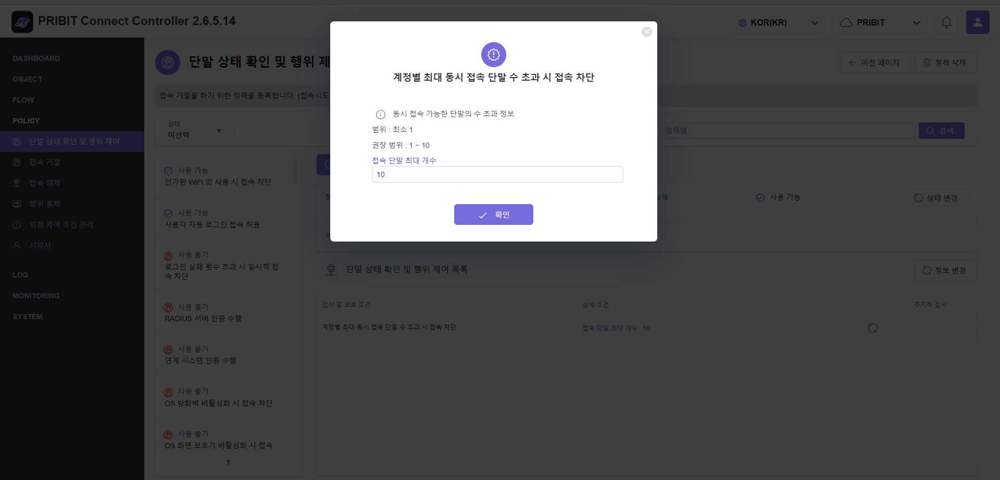


하나의 플랫폼에서 이중 접속 시  

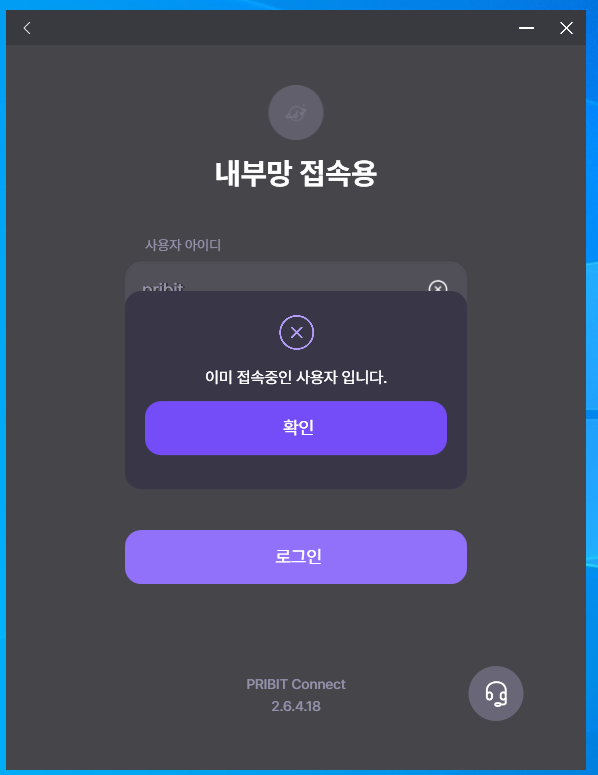  


예시:  
- 정책 설정: Windows, macOS, Android, iOS를 제한 대상으로 선택하고 최대 접속 단말을 2개로 설정  
결과:  
- 4개 플랫폼(Windows, macOS, Android, iOS) 중 최대 2개 플랫폼에서만 동시 접속 가능  
시나리오:  
- Windows와 iOS에서 이미 접속 중인 경우 → Android나 macOS에서 추가 접속 시도 시 차단됨  
- macOS 접속을 종료하면 → Android에서 접속 가능해짐  

접속 가능한 단말(Platform) 갯수 초과 시  

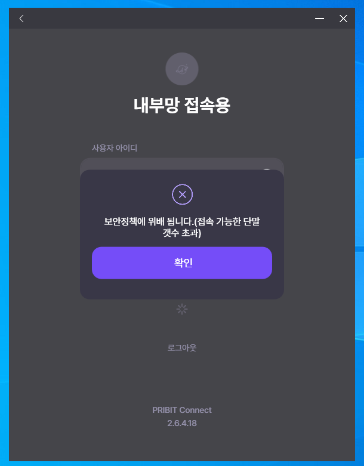  

<br>

### 단말 유휴 시간 초과 시 접속 차단 (Block Access After Device Idle Timeout)  

설명: 이 설정을 적용하면 지정된 시간동안 단말을 사용하지 않을 경우(Idle Time) 접속을 차단합니다.  

PCA 에서 차단 화면  

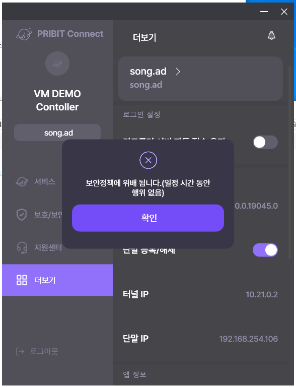 

<br>

### 최대 접속 시간 초과 시 접속 차단 (Block Access When Maximum Session Time Exceeded)
설명: 이 설정을 적용하면 1회 최대 허용 접속 시간을 설정할 수 있고, 초과한 경우 세션을 종료하고 접속을 차단합니다.  

최대 접속 시간 상세 설정  

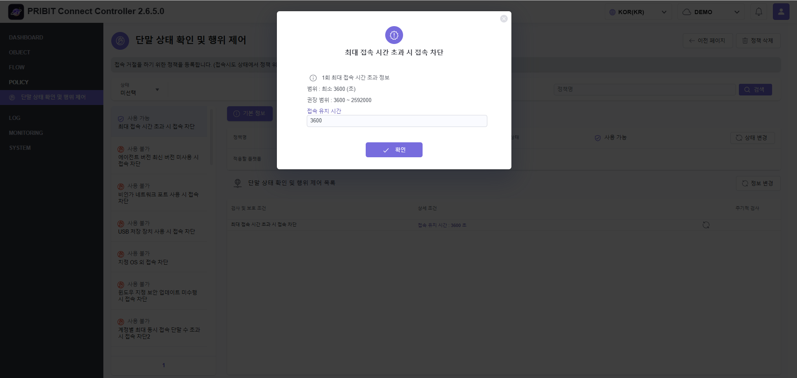

범위 : 최소 3600 (초) 기본값  
권장 범위 : 3600 ~ 2592000  
접속 유지 시간  
- ex) 28800  


PCA 에서 차단 화면   

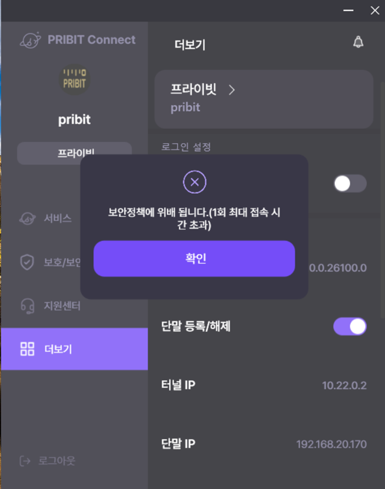

<br>

### 업무 시간 외 접속 시 접속 차단 (Block Access Outside Working Hours)
설명: 이 설정을 적용하면 지정된 업무 시간 외에 접속을 시도하는 경우 차단합니다. 

---

## 권한 관리 정책

### 관리자 권한 상승 불가 (Prevent Administrator Privilege Escalation)
설명: 이 설정을 적용하면 사용자가 관리자 권한으로 상승하는 것을 모두 차단합니다.


### 관리자 권한 상승 시도 시 접속 차단 (Block Access On Administrator Privilege Escalation Attempt)
설명: 이 설정을 적용하면 관리자 권한 상승을 시도하는 경우 즉시 접속을 차단합니다.


---

## 로그인 보안 정책

### 로그인 실패 횟수 초과 시 일시적 접속 차단 (Temporarily Block Access After Excessive Login Failures)
설명: 이 설정을 적용하면 지정된 횟수 이상 로그인에 실패한 경우 일정 시간 동안 해당 계정의 접속을 차단합니다.

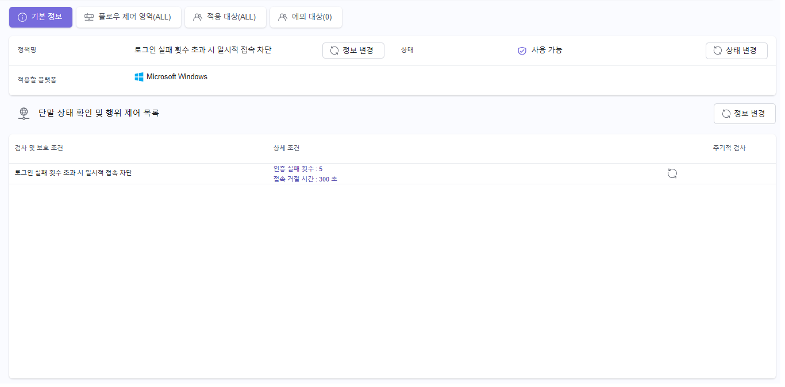

- 인증 실패 횟수 :  
  - ex) 5  
- 접속 거절 시간 : (초)  
  - ex) 300   

<br>  

접속 차단 화면  

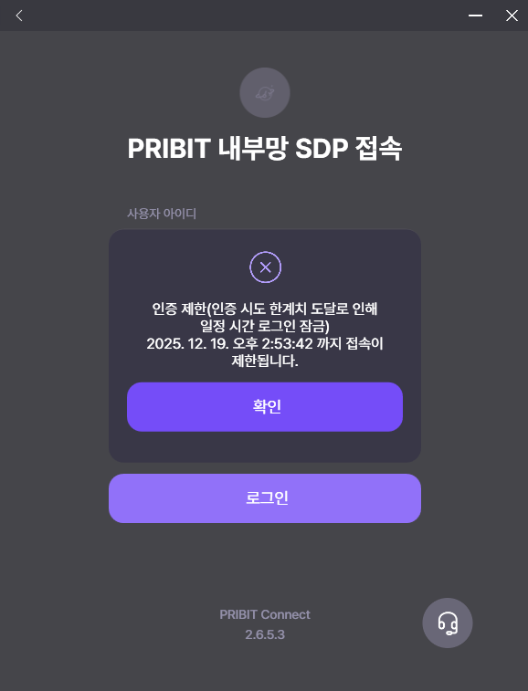

<br>  

### 비밀번호 주기적 변경 미수행 시 접속 차단 (Block Access If Password Rotation Not Performed)
설명: 이 설정을 적용하면 정해진 주기 내에 비밀번호를 변경하지 않은 사용자의 접속을 차단합니다.

비밀번호 주기적 변경 상세 설정 

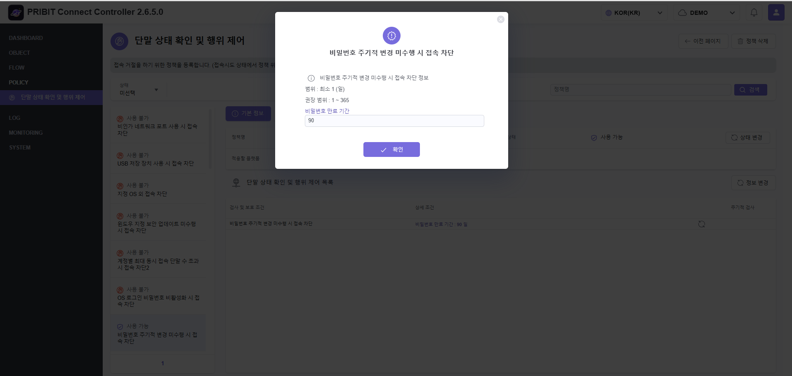

비밀번호 만료 기간  
- *ex) 90*  

> [!NOTE]  
> 국내 주요 기관(국정원, 금감원, ISMS-P 등) 의 비밀번호 변경 주기 설정 가이드라인은 최근 국내외 보안 정책 변화에 따라 주기적 변경 의무가 완화되었으나, 아직 일부 법령과 지침, 인증 기준에선 “반기별 1회(6개월)” 또는 “최소 3~6개월”마다 변경을 권고하고 있습니다.  
  

차단 화면 

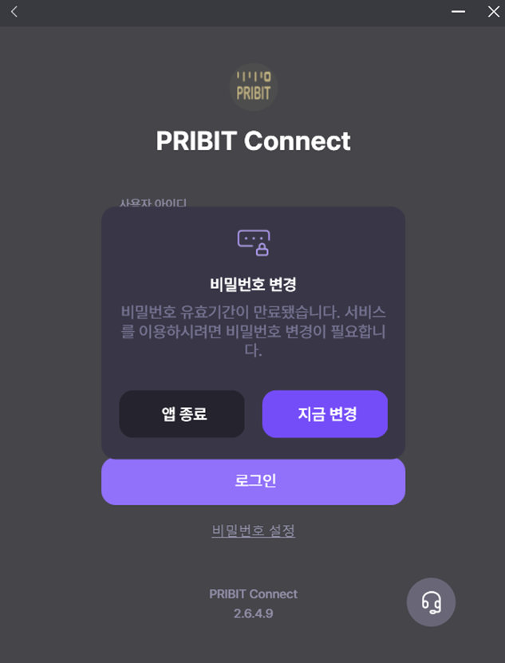

<br>

### 사용자 자동 로그인 접속 허용 (Allow User Auto-Login Access)
설명: 이 설정을 적용하면 사용자가 자동 로그인을 통해 접속할 수 있도록 허용합니다.

PCA 접속 할 때, `로그인 상태 유지` 체크 박스가 표시 됩니다.  
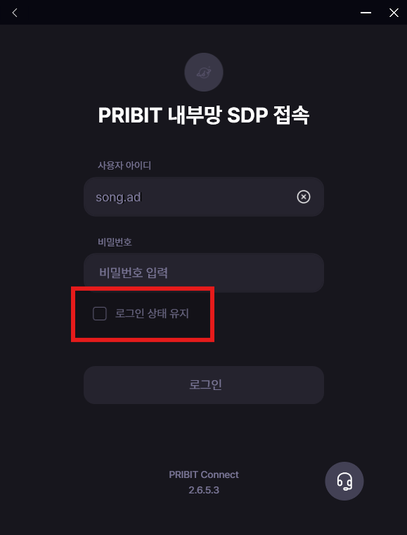  

`로그인 상태 유지` 체크 박스를 선택 후 사용자 로그인을 진행하여 로그인 완료하게 되면, 이후 로그인은 비밀번호 입력 없이 자동 로그인 처리됩니다.  

다만, 앱에서 `로그아웃`을 눌러 사용자 인증이 로그아웃 처리 되었을 경우, 재로그인을 수행해야 합니다. 

> [!WARN]  
> 자동로그인은 편의성과 보안의 균형입니다. 자동로그인 사용 시 사용자의 명확한 동의를 획득해야 하고, 세션 타임아웃, 모니터링, 실시간 알림 기능을 사용하여 보안 대책을 추가로 설정하는 것을 권고합니다.  
> 사용자의 데이터를 보호하는 것이 최우선입니다.   

<br>

---

## 에이전트 무결성 정책

### 에이전트 무결성 훼손 시 접속 차단 (Block Access If Agent Integrity Compromised)
설명: 이 설정을 적용하면 에이전트 파일이 변조되거나 무결성이 훼손된 경우 접속을 차단합니다.

### 에이전트 버전 최신 버전 미사용 시 접속 차단 (Block Access If Agent Version Is Outdated)
설명: 이 설정을 적용하면 에이전트가 최신 버전으로 업데이트되지 않은 단말의 접속을 차단합니다.

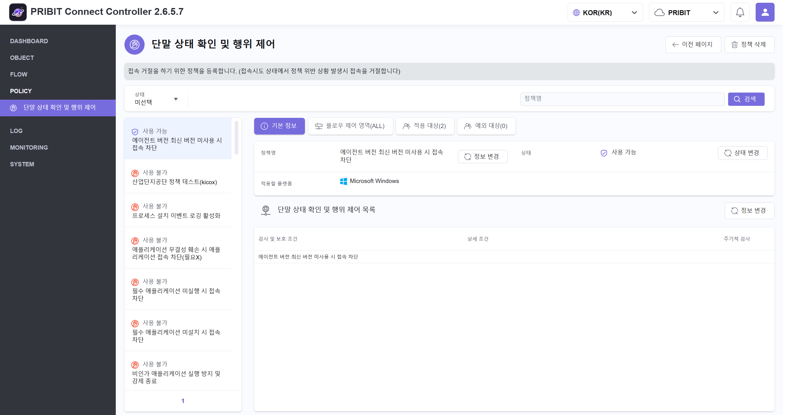

차단 화면  

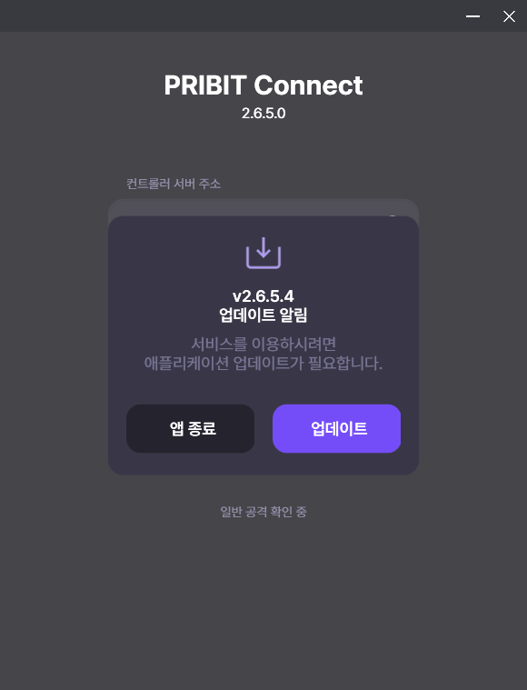  

최신 버전 다운로드  

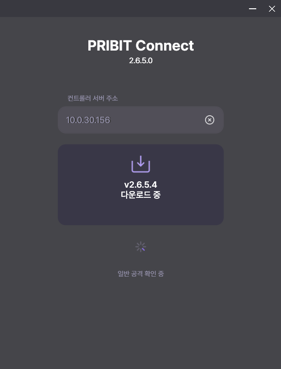  

<br>

<br>

---

## 데이터 보호 정책

### 화면 캡처 및 프린트스크린 기능 사용 불가 (Disable Screen Capture And PrintScreen)
설명: 이 설정을 적용하면 화면 캡처 및 프린트스크린 기능을 차단하여 화면 정보 유출을 방지합니다.


화면 캡처 및 프린트 스크린 기능 사용 시 화면  

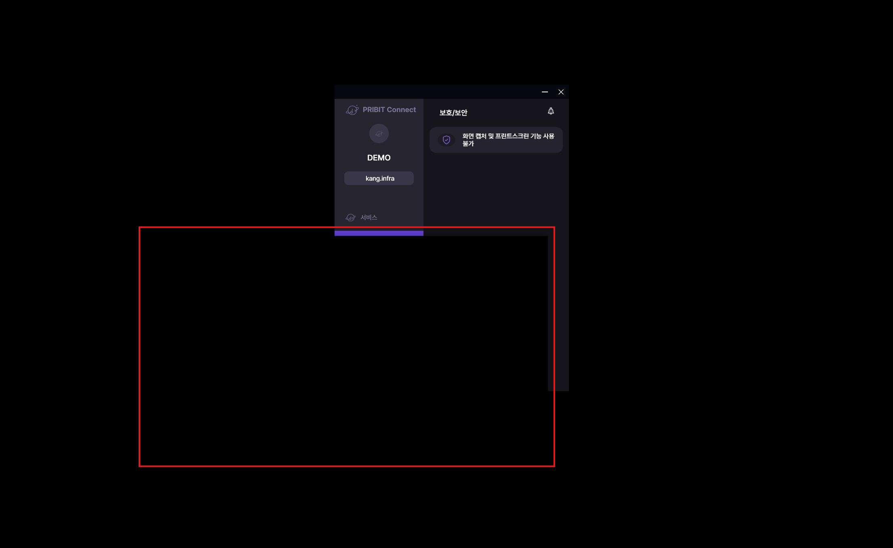

Pribit Connect 제품 이외에 모두 표시 되지 않습니다. 

<br>

### 스크린 워터마킹 표시 (Display Screen Watermark)
설명: 이 설정을 적용하면 화면에 사용자 정보, 시간 등의 워터마크를 표시하여 화면 캡처 시 추적이 가능하도록 합니다.

스크린 워터 마킹 표시 상세 설정  

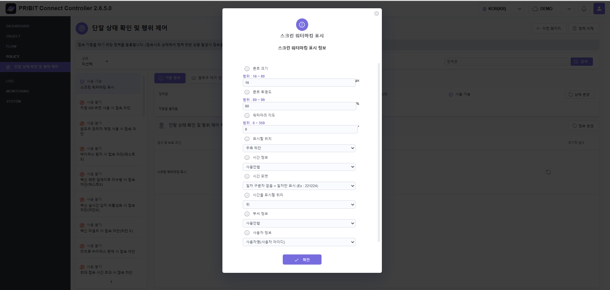 

- 폰트 크기 (범위: 16 ~ 80)  
  - ex) 16 px  
- 폰트 투명도 (범위: 80 ~ 99)  
  - ex) 80 %  
- 워터마크 각도 (범위: 0 ~ 359)  
  - ex) 0 º 
- 표시할 위치  
  - [ ] 전체  
  - [ ] 우측 상단  
  - [x] 우측 하단 *`(default)`*  
  - [ ] 중앙  
  - [ ] 좌측 하단  
  - [ ] 좌측 상단  
- 시간 정보 
  - [x] 사용안함  *`(default)`*  
  - [ ] 접속시간(서버 기준)  
  - [ ] 접속시간(클라이언트 기준)  
  - [ ] 실시간(클라이언트 기준)  
- 시간 포맷  
  - [x] 일자 구분자 없음 + 일자만 표시 (Ex : 221224) *`(default)`*  
  - [ ] 일자 구분자 없음 + 분까지 표시 (Ex : 221224 12:34)  
  - [ ] 일자 구분자 없음 + 초까지 표시 (Ex : 221224 12:34:56)  
  - [ ] 일자 구분자 + 일자만 표시 (Ex : 22년 12월 24일)  
  - [ ] 일자 구분자 + 분까지 표시 (Ex : 22년 12월 24일 12:34)  
  - [ ] 일자 구분자 + 초까지 표시 (Ex : 22년 12월 24일 12:34:56)  
  - [ ] 일자 구분자 + 일자만 표시 (Ex : 22-12-24)  
  - [ ] 일자 구분자 + 분까지 표시 (Ex : 22-12-24 12:34)  
  - [ ] 일자 구분자 + 초까지 표시 (Ex : 22-12-24 12:34:56)  
  - [ ] 일자 구분자 없음 + 일자만 표시 (Ex : 20221224)  
  - [ ] 일자 구분자 없음 + 분까지 표시 (Ex : 20221224 12:34)  
  - [ ] 일자 구분자 없음 + 초까지 표시 (Ex : 20221224 12:34:56)  
  - [ ] 일자 구분자 + 일자만 표시 (Ex : 2022년 12월 24일)  
  - [ ] 일자 구분자 + 분까지 표시 (Ex : 2022년 12월 24일 12:34)  
  - [ ] 일자 구분자 + 초까지 표시 (Ex : 2022년 12월 24일 12:34:56)  
  - [ ] 일자 구분자 + 일자만 표시 (Ex : 2022-12-24)  
  - [ ] 일자 구분자 + 분까지 표시 (Ex : 2022-12-24 12:34)  
  - [ ] 일자 구분자 + 초까지 표시 (Ex : 2022-12-24 12:34:56)  
  - [ ] 일자 구분자 + 일자만 표시(Ex : Dec, 24, 2022)  
  - [ ] 일자 구분자 + 분까지 표시(Ex : Dec, 24, 2022 12:34)  
  - [ ] 일자 구분자 + 초까지 표시(Ex : Dec, 24, 2022 12:34:56)  
- 시간을 표시할 위치  
  - [x] 위  *`(default)`*  
  - [ ] 아래  
- 부서 정보  
  - [x] 사용 안함  *`(default)`*  
  - [ ] 최상위 부서  
  - [ ] 소속 부서  
- 사용자 정보
  - [ ] 사용자 아이디  
  - [ ] 사용자 명  
  - [x] 사용자명(사용자 아이디)  *`(default)`*  
  - [ ] 사용자 아이디(사용자명)  

> [!NOTE]  
> 제약 사항  
> 현재 기능 제약 사항으로 위 설정 외 항목들은 사용자가 지정 할 수 없습니다.  
> *ex) 사내 로고 icon 을 삽입, 폰트 색상 변경 등 불가*   

<br>

스크린 워터마크 표시 화면  

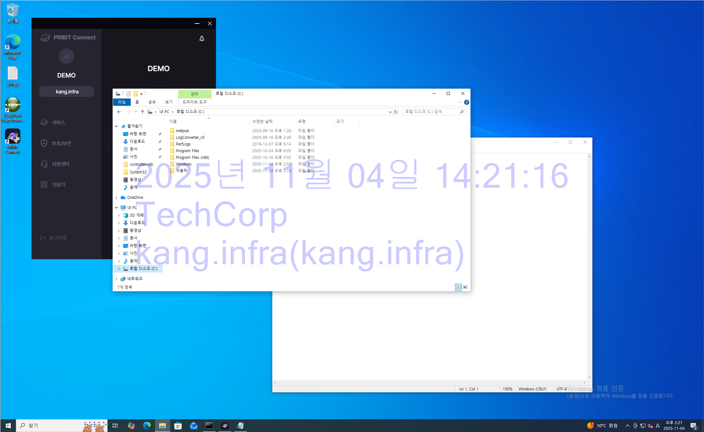  

<br>

### 프린터 사용 제한 (Restrict Printer Usage)
설명: 이 설정을 적용하면 프린터 사용을 제한하여 출력을 통한 정보 유출을 방지합니다.

정책 적용 전 및 로그인 전 OS 의 프린터 상태  

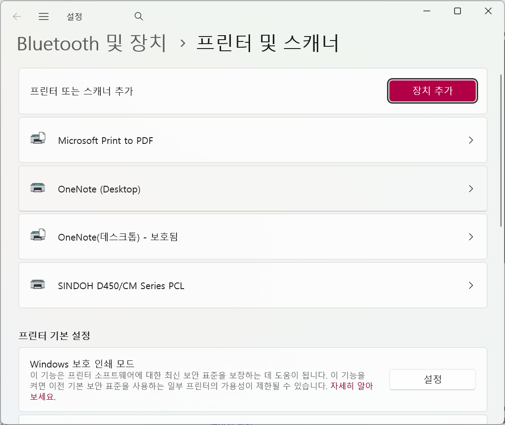

정책 적용 된 상태에서 PCA 로그인 후 OS 의 프린터 상태  

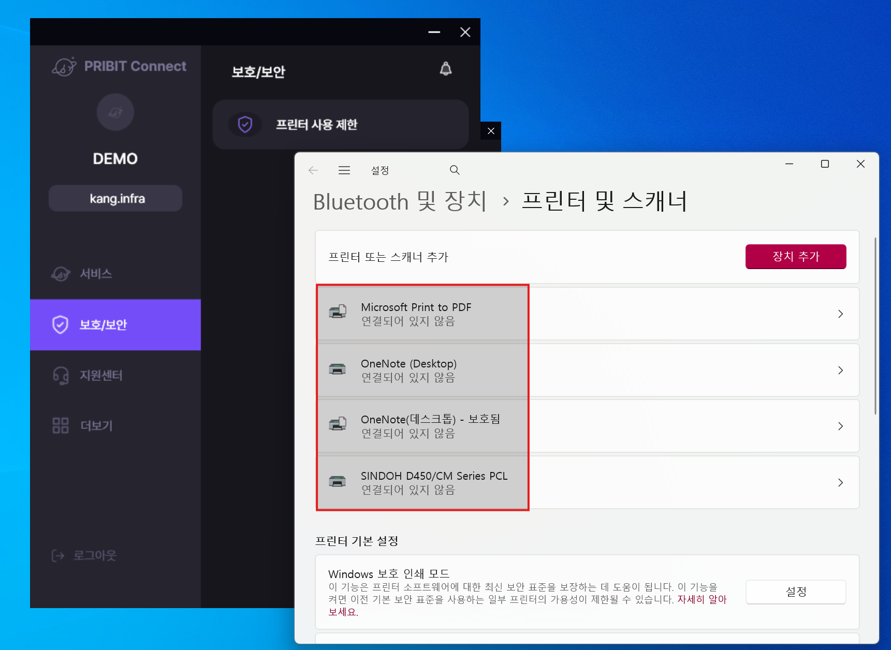

프린터 장치가 `연결되어 있지 않음` 으로 표시되고, 장치를 이용할 수 없게 됩니다.  

<br>

### 원격 데스크톱 접속 시 파일 전송 및 클립보드 사용 불가 (Disable File Transfer And Clipboard For Remote Desktop)
설명: 이 설정을 적용하면 원격 데스크톱 연결 시 파일 전송 및 클립보드 공유 기능을 차단하여 데이터 유출을 방지합니다.

정책 적용 전 및 로그인 전 데스크톱 연결에서의 파일 전송, 클립보드 공유 기능  

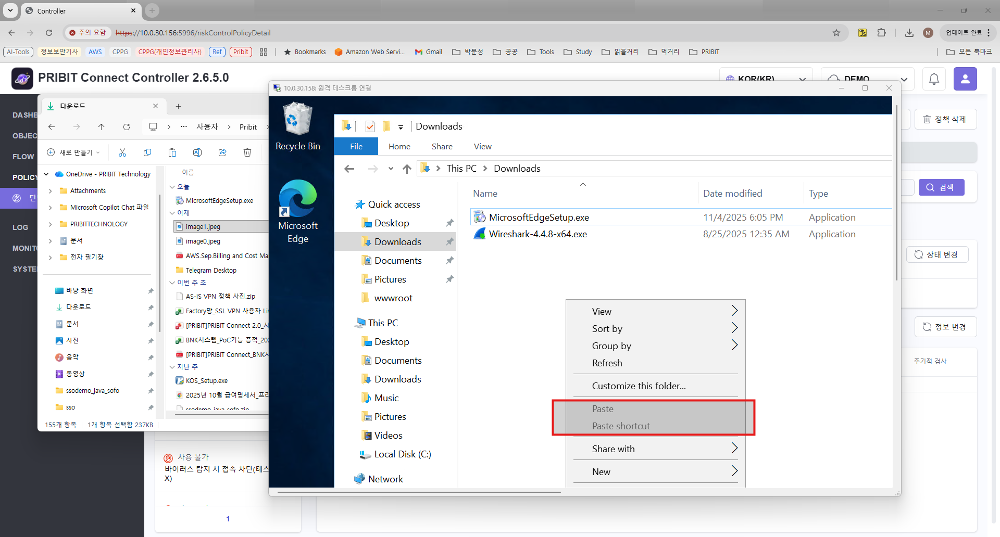  

정책 적용 된 상태에서 PCA 로그인 후 데스크톱 연결에서의 파일 전송, 클립보드 공유 차단 화면 

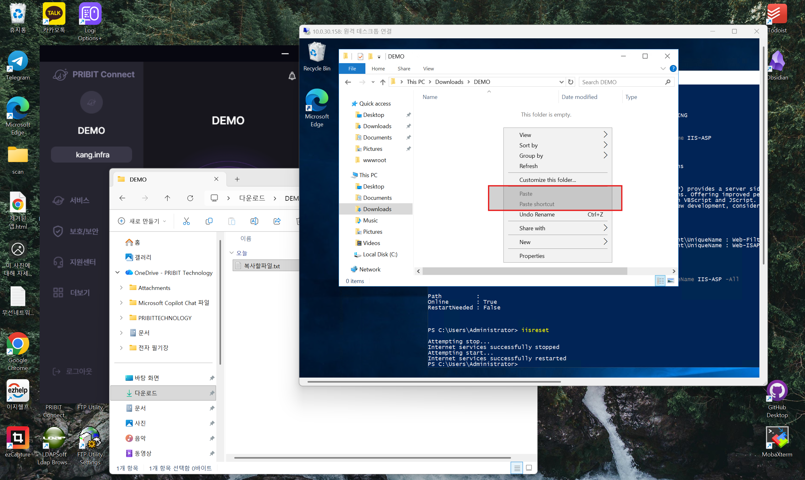  

RDP를 이용한 파일 전송이나 클립보드에 공유된 내용은 Remote Desktop 접속 장비에 공유되지 않습니다.  

<br>

---

## 네트워크 트래픽 및 로깅 정책

### 전체 네트워크 트래픽 데이터 플로우 검사 (Inspect All Network Traffic For Data Flow)
설명: 이 설정을 적용하면 애플리케이션 플로우에 등록되지 않는 트래픽 발생 시 차단 합니다. 

통신 애플리케이션에 등록되어 있는 화면  
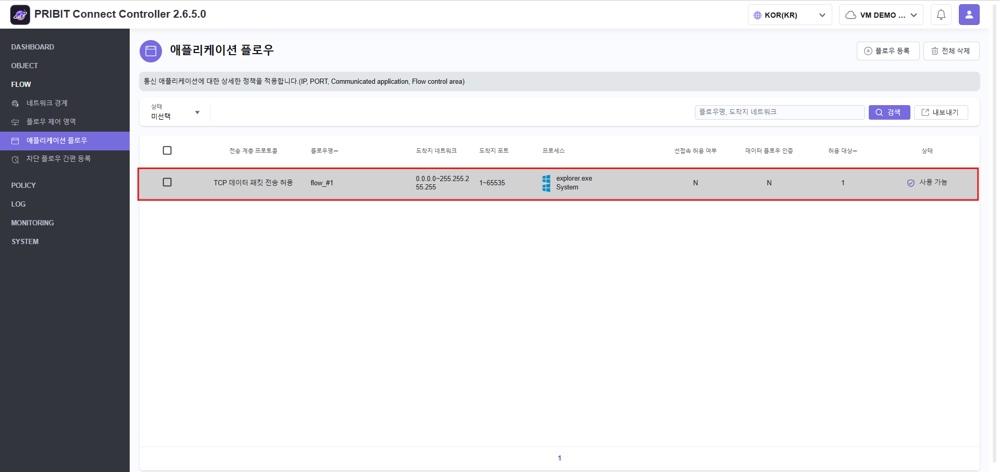  


단말에서 차단되는 화면  
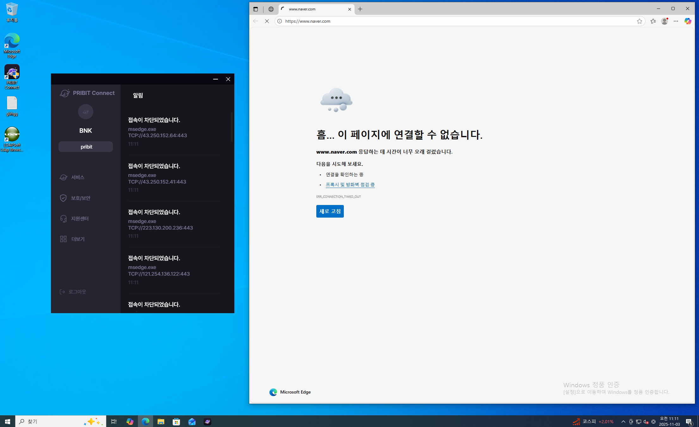  

<br>

### 데이터 플로우 기본 허용 모드 활성화 (Enable Default-Allow Data Flow Mode)  
설명: 이 설정을 적용하면 데이터 플로우에 대해 기본적으로 허용 정책을 적용하고 특정 항목만 차단합니다. 

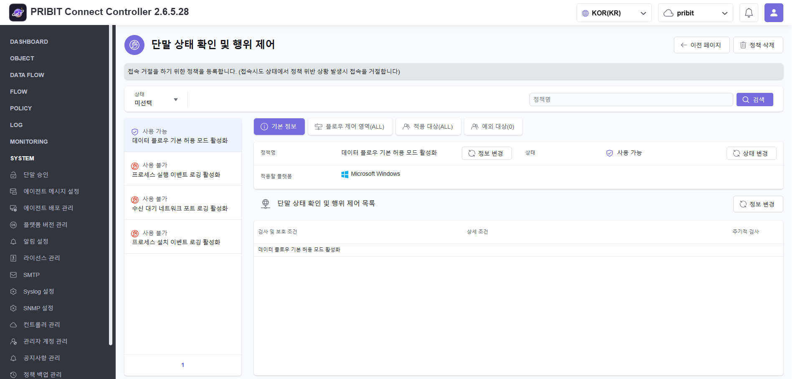  

어플리케이션 플로우에 등록(허용)되지 않는 목적지도 기본으로 허용되도록하는 모드입니다. 

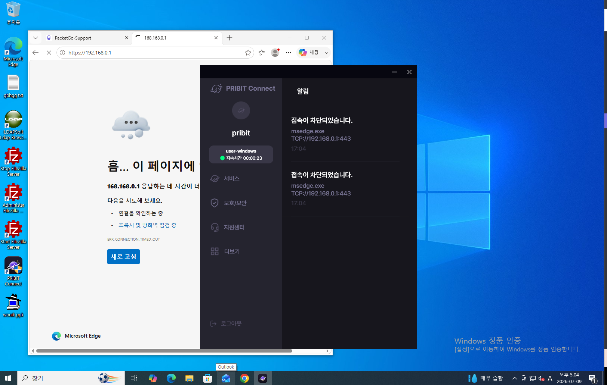  

- 예시) 애플리케이션 Flow 에 192.168.0.128 ~ 192.168.0.254 까지(Port ALL Allow) 설정되어 있으면, 기본적으로 192.168.0.1 ~ 192.168.0.127 주소로 접속 시 차단됩니다. 

데이터 플로우 기본 허용 모드 활성화 정책이 설정되어 기본 허용 모드로 변경됩니다. 

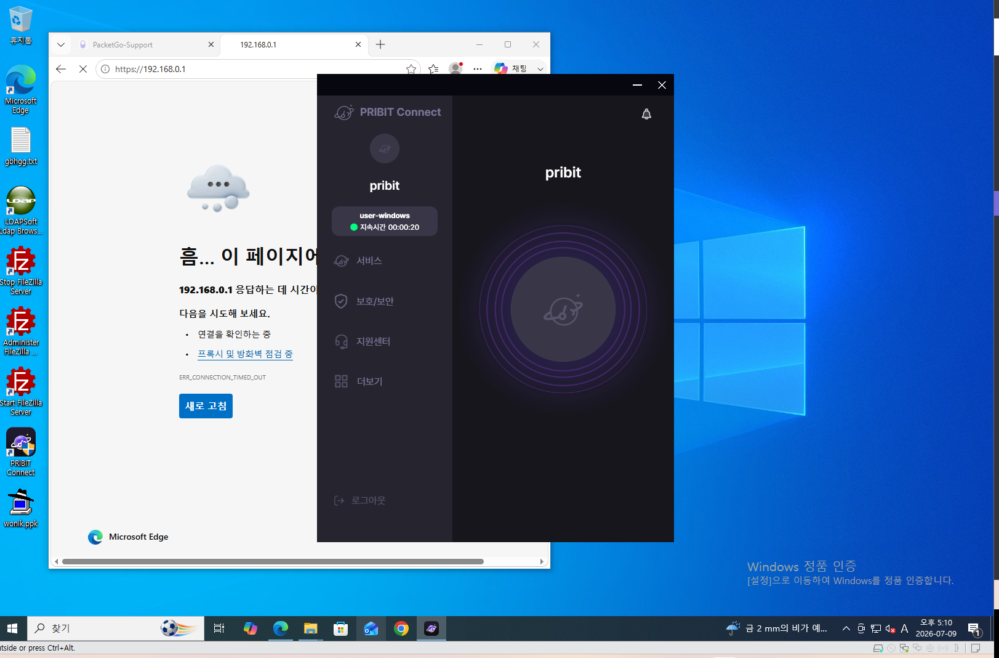  

- 192.168.0.1 ~ 192.168.0.127 주소로 접속 시도 해도 차단되지 않습니다. 

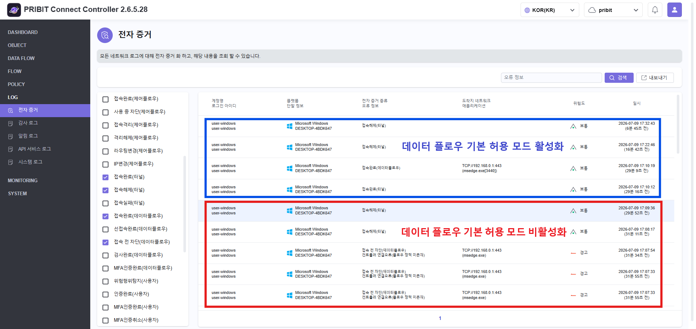  

데이터 플로우 기본 허용 모드 활성화 시 접속 차단 없이 사용하는 로그를 확인 할 수 있습니다.  

<br>  

### 데이터 패킷 드롭 로깅 활성화 (Enable Data Packet Drop Logging)  

설명: 이 설정을 적용하면 차단된 패킷에 대한 로그를 기록하여 보안 이벤트를 추적할 수 있습니다.

[플로우 제어 영역 외 애플리케이션 접속 차단](#플로우-제어-영역-외-애플리케이션-접속-차단-block-access-to-applications-outside-flow-control-zones) 정책을 적용하면 차단된 패킷이 발생하고, 차단 내용들을 기록(Logging)하는 설정을 합니다.  

해당 로그는 LOG > 전자증거 > 터널접속로그 > 전자증거 세부 항목 > 에이전트 데이터 패킷 드롭 로그 에서 확인 할 수 있습니다. 

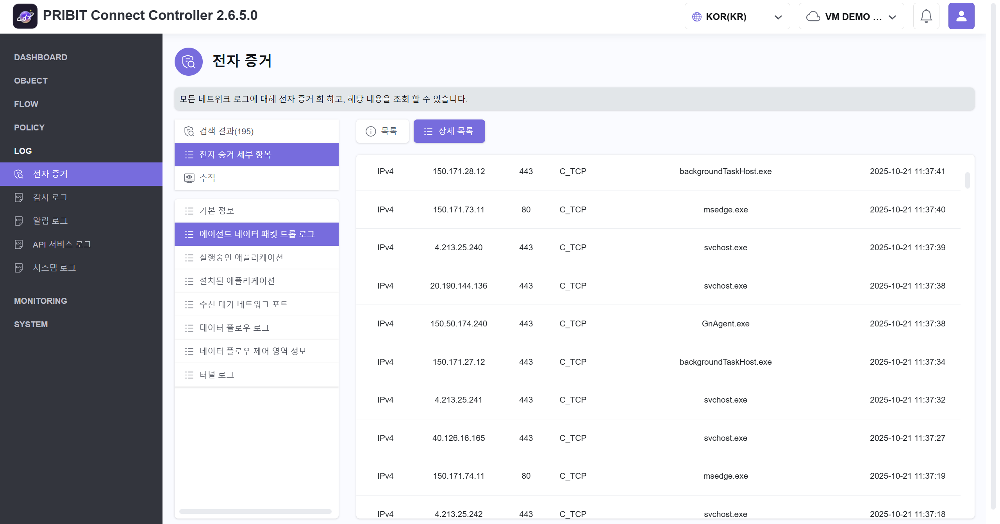  

<br>

### 수신 대기 네트워크 포트 로깅 활성화 (Enable Listening Network Port Logging)  
설명: 이 설정을 적용하면 단말에서 열려있는 수신 대기 포트 정보를 로깅하여 비정상 포트 사용을 탐지합니다.

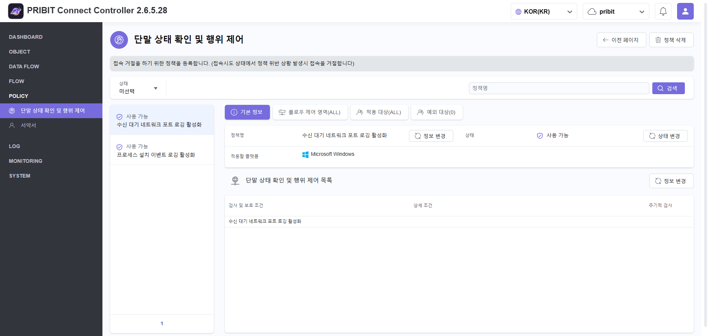 

해당 로그는 LOG > 전자증거 > 터널접속로그 > 전자증거 세부 항목 > 설치된 애플리케이션 > 상세 보기 에서 확인 할 수 있습니다. 

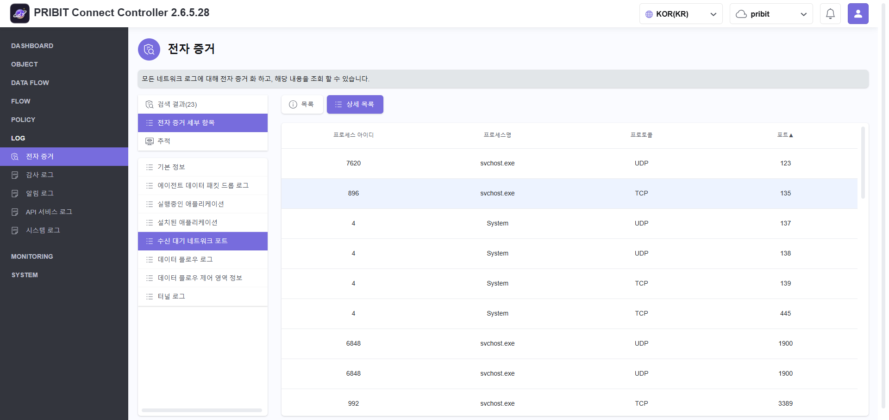 

프로세스 아이디 그리고 프로세스 명, 프로토콜, 포트 정보를 확인할 수 있습니다. 

<br>

### 프로세스 설치 이벤트 로깅 활성화 (Enable Process Install Event Logging)  
설명: 이 설정을 적용하면 프로세스 설치 이벤트를 로깅하여 비인가 소프트웨어 설치를 추적합니다.

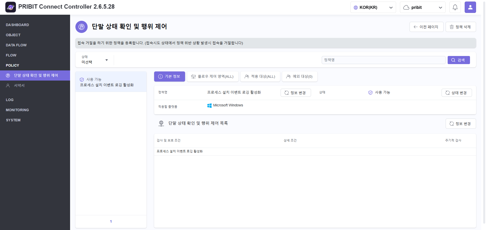 

해당 로그는 LOG > 전자증거 > 터널접속로그 > 전자증거 세부 항목 > 설치된 애플리케이션 > 상세 보기 에서 확인 할 수 있습니다. 

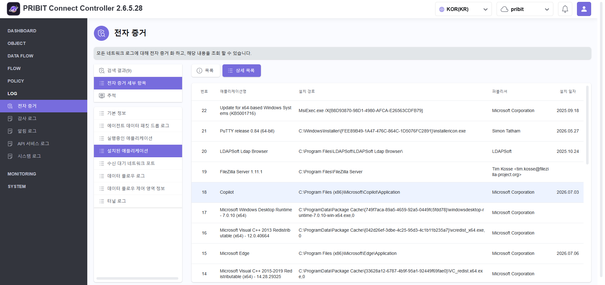

애플리케이션 명 그리고 설치 경로, 배포명(제조사), 설치된 일자를 확인 할 수 있습니다. 

<br>

### 프로세스 실행 이벤트 로깅 활성화 (Enable Process Execution Event Logging)  
설명: 이 설정을 적용하면 프로세스 실행 이벤트를 로깅하여 악성 프로세스 실행을 탐지하고 추적합니다.

  

해당 로그는 LOG > 전자증거 > 터널접속로그 > 전자증거 세부 항목 > 실행중인 애플리케이션 > 상세 보기 에서 확인 할 수 있습니다. 

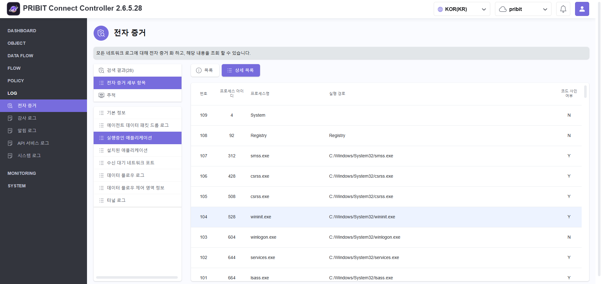 

프로세스 아이디(PID), 프로세스 명, 실행 경로, 코드 사인 여부를 확인 할 수 있습니다. 

<br>
