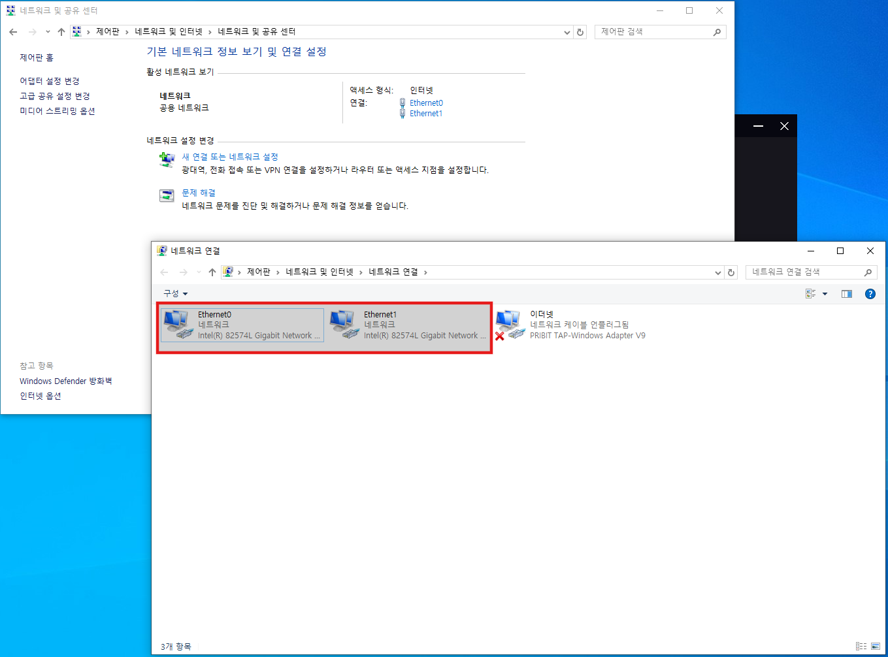
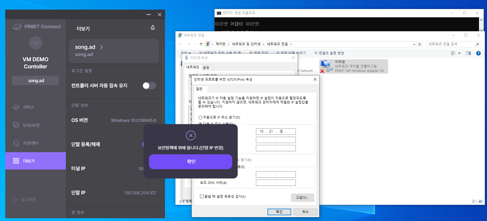
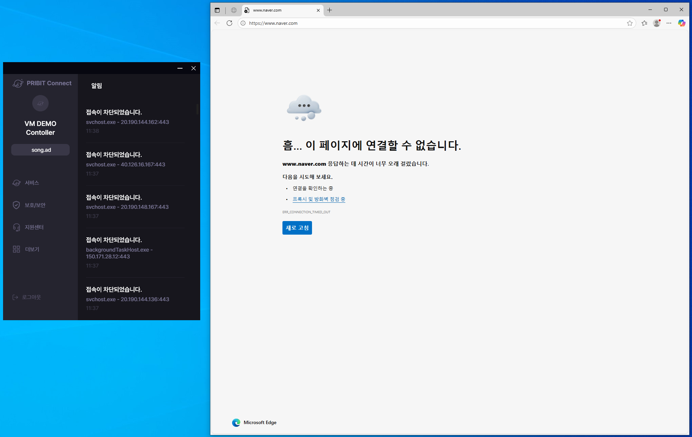

# PCC 보안 정책 (Security Policy)

<!-- TOC start  -->
- [PCC 보안 정책 (Security Policy)](#pcc-보안-정책-security-policy)
  - [인증 관련 정책](#인증-관련-정책)
    - [LDAP 인증 수행 (Enforce LDAP Authentication)](#ldap-인증-수행-enforce-ldap-authentication)
    - [RADIUS 서버 인증 수행 (Enforce RADIUS Authentication)](#radius-서버-인증-수행-enforce-radius-authentication)
    - [연계 시스템 인증 수행 (Enforce Integrated System Authentication)](#연계-시스템-인증-수행-enforce-integrated-system-authentication)
  - [MFA(다중 인증) 정책](#mfa다중-인증-정책)
    - [로그인 시 MFA 인증 요구 (Require MFA At Login)](#로그인-시-mfa-인증-요구-require-mfa-at-login)
    - [데이터 플로우 접속 시 MFA 인증 요구 (Require MFA For Data Flow Access)](#데이터-플로우-접속-시-mfa-인증-요구-require-mfa-for-data-flow-access)
  - [OS 보안 정책](#os-보안-정책)
    - [OS 로그인 비밀번호 비활성화 시 접속 차단 (Block Access If OS Login Password Disabled)](#os-로그인-비밀번호-비활성화-시-접속-차단-block-access-if-os-login-password-disabled)
    - [OS 방화벽 비활성화 시 접속 차단 (Block Access If OS Firewall Disabled)](#os-방화벽-비활성화-시-접속-차단-block-access-if-os-firewall-disabled)
    - [OS 화면 보호기 비활성화 시 접속 차단 (Block Access If OS Screen Saver Disabled)](#os-화면-보호기-비활성화-시-접속-차단-block-access-if-os-screen-saver-disabled)
    - [지정 OS 버전 사용 시 접속 차단 (Block Access When Using Specific OS Version)](#지정-os-버전-사용-시-접속-차단-block-access-when-using-specific-os-version)
    - [지정 OS 외 접속 차단 (Block Access On Non-Approved OS)](#지정-os-외-접속-차단-block-access-on-non-approved-os)
    - [윈도우 관리자 계정 사용 시 접속 차단 (Block Access When Using Windows Administrator Account)](#윈도우-관리자-계정-사용-시-접속-차단-block-access-when-using-windows-administrator-account)
    - [윈도우 지정 보안 업데이트 미수행 시 접속 차단 (Block Access If Required Windows Security Updates Not Applied)](#윈도우-지정-보안-업데이트-미수행-시-접속-차단-block-access-if-required-windows-security-updates-not-applied)
  - [백신 및 악성코드 정책](#백신-및-악성코드-정책)
    - [백신 미설치 시 접속 차단 (Block Access If Antivirus Not Installed)](#백신-미설치-시-접속-차단-block-access-if-antivirus-not-installed)
    - [백신 실시간 감지 비활성화 시 접속 차단 (Block Access If Antivirus Real-Time Protection Disabled)](#백신-실시간-감지-비활성화-시-접속-차단-block-access-if-antivirus-real-time-protection-disabled)
    - [백신 패턴 업데이트 미수행 시 접속 차단 (Block Access If Antivirus Definitions Outdated)](#백신-패턴-업데이트-미수행-시-접속-차단-block-access-if-antivirus-definitions-outdated)
    - [바이러스 탐지 시 접속 차단 (Block Access On Virus Detection)](#바이러스-탐지-시-접속-차단-block-access-on-virus-detection)
    - [미치료 바이러스 존재 시 접속 차단 (Block Access If Untreated Virus Detected)](#미치료-바이러스-존재-시-접속-차단-block-access-if-untreated-virus-detected)
  - [네트워크 정책](#네트워크-정책)
    - [WiFi 사용 접속 시 접속 차단 (Block Access On WiFi Connection)](#wifi-사용-접속-시-접속-차단-block-access-on-wifi-connection)
    - [WiFi 변경 시 접속 차단 (Block Access On WiFi Change)](#wifi-변경-시-접속-차단-block-access-on-wifi-change)
    - [비인가 WiFi 사용 시 접속 차단 (Block Access On Unauthorized WiFi Use)](#비인가-wifi-사용-시-접속-차단-block-access-on-unauthorized-wifi-use)
    - [인가된 WiFi 외 사용 시 접속 차단 (Block Access Outside Approved WiFi)](#인가된-wifi-외-사용-시-접속-차단-block-access-outside-approved-wifi)
    - [미승인 WiFi 사용 시 승인 요청 및 접속 차단 (Require Approval And Block Access For Unapproved WiFi)](#미승인-wifi-사용-시-승인-요청-및-접속-차단-require-approval-and-block-access-for-unapproved-wifi)
    - [모바일 네트워크 사용 시 접속 차단 (Block Access On Mobile Network Use)](#모바일-네트워크-사용-시-접속-차단-block-access-on-mobile-network-use)
    - [모바일 캐리어 변경 시 접속 차단 (Block Access On Mobile Carrier Change)](#모바일-캐리어-변경-시-접속-차단-block-access-on-mobile-carrier-change)
    - [테더링 사용 접속 시 접속 차단 (Block Access When Tethering Is Used)](#테더링-사용-접속-시-접속-차단-block-access-when-tethering-is-used)
    - [다중 네트워크 인터페이스(NIC) 사용 시 접속 차단 (Block Access When Multiple NICs Are Used)](#다중-네트워크-인터페이스nic-사용-시-접속-차단-block-access-when-multiple-nics-are-used)
    - [단말의 IP 변경 시 접속 차단 (Block Access On Device IP Change)](#단말의-ip-변경-시-접속-차단-block-access-on-device-ip-change)
    - [인가된 IP 대역 외 접속 차단 (Block Access Outside Approved IP Ranges)](#인가된-ip-대역-외-접속-차단-block-access-outside-approved-ip-ranges)
    - [미승인 IP 접속 시 승인 요청 및 접속 차단 (Require Approval And Block Access For Unapproved IPs)](#미승인-ip-접속-시-승인-요청-및-접속-차단-require-approval-and-block-access-for-unapproved-ips)
    - [비인가 네트워크 포트 사용 시 접속 차단 (Block Access When Unauthorized Network Ports Used)](#비인가-네트워크-포트-사용-시-접속-차단-block-access-when-unauthorized-network-ports-used)
  - [USB 및 외부 장치 정책](#usb-및-외부-장치-정책)
    - [USB 저장 장치 사용 시 접속 차단 (Block Access When USB Storage Device Used)](#usb-저장-장치-사용-시-접속-차단-block-access-when-usb-storage-device-used)
    - [USB 네트워크 어댑터 사용 시 접속 차단 (Block Access When USB Network Adapter Used)](#usb-네트워크-어댑터-사용-시-접속-차단-block-access-when-usb-network-adapter-used)
  - [애플리케이션 정책](#애플리케이션-정책)
    - [비인가 애플리케이션 설치 시 접속 차단 (Block Access If Unauthorized Application Installed)](#비인가-애플리케이션-설치-시-접속-차단-block-access-if-unauthorized-application-installed)
    - [비인가 애플리케이션 실행 시 접속 차단 (Block Access When Unauthorized Application Is Running)](#비인가-애플리케이션-실행-시-접속-차단-block-access-when-unauthorized-application-is-running)
    - [비인가 애플리케이션 실행 방지 및 강제 종료 (Prevent And Force-Stop Unauthorized Application Execution)](#비인가-애플리케이션-실행-방지-및-강제-종료-prevent-and-force-stop-unauthorized-application-execution)
    - [필수 애플리케이션 미설치 시 접속 차단 (Block Access If Required Applications Not Installed)](#필수-애플리케이션-미설치-시-접속-차단-block-access-if-required-applications-not-installed)
    - [필수 애플리케이션 미실행 시 접속 차단 (Block Access If Required Applications Not Running)](#필수-애플리케이션-미실행-시-접속-차단-block-access-if-required-applications-not-running)
    - [애플리케이션 무결성 훼손 시 애플리케이션 접속 차단 (Block Access To Applications With Tampered Integrity)](#애플리케이션-무결성-훼손-시-애플리케이션-접속-차단-block-access-to-applications-with-tampered-integrity)
    - [플로우 제어 영역 외 애플리케이션 접속 차단 (Block Access To Applications Outside Flow Control Zones)](#플로우-제어-영역-외-애플리케이션-접속-차단-block-access-to-applications-outside-flow-control-zones)
  - [단말 및 접속 관리 정책](#단말-및-접속-관리-정책)
    - [미승인 단말 접속 시 승인 요청 및 접속 차단 (Require Approval And Block Access For Unapproved Devices)](#미승인-단말-접속-시-승인-요청-및-접속-차단-require-approval-and-block-access-for-unapproved-devices)
    - [가상 머신 환경에서의 접속 차단 (Block Access From Virtual Machine Environments)](#가상-머신-환경에서의-접속-차단-block-access-from-virtual-machine-environments)
    - [계정별 최대 동시 접속 단말 수 초과 시 접속 차단 (Block Access When Concurrent Device Limit Exceeded Per Account)](#계정별-최대-동시-접속-단말-수-초과-시-접속-차단-block-access-when-concurrent-device-limit-exceeded-per-account)
    - [단말 유휴 시간 초과 시 접속 차단 (Block Access After Device Idle Timeout)](#단말-유휴-시간-초과-시-접속-차단-block-access-after-device-idle-timeout)
    - [최대 접속 시간 초과 시 접속 차단 (Block Access When Maximum Session Time Exceeded)](#최대-접속-시간-초과-시-접속-차단-block-access-when-maximum-session-time-exceeded)
    - [업무 시간 외 접속 시 접속 차단 (Block Access Outside Working Hours)](#업무-시간-외-접속-시-접속-차단-block-access-outside-working-hours)
  - [권한 관리 정책](#권한-관리-정책)
    - [관리자 권한 상승 불가 (Prevent Administrator Privilege Escalation)](#관리자-권한-상승-불가-prevent-administrator-privilege-escalation)
    - [관리자 권한 상승 시도 시 접속 차단 (Block Access On Administrator Privilege Escalation Attempt)](#관리자-권한-상승-시도-시-접속-차단-block-access-on-administrator-privilege-escalation-attempt)
  - [로그인 보안 정책](#로그인-보안-정책)
    - [로그인 실패 횟수 초과 시 일시적 접속 차단 (Temporarily Block Access After Excessive Login Failures)](#로그인-실패-횟수-초과-시-일시적-접속-차단-temporarily-block-access-after-excessive-login-failures)
    - [비밀번호 주기적 변경 미수행 시 접속 차단 (Block Access If Password Rotation Not Performed)](#비밀번호-주기적-변경-미수행-시-접속-차단-block-access-if-password-rotation-not-performed)
    - [사용자 자동 로그인 접속 허용 (Allow User Auto-Login Access)](#사용자-자동-로그인-접속-허용-allow-user-auto-login-access)
  - [에이전트 무결성 정책](#에이전트-무결성-정책)
    - [에이전트 무결성 훼손 시 접속 차단 (Block Access If Agent Integrity Compromised)](#에이전트-무결성-훼손-시-접속-차단-block-access-if-agent-integrity-compromised)
    - [에이전트 버전 최신 버전 미사용 시 접속 차단 (Block Access If Agent Version Is Outdated)](#에이전트-버전-최신-버전-미사용-시-접속-차단-block-access-if-agent-version-is-outdated)
  - [데이터 보호 정책](#데이터-보호-정책)
    - [화면 캡처 및 프린트스크린 기능 사용 불가 (Disable Screen Capture And PrintScreen)](#화면-캡처-및-프린트스크린-기능-사용-불가-disable-screen-capture-and-printscreen)
    - [스크린 워터마킹 표시 (Display Screen Watermark)](#스크린-워터마킹-표시-display-screen-watermark)
    - [프린터 사용 제한 (Restrict Printer Usage)](#프린터-사용-제한-restrict-printer-usage)
    - [원격 데스크톱 접속 시 파일 전송 및 클립보드 사용 불가 (Disable File Transfer And Clipboard For Remote Desktop)](#원격-데스크톱-접속-시-파일-전송-및-클립보드-사용-불가-disable-file-transfer-and-clipboard-for-remote-desktop)
  - [네트워크 트래픽 및 로깅 정책](#네트워크-트래픽-및-로깅-정책)
    - [전체 네트워크 트래픽 데이터 플로우 검사 (Inspect All Network Traffic For Data Flow)](#전체-네트워크-트래픽-데이터-플로우-검사-inspect-all-network-traffic-for-data-flow)
    - [데이터 플로우 기본 허용 모드 활성화 (Enable Default-Allow Data Flow Mode)](#데이터-플로우-기본-허용-모드-활성화-enable-default-allow-data-flow-mode)
    - [데이터 패킷 드롭 로깅 활성화 (Enable Data Packet Drop Logging)](#데이터-패킷-드롭-로깅-활성화-enable-data-packet-drop-logging)
    - [수신 대기 네트워크 포트 로깅 활성화 (Enable Listening Network Port Logging)](#수신-대기-네트워크-포트-로깅-활성화-enable-listening-network-port-logging)
    - [프로세스 설치 이벤트 로깅 활성화 (Enable Process Install Event Logging)](#프로세스-설치-이벤트-로깅-활성화-enable-process-install-event-logging)
    - [프로세스 실행 이벤트 로깅 활성화 (Enable Process Execution Event Logging)](#프로세스-실행-이벤트-로깅-활성화-enable-process-execution-event-logging)
<!-- TOC end -->

  

## 인증 관련 정책

### LDAP 인증 수행 (Enforce LDAP Authentication)
설명: 이 설정을 적용하면 사용자는 LDAP(Lightweight Directory Access Protocol) 서버를 통한 인증을 거쳐야만 시스템에 접속할 수 있습니다.

### RADIUS 서버 인증 수행 (Enforce RADIUS Authentication)
설명: 이 설정을 적용하면 RADIUS(Remote Authentication Dial-In User Service) 서버를 통한 인증 절차를 거쳐야 접속이 가능합니다.

### 연계 시스템 인증 수행 (Enforce Integrated System Authentication)
설명: 이 설정을 적용하면 연계된 외부 시스템의 인증을 통과해야만 접속할 수 있습니다.

---

## MFA(다중 인증) 정책

### 로그인 시 MFA 인증 요구 (Require MFA At Login)
설명: 이 설정을 적용하면 로그인 시 비밀번호 외에 추가 인증 수단(OTP, 생체인증 등)을 요구하여 보안을 강화합니다.

### 데이터 플로우 접속 시 MFA 인증 요구 (Require MFA For Data Flow Access)
설명: 이 설정을 적용하면 데이터 플로우에 접속할 때 다중 인증을 거쳐야 접근이 가능합니다.

---

## OS 보안 정책

### OS 로그인 비밀번호 비활성화 시 접속 차단 (Block Access If OS Login Password Disabled)
설명: 이 설정을 적용하면 운영체제의 로그인 비밀번호가 설정되어 있지 않은 단말의 접속을 차단합니다.

### OS 방화벽 비활성화 시 접속 차단 (Block Access If OS Firewall Disabled)
설명: 이 설정을 적용하면 운영체제의 방화벽이 비활성화된 단말의 접속을 차단하여 네트워크 보안을 유지합니다.

### OS 화면 보호기 비활성화 시 접속 차단 (Block Access If OS Screen Saver Disabled)
설명: 이 설정을 적용하면 화면 보호기가 비활성화된 단말의 접속을 차단하여 무단 접근을 방지합니다.

### 지정 OS 버전 사용 시 접속 차단 (Block Access When Using Specific OS Version)
설명: 이 설정을 적용하면 보안상 취약하거나 지원이 종료된 특정 OS 버전을 사용하는 단말의 접속을 차단합니다.

### 지정 OS 외 접속 차단 (Block Access On Non-Approved OS)
설명: 이 설정을 적용하면 승인된 운영체제 외의 OS를 사용하는 단말의 접속을 차단합니다.

### 윈도우 관리자 계정 사용 시 접속 차단 (Block Access When Using Windows Administrator Account)
설명: 이 설정을 적용하면 Windows 관리자 계정으로 로그인한 상태에서의 접속을 차단하여 권한 남용을 방지합니다.

### 윈도우 지정 보안 업데이트 미수행 시 접속 차단 (Block Access If Required Windows Security Updates Not Applied)
설명: 이 설정을 적용하면 필수 Windows 보안 패치가 설치되지 않은 단말의 접속을 차단합니다.

---

## 백신 및 악성코드 정책

### 백신 미설치 시 접속 차단 (Block Access If Antivirus Not Installed)
설명: 이 설정을 적용하면 백신 프로그램이 설치되지 않은 단말의 접속을 차단합니다.

### 백신 실시간 감지 비활성화 시 접속 차단 (Block Access If Antivirus Real-Time Protection Disabled)
설명: 이 설정을 적용하면 백신의 실시간 감지 기능이 꺼져 있는 단말의 접속을 차단합니다.

### 백신 패턴 업데이트 미수행 시 접속 차단 (Block Access If Antivirus Definitions Outdated)
설명: 이 설정을 적용하면 백신 패턴이 최신 상태로 업데이트되지 않은 단말의 접속을 차단합니다.

### 바이러스 탐지 시 접속 차단 (Block Access On Virus Detection)
설명: 이 설정을 적용하면 단말에서 바이러스가 탐지된 경우 즉시 접속을 차단합니다.

### 미치료 바이러스 존재 시 접속 차단 (Block Access If Untreated Virus Detected)
설명: 이 설정을 적용하면 치료되지 않은 바이러스가 단말에 존재하는 경우 접속을 차단합니다.

---

## 네트워크 정책

### WiFi 사용 접속 시 접속 차단 (Block Access On WiFi Connection)
설명: 이 설정을 적용하면 WiFi 네트워크를 통한 접속을 모두 차단합니다.

### WiFi 변경 시 접속 차단 (Block Access On WiFi Change)
설명: 이 설정을 적용하면 접속 중 WiFi 네트워크가 변경될 경우 접속을 차단합니다.

### 비인가 WiFi 사용 시 접속 차단 (Block Access On Unauthorized WiFi Use)
설명: 이 설정을 적용하면 승인되지 않은 WiFi 네트워크를 사용하는 경우 접속을 차단합니다.

### 인가된 WiFi 외 사용 시 접속 차단 (Block Access Outside Approved WiFi)
설명: 이 설정을 적용하면 승인된 WiFi 목록에 없는 네트워크 사용 시 접속을 차단합니다.

### 미승인 WiFi 사용 시 승인 요청 및 접속 차단 (Require Approval And Block Access For Unapproved WiFi)
설명: 이 설정을 적용하면 미승인 WiFi 사용 시 관리자에게 승인 요청을 보내고 승인 전까지 접속을 차단합니다.

### 모바일 네트워크 사용 시 접속 차단 (Block Access On Mobile Network Use)
설명: 이 설정을 적용하면 모바일 데이터 네트워크(LTE, 5G 등)를 통한 접속을 차단합니다.

### 모바일 캐리어 변경 시 접속 차단 (Block Access On Mobile Carrier Change)
설명: 이 설정을 적용하면 모바일 통신사가 변경된 경우 접속을 차단합니다.

### 테더링 사용 접속 시 접속 차단 (Block Access When Tethering Is Used)
설명: 이 설정을 적용하면 테더링을 통한 네트워크 연결 시 접속을 차단합니다.

### 다중 네트워크 인터페이스(NIC) 사용 시 접속 차단 (Block Access When Multiple NICs Are Used)  

설명: 이 설정을 적용하면 여러 개의 네트워크 인터페이스가 동시에 활성화된 경우 접속을 차단하여 데이터 유출 경로를 차단합니다.  

예외) *PRIBIT TAP-Windows Adapter V9 어댑터 제외*

사용자는 윈도우 설정의 네트워크 연결(네트워크 어댑터 설정; ncpa.cpl)에서 필요하지 않은 어댑터들의 상태를 `사용 안 함` 으로 변경해야 합니다. 

여러개의 네트워크 어댑터 사용  

  

 

PCA 에서 차단 화면  

  

  

### 단말의 IP 변경 시 접속 차단 (Block Access On Device IP Change)  

설명: 이 설정을 적용하면 PCA 접속 중 단말의 IP주소(**PRIBIT TAP-Windows Adapter V9 어댑터의 IP 주소**)가 변경될 경우 접속을 차단합니다.  

사용자 단말에서 IP를 강제로 변경 시  

 

### 인가된 IP 대역 외 접속 차단 (Block Access Outside Approved IP Ranges)
설명: 이 설정을 적용하면 승인된 IP 대역 외의 네트워크에서 접속을 시도할 경우 차단합니다.

### 미승인 IP 접속 시 승인 요청 및 접속 차단 (Require Approval And Block Access For Unapproved IPs)
설명: 이 설정을 적용하면 미승인 IP에서 접속 시도 시 관리자에게 승인 요청을 보내고 승인 전까지 접속을 차단합니다.

### 비인가 네트워크 포트 사용 시 접속 차단 (Block Access When Unauthorized Network Ports Used)
설명: 이 설정을 적용하면 승인되지 않은 네트워크 포트를 사용하는 경우 접속을 차단합니다.

---

## USB 및 외부 장치 정책

### USB 저장 장치 사용 시 접속 차단 (Block Access When USB Storage Device Used)
설명: 이 설정을 적용하면 USB 메모리, 외장 하드 등 USB 저장 장치가 연결된 단말의 접속을 차단하여 데이터 유출을 방지합니다.

### USB 네트워크 어댑터 사용 시 접속 차단 (Block Access When USB Network Adapter Used)
설명: 이 설정을 적용하면 USB 네트워크 어댑터가 연결된 경우 접속을 차단하여 비인가 네트워크 경로 사용을 방지합니다.

---

## 애플리케이션 정책

### 비인가 애플리케이션 설치 시 접속 차단 (Block Access If Unauthorized Application Installed)
설명: 이 설정을 적용하면 승인되지 않은 애플리케이션이 설치된 단말의 접속을 차단합니다.

### 비인가 애플리케이션 실행 시 접속 차단 (Block Access When Unauthorized Application Is Running)
설명: 이 설정을 적용하면 승인되지 않은 애플리케이션이 실행 중인 경우 접속을 차단합니다.

### 비인가 애플리케이션 실행 방지 및 강제 종료 (Prevent And Force-Stop Unauthorized Application Execution)
설명: 이 설정을 적용하면 비인가 애플리케이션의 실행을 원천적으로 차단하고 이미 실행 중인 경우 강제로 종료시킵니다.

### 필수 애플리케이션 미설치 시 접속 차단 (Block Access If Required Applications Not Installed)
설명: 이 설정을 적용하면 필수로 지정된 애플리케이션이 설치되지 않은 단말의 접속을 차단합니다.

### 필수 애플리케이션 미실행 시 접속 차단 (Block Access If Required Applications Not Running)
설명: 이 설정을 적용하면 필수 애플리케이션이 실행되지 않은 상태에서의 접속을 차단합니다.

### 애플리케이션 무결성 훼손 시 애플리케이션 접속 차단 (Block Access To Applications With Tampered Integrity)
설명: 이 설정을 적용하면 애플리케이션 파일이 변조되거나 무결성이 훼손된 경우 해당 애플리케이션 접속을 차단합니다.

### 플로우 제어 영역 외 애플리케이션 접속 차단 (Block Access To Applications Outside Flow Control Zones)

설명: 이 설정을 적용하면 플로우 제어 영역으로 지정되지 않은 애플리케이션(또는 IP 대역)에 대한 접속을 차단합니다.

플로우 제어 영역 외 애플리케이션 접속 차단 및 알람 화면

 

---

## 단말 및 접속 관리 정책

### 미승인 단말 접속 시 승인 요청 및 접속 차단 (Require Approval And Block Access For Unapproved Devices)
설명: 이 설정을 적용하면 승인되지 않은 단말에서 접속 시도 시 관리자에게 승인 요청을 보내고 승인 전까지 접속을 차단합니다.

### 가상 머신 환경에서의 접속 차단 (Block Access From Virtual Machine Environments)
설명: 이 설정을 적용하면 가상 머신(VM) 환경에서의 접속을 차단하여 보안 위험을 줄입니다.

### 계정별 최대 동시 접속 단말 수 초과 시 접속 차단 (Block Access When Concurrent Device Limit Exceeded Per Account)
설명: 이 설정을 적용하면 한 계정이 동시에 접속할 수 있는 단말 수를 제한하고 초과 시 접속을 차단합니다.

### 단말 유휴 시간 초과 시 접속 차단 (Block Access After Device Idle Timeout)  

설명: 이 설정을 적용하면 지정된 시간동안 단말을 사용하지 않을 경우(Idle Time) 접속을 차단합니다.  

PCA 에서 차단 화면  

 

 

### 최대 접속 시간 초과 시 접속 차단 (Block Access When Maximum Session Time Exceeded)
설명: 이 설정을 적용하면 최대 허용 접속 시간을 초과한 경우 세션을 종료하고 접속을 차단합니다.

### 업무 시간 외 접속 시 접속 차단 (Block Access Outside Working Hours)
설명: 이 설정을 적용하면 지정된 업무 시간 외에 접속을 시도하는 경우 차단합니다.

---

## 권한 관리 정책

### 관리자 권한 상승 불가 (Prevent Administrator Privilege Escalation)
설명: 이 설정을 적용하면 일반 사용자가 관리자 권한으로 상승하는 것을 차단합니다.

### 관리자 권한 상승 시도 시 접속 차단 (Block Access On Administrator Privilege Escalation Attempt)
설명: 이 설정을 적용하면 관리자 권한 상승을 시도하는 경우 즉시 접속을 차단합니다.

---

## 로그인 보안 정책

### 로그인 실패 횟수 초과 시 일시적 접속 차단 (Temporarily Block Access After Excessive Login Failures)
설명: 이 설정을 적용하면 지정된 횟수 이상 로그인에 실패한 경우 일정 시간 동안 해당 계정의 접속을 차단합니다.

### 비밀번호 주기적 변경 미수행 시 접속 차단 (Block Access If Password Rotation Not Performed)
설명: 이 설정을 적용하면 정해진 주기 내에 비밀번호를 변경하지 않은 사용자의 접속을 차단합니다.

### 사용자 자동 로그인 접속 허용 (Allow User Auto-Login Access)
설명: 이 설정을 적용하면 사용자가 자동 로그인을 통해 접속할 수 있도록 허용합니다.

---

## 에이전트 무결성 정책

### 에이전트 무결성 훼손 시 접속 차단 (Block Access If Agent Integrity Compromised)
설명: 이 설정을 적용하면 보안 에이전트 파일이 변조되거나 무결성이 훼손된 경우 접속을 차단합니다.

### 에이전트 버전 최신 버전 미사용 시 접속 차단 (Block Access If Agent Version Is Outdated)
설명: 이 설정을 적용하면 보안 에이전트가 최신 버전으로 업데이트되지 않은 단말의 접속을 차단합니다.

---

## 데이터 보호 정책

### 화면 캡처 및 프린트스크린 기능 사용 불가 (Disable Screen Capture And PrintScreen)
설명: 이 설정을 적용하면 화면 캡처 및 프린트스크린 기능을 차단하여 화면 정보 유출을 방지합니다.

### 스크린 워터마킹 표시 (Display Screen Watermark)
설명: 이 설정을 적용하면 화면에 사용자 정보, 시간 등의 워터마크를 표시하여 화면 캡처 시 추적이 가능하도록 합니다.

### 프린터 사용 제한 (Restrict Printer Usage)
설명: 이 설정을 적용하면 프린터 사용을 제한하여 출력을 통한 정보 유출을 방지합니다.

### 원격 데스크톱 접속 시 파일 전송 및 클립보드 사용 불가 (Disable File Transfer And Clipboard For Remote Desktop)
설명: 이 설정을 적용하면 원격 데스크톱 연결 시 파일 전송 및 클립보드 공유 기능을 차단하여 데이터 유출을 방지합니다.

---

## 네트워크 트래픽 및 로깅 정책

### 전체 네트워크 트래픽 데이터 플로우 검사 (Inspect All Network Traffic For Data Flow)
설명: 이 설정을 적용하면 모든 네트워크 트래픽을 검사하여 데이터 플로우를 모니터링합니다.

### 데이터 플로우 기본 허용 모드 활성화 (Enable Default-Allow Data Flow Mode)
설명: 이 설정을 적용하면 데이터 플로우에 대해 기본적으로 허용 정책을 적용하고 특정 항목만 차단합니다.

### 데이터 패킷 드롭 로깅 활성화 (Enable Data Packet Drop Logging)  

설명: 이 설정을 적용하면 차단된 패킷에 대한 로그를 기록하여 보안 이벤트를 추적할 수 있습니다.

[플로우 제어 영역 외 애플리케이션 접속 차단](#플로우-제어-영역-외-애플리케이션-접속-차단-block-access-to-applications-outside-flow-control-zones) 정책을 적용하면 차단된 패킷이 발생하고, 차단 내용들을 기록(Logging)하는 설정을 합니다.  

해당 로그는 LOG > 전자증거 > 터널접속로그 > 전자증거 세부 항목 > 에이전트 데이터 패킷 드롭 로그 에서 확인 할 수 있습니다. 

  

 

### 수신 대기 네트워크 포트 로깅 활성화 (Enable Listening Network Port Logging)
설명: 이 설정을 적용하면 단말에서 열려있는 수신 대기 포트 정보를 로깅하여 비정상 포트 사용을 탐지합니다.

### 프로세스 설치 이벤트 로깅 활성화 (Enable Process Install Event Logging)
설명: 이 설정을 적용하면 프로세스 설치 이벤트를 로깅하여 비인가 소프트웨어 설치를 추적합니다.

### 프로세스 실행 이벤트 로깅 활성화 (Enable Process Execution Event Logging)
설명: 이 설정을 적용하면 프로세스 실행 이벤트를 로깅하여 악성 프로세스 실행을 탐지하고 추적합니다.

