**TOC (Table Of Contents)**  

문서 적용 버전 : `2.6.4.x` ~ `2.6.5.x`  

<!-- TOC start  -->
- [사용자 / 그룹 관리 및 인증](#사용자--그룹-관리-및-인증)
  - [사용자 계정 관리](#사용자-계정-관리)
    - [사용자 계정 (Internal DB) 생성 및 삭제](#사용자-계정-internal-db-생성-및-삭제)
    - [비밀번호 강제 변경](#비밀번호-강제-변경)
    - [사용자 계정 동기화](#사용자-계정-동기화)
      - [RDBMS Database 동기화](#rdbms-database-동기화)
      - [Active Directory(LDAP) 동기화](#active-directoryldap-동기화)
  - [사용자 그룹 관리](#사용자-그룹-관리)
  - [사용자 인증](#사용자-인증)
    - [사용자 임시 비밀번호 로그인](#사용자-임시-비밀번호-로그인)
    - [사용자 MFA 로그인](#사용자-mfa-로그인)
    - [사용자 Internal DB 인증](#사용자-internal-db-인증)
    - [사용자 AD(LDAP) 인증](#사용자-adldap-인증)
      - [AD(LDAP) 인증 정책 생성](#adldap-인증-정책-생성)
      - [AD(LDAP) 인증을 위한 서버 정보 입력](#adldap-인증을-위한-서버-정보-입력)
- [PCA 배포 관리](#pca-배포-관리)
  - [PCA 관리 버전 등록](#pca-관리-버전-등록)
  - [PCA 필수 업데이트](#pca-필수-업데이트)
- [통신 어플리케이션](#통신-어플리케이션)
  - [통신 애플리케이션 등록](#통신-애플리케이션-등록)
    - [업무용 Web Server 에 접속하는 서비스를 msedge.exe 으로 실행하도록 Agent 에 등록](#업무용-web-server-에-접속하는-서비스를-msedgeexe-으로-실행하도록-agent-에-등록)
    - [Window File Server Explorer 등록](#window-file-server-explorer-등록)
      - [윈도우 탐색기 등록](#윈도우-탐색기-등록)
      - [System (윈도우 시스템 인증) 등록](#system-윈도우-시스템-인증-등록)
- [보안 정책](#보안-정책)
  - [보안 정책 \> 사용자 인증 정책](#보안-정책--사용자-인증-정책)
  - [보안 정책 \> 단말 인증 정책](#보안-정책--단말-인증-정책)
  - [보안 정책 \> 단말 관리 정책](#보안-정책--단말-관리-정책)
- [로깅](#로깅)
- [Admin 보안 정책 (SYSTEM)](#admin-보안-정책-system)


<!-- TOC end -->

# 사용자 / 그룹 관리 및 인증  

PCC 에서는 자체 DB(MariaDB)를 사용하여 사용자 및 그룹을 관리합니다. 

<br> 

## 사용자 계정 관리  

PCC에서 사용자 생성 방법은 `수동 생성`, `일괄 등록`, `사용자 동기화` 가 있습니다.  
- `수동 생성` : PCC Internal DB에 직접 생성  
- `일괄 등록` : Excel 로 업로드 
- `사용자 동기화` : 고객사의 인사 DB에서 데이터를 동기화  

PCC에서 사용자 계정은 대소문자를 구별하지 않습니다.  

<br>

### 사용자 계정 (Internal DB) 생성 및 삭제  

OBJECT > 사용자 

`사용자 등록` 버튼을 눌러 사용자를 생성합니다. 

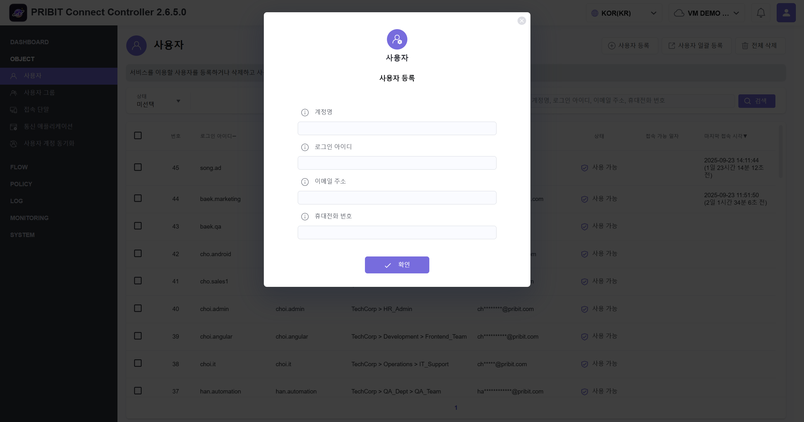  
- 계정명 : 
  - 사용자의 계정(이름)을 설정합니다.  
  - 필수 입력값입니다.  
  - ex) *`test`*
- 로그인 아이디 : 
  - 사용자가 로그인 할 계정을 설정합니다.  
  - 필수 입력값입니다.  
  - ex) *`test`*
- 이메일 주소 : 
  - 사용자의 이메일 주소를 입력합니다.  
  - 필수 입력값입니다.  
  - ex) *`test@test.com`*
- 휴대전화 번호 
  - 사용자의 휴대전화 번호를 입력합니다.  
  - ex) (blank)

<br>

> [!NOTE]  
> 최초 계정 생성 시 초기 비밀번호로 자동 설정됩니다.  
> 초기 비밀번호는 *`1111`* 입니다.  
> 사용자 계정을 PCC에 최초 생성하거나 사용자의 비밀번호를 초기화하여 초기 비밀번호로 접속 시 반드시 비밀번호를 변경하도록 되어있습니다.  
> *( `비밀번호 강제 변경` 을 진행한 사용자는 제외 )*  
> 비밀번호를 변경 할 때, 시스템에 설정되어 있는 `인증 번호 제공 방법` 에 따라 인증을 수행합니다.  
> *( SYSTEM > 시스템 환경 설정 > 콘솔 정보 > 인증 번호 제공 방법 : `이메일`, `SMS`, `이메일 + SMS` )*  

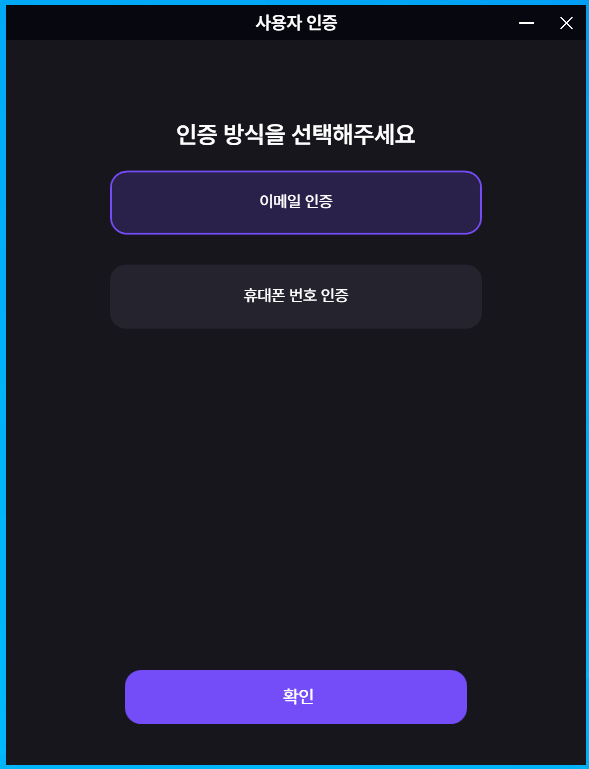  

- 초기 비밀번호로 사용자가 로그인 하기 위해서는 사전에 `SMTP(E-Mail)`, `SMS` 기능이 사용 가능하도록 준비되어 있어야 합니다. 

<br><br>

### 비밀번호 강제 변경 
- 비밀번호 강제 변경은 관리자만 수행할 수 있습니다.  
- 계정 생성 후 비밀번호를 강제 변경 시, 기존 비밀번호를 요구하지 않습니다.  
- **비밀번호 강제 변경 = (비밀번호 초기화 + 비밀번호 변경)**  

<br><br>

### 사용자 계정 동기화 

OBJECT > 사용자 계정 동기화 
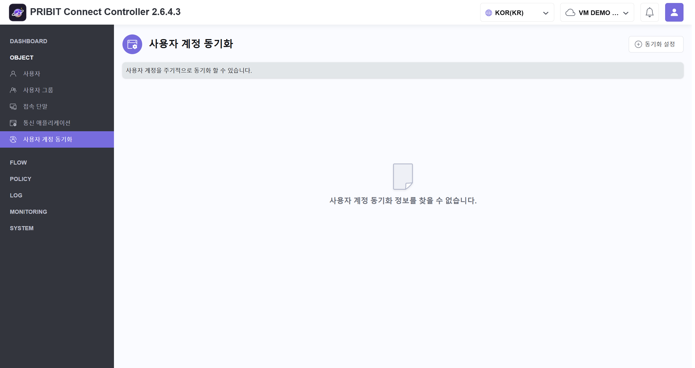

> [!NOTE] 
> 본 문서에서는 사용자 계정 API 동기화는 안내하지 않습니다.  
> (자료 부족)  

<br>

#### RDBMS Database 동기화 

동기화 방법 선택 화면에서 `데이터베이스 연결` 을 선택합니다. 

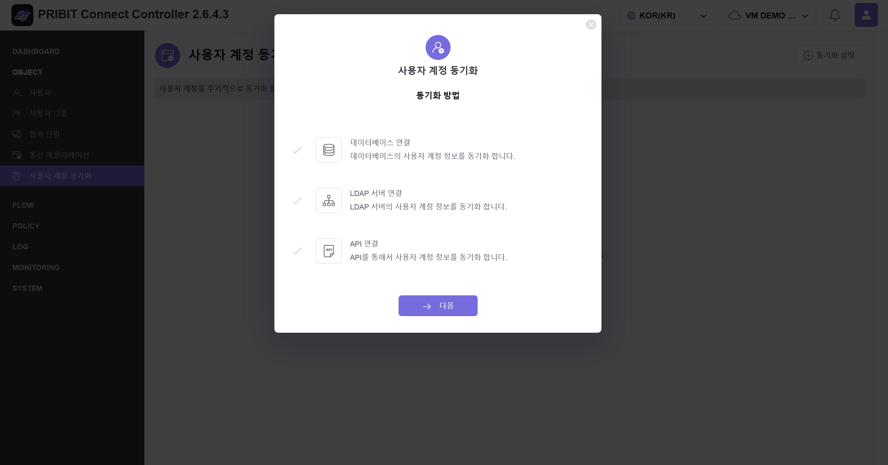

- [x] 데이터베이스 연결  

<br>

데이터베이스 설정 

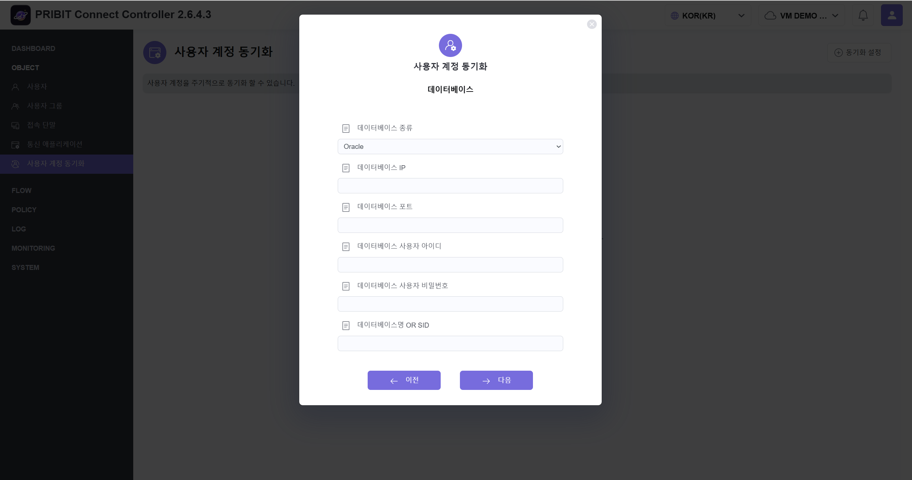

- 데이터베이스 종류 
  - 연결 가능한 데이터베이스 종류는 `Orcle`, `MySQL(MariaDB)`, `PostgreSQL`, `SqlServer(Microsoft SQL)` 를 지원합니다. 
  - ex) 
    - [x] *`MySQL(MariaDB)`*  
- 데이터베이스 IP 
  - 연결할 데이터베이스의 IP 주소를 입력합니다. 
  - ex) *`10.0.30.156`*  
- 데이터베이스 포트 
  - 연결할 데이터베이스의 포트 정보를 입력합니다. 
  - *Oracle: 1521, MySQL(MariaDB): 3306, PostreSQL: 5432, SqlServer(Microsoft SQL): 1443*  
  - ex) *`3306`*  
- 데이터베이스 사용자 아이디 
  - 연결할 데이터베이스의 계정 정보를 입력합니다. 
  - ex) *`pribit`* 
- 데이터베이스 사용자 비밀번호 
  - 연결할 데이터베이스의 계정 비밀번호를 입력합니다. 
  - ex) *`Pa********60!`*
- 데이터베이스명 or SID
  - 연결할 데이터베이스명 또는 SID(Oracle) 값을 입력합니다. 
  - ex) *`DB_PGZT`*  

<br>

사용자 테이블 설정 

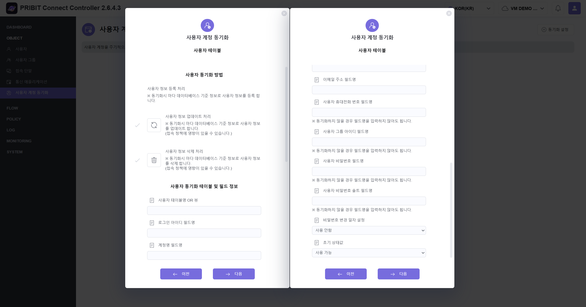

사용자 동기화 방법 

※ 동기화 시 고객사 데이터베이스의 변경된 정보로 PCC의 사용자 정보를 업데이트 또는 삭제합니다.  

- [x] 사용자 정보 업데이트 처리 
- [x] 사용자 정보 삭제 처리 

사용자 동기화 테이블 및 필드 정보 

- 사용자 테이블명 or 뷰 
  - 사용자 계정의 테이블을 입력합니다. 
  - ex) *`USERS`*  
- 로그인 아이디 필드명
  - 사용자 계정 테이블의 Login ID 컬럼 명을 입력합니다. 
  - ex) *`USER_ID`* 
- 계정명 필드명
  - 사용자 계정 테이블의 사용자 이름 컬럼 명을 입력합니다. 
  - ex) *`USER_NAME`* 
- 이메일 주소 필드명 
  - 사용자 계정 테이블의 사용자 이메일 컬럼 명을 입력합니다. 
  - ex) *`EMAIL_ADDR`* 
- 사용자 휴대전화 번호 필드명 
  - 사용자 계정 테이블의 사용자 휴대전화 번호 컬럼 명을 입력합니다. 
  - ex) *`USER_PHONE`* 
- 사용자 그룹 아이디 필드명 
  - ex) (blank) 
- 사용자 비밀번호 필드명 
  - ex) (blank) 
- 사용자 비밀번호 솔트 필드명 
  - ex) (blank) 
- 비밀번호 변경 일자 설정 
  - 동기화 시 비밀번호 변경 일자를 설정하는 방법을 *`사용 안함`*, *`동기화 일시로 자동 업데이트`* 로 설정합니다.  
  - ex) 
    - [x] *`사용 안함`*
- 초기 상태값 
  - 동기화 시 사용자의 상태를 *`사용 가능`*, *`사용 불가`*, *`사용 대기`* 로 설정합니다.  
  - ex)
    - [x] *`사용 가능`* 

<br> 

> [!NOTE] 사용자의 "사용 대기" 상태  
> 사용자의 `사용 대기` 상태는 동기화 시에만 지정 할 수 있는 사용자의 상태입니다.  
> 사용자의 `사용 대기` 를 사용하기 위해서는 SYSTEM > 시스템 환경 설정 > 컨트롤러 정보 에서 특정 기업 코드를 설정해야 합니다.  

<br>

사용자 그룹 테이블 설정  

(본 가이드에서는 사용자 그룹 동기화는 진행하지 않습니다.)

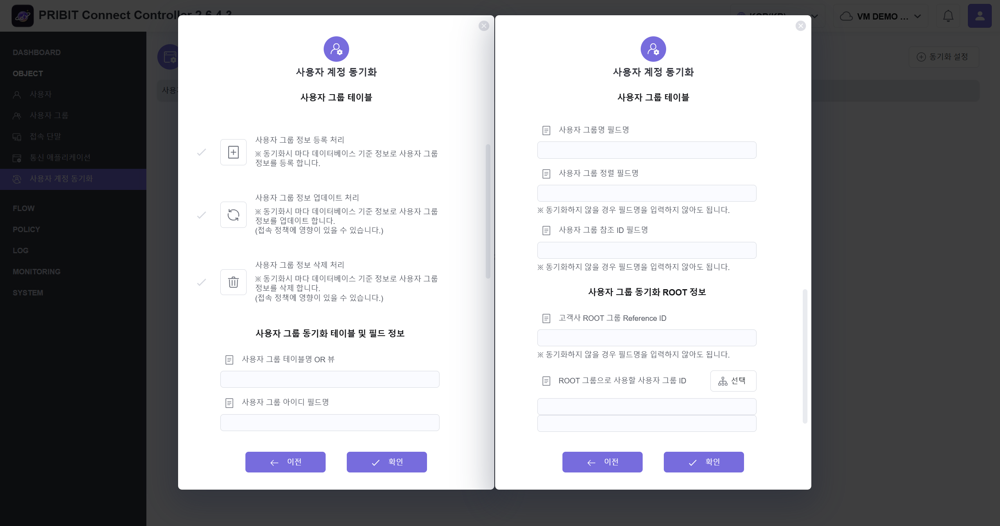

사용자 그룹 동기화 방법  

- [ ] 사용자 그룹 정보 등록 처리 
- [ ] 사용자 그룹 정보 업데이트 처리 
- [ ] 사용자 그룹 정보 삭제 처리 

사용자 그룹 동기화 테이블 및 필드 정보 

- 사용자 그룹 테이블명 or 뷰 
  - ex) (blank) 
- 사용자 그룹 아이디 필드명 
  - ex) (blank) 
- 사용자 그룹명 필드명 
  - ex) (blank) 
- 사용자 그룹 정렬 필드명 
  - ex) (blank) 
- 사용자 그룹 참조 ID 필드명 
  - ex) (blank) 
  
사용자 그룹 동기화 ROOT 정보 

- 고객사 ROOT 그룹 REference ID 
  - ex) (blank)
- ROOT 그룹으로 사용할 사용자 그룹 ID (선택) 
  - 최상위 그룹의 위치를 지정할 수 있습니다. 
    - ex) (blank)  

<br>

동기화 실행 

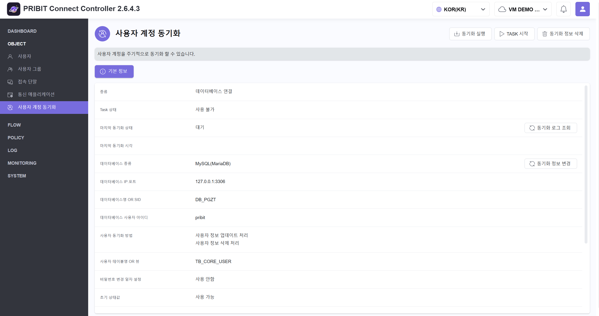

동기화 설정을 완료 후 실제 계정 동기화 수행을 진행하려면 `동기화 실행` 버튼을 눌러 진행해야 합니다. 

<br>

#### Active Directory(LDAP) 동기화 

동기화 방법 선택 화면에서 `LDAP 서버 연결` 을 선택합니다. 
AD를 기본으로 설정했다면 아래 안내되는 설정과 크게 다르지 않습니다.  
기본적으로는 예시에 설정된 값으로 적용을 합니다. (AD 서버 IP, 접속 계정, 비밀번호는 제외)  


- [x] LDAP 서버 연결  

<br>

LDAP 서버 동기화 설정 

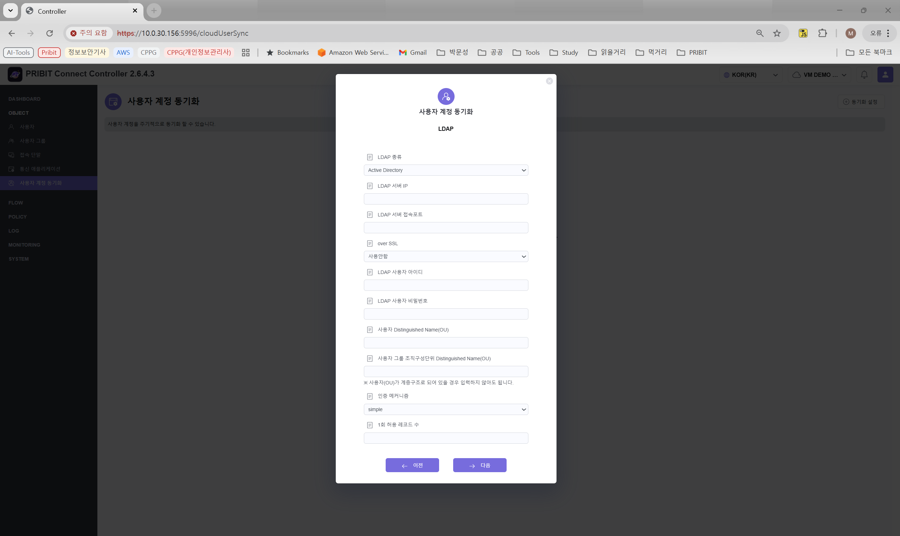  

- LDAP 종류 
  - [x] *`Active Directory`* 
- LDAP 서버 IP  
  - ex) *`10.0.30.158`*  
- LDAP 서버 접속 포트  
  - ex) *`389`*  
- over SSL
  - [x] 사용 안함  
- LDAP 사용자 아이디  
  - ex) *`administrator@pribit.com`*  
  - 사용자 계정은 `@도메인` 으로 입력해주어야 합니다. 
- LDAP 사용자 비밀번호 
  - ex) *`Pri***60!`*  
- 사용자 Distinguished Name(OU)  
  - ex) *`OU=TechCorp,DC=pribit,DC=com`*  
- 사용자 그룹 조직구성단위 Distinguished Name(OU)  
  - ex) (blank)  
- 인증 메커니즘 
  - [x] *`simple`*  
- 1회 허용 레코드 수 
  - ex) *`50`*  

<br>

사용자 동기화 Canonical Name(CN) 정보  

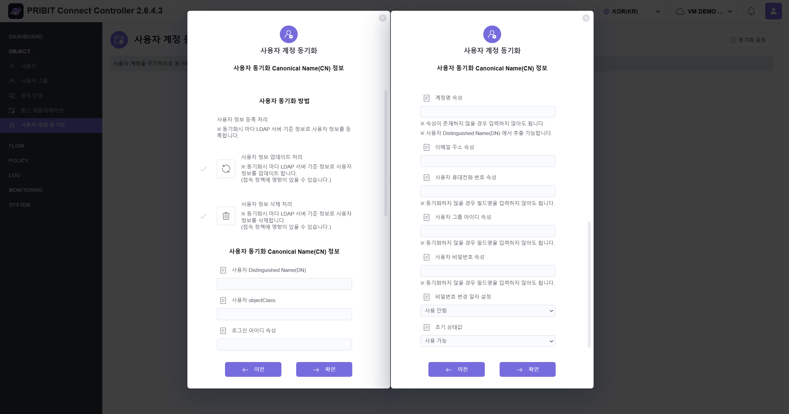  

- 사용자 정보 등록 처리 
  - [x] 사용자 정보 업데이트 처리  
  - [x] 사용자 정보 삭제 처리  
- 사용자 Distinguished Name(DN)  
  - AD 에서 기본적으로 생성하게되면 *`distinguishedName`* 로 생성됩니다.  
  - ex) *`distinguishedName`*  
- 사용자 objectClass  
  - AD 에서 기본적으로 생성하게되면 *`user`* 으로 설정됩니다.  
  - ex) *`user`*  
- 로그인 아이디 속성  
  - AD 에서 기본적으로 생성하게되면 *`sAMAccountName`* 로 생성됩니다.  
  - ex) *`sAMAccountName`*  
- 계정명 속성  
  - ex) (blank)  
- 이메일 주소 속성  
  - AD 에서 기본적으로 생성하게되면 *`userPrincipalName`* 로 생성됩니다.  
  - ex) *`userPrincipalName`*  
- 사용자 휴대전화 번호 속성  
  - ex) (blank)  
- 사용자 그룹 아이디 속성  
  - ex) (blank)  
- 사용자 비밀번호 속성  
  - ex) (blank)  
- 비밀번호 변경 일자 설정 
  - [x] 사용 안함  
- 초기 상태값
  - [x] 사용 가능 

<br>

> **비밀번호 변경 일자 설정:** `사용 안함` / `동기화 일시로 자동 업데이트`  
> PCC DB에 계정 동기화 시 계정의 비밀번호 업데이트 일시를 동기화 일시로 자동 업데이트합니다.   

<br>

> [!NOTE] 
> 초기 상태값: 사용 가능 / 사용 불가 / 사용 대기    
>   
> PCC DB에 계정 동기화 시 계정의 초기 상태값을 `사용 가능` / `사용 불가` / `사용 대기` 중 하나로 설정합니다.   
> `사용 가능` : 정상 사용자  
> `사용 불가` : 잠김 사용자  
> `사용 대기` : 대기 사용자  

<br>

사용자 그룹 조직구성단위(OU) 정보 
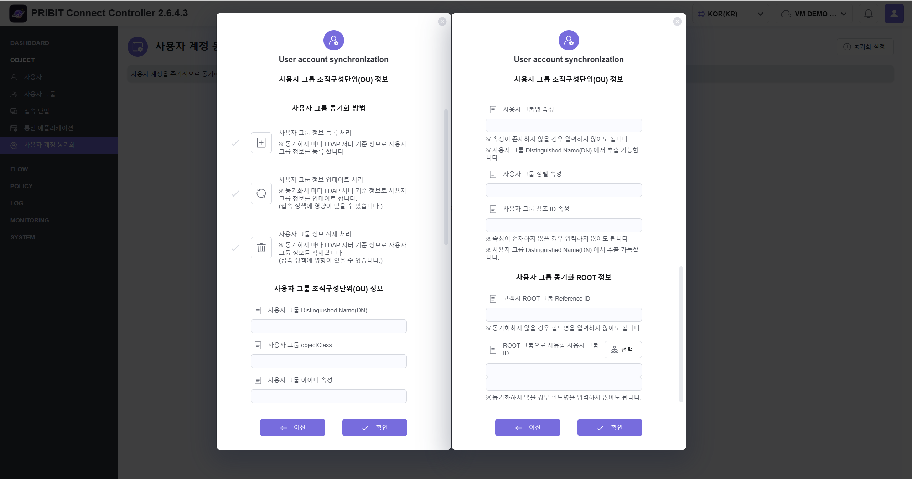  

사용자 그룹 동기화 방법
- [x] 사용자 그룹 정보 등록 처리  
- [x] 사용자 그룹 정보 업데이트 처리  
- [x] 사용자 그룹 정보 삭제 처리  

사용자 그룹 조직구성단위(OU) 정보  
- 사용자 그룹 Distinguished Name(DN)  
  - AD 에서 기본적으로 생성하게되면 *`distinguishedName`* 로 생성됩니다.  
  - ex) *`distinguishedName`*  
- 사용자 그룹 objectClass  
  - AD 에서 기본적으로 생성하게되면 *`organizationalUnit`* 로 생성됩니다.  
  - ex) *`organizationalUnit`*  
- 사용자 그룹 아이디 속성  
  - ex) (blank)  
- 사용자 그룹명 속성  
  - ex) (blank)  
- 사용자 그룹 정렬 속성  
  - ex) *`ou`*
- 사용자 그룹 참조 ID 속성  
  - ex) (blank)  

사용자 그룹 동기화 ROOT 정보
- 고객사 ROOT 그룹 Reference ID  
  - ex) (blank)  
- ROOT 그룹으로 사용할 사용자 그룹 ID  
  - 최상위 그룹의 위치를 지정합니다. 
  - ex) *`ROOT`*   

<br>

동기화 실행 
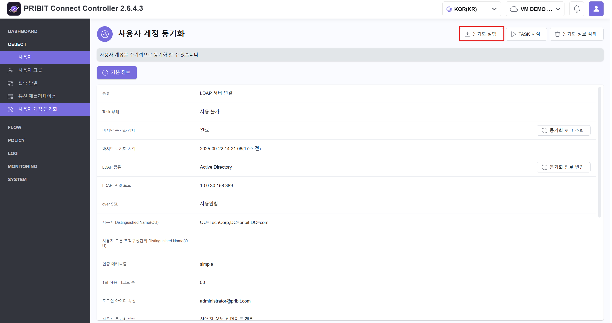  

동기화 설정을 완료 후 실제 계정 동기화 수행을 진행하려면 `동기화 실행` 버튼을 눌러 진행해야 합니다. 

<br>

사용자 동기화 완료 
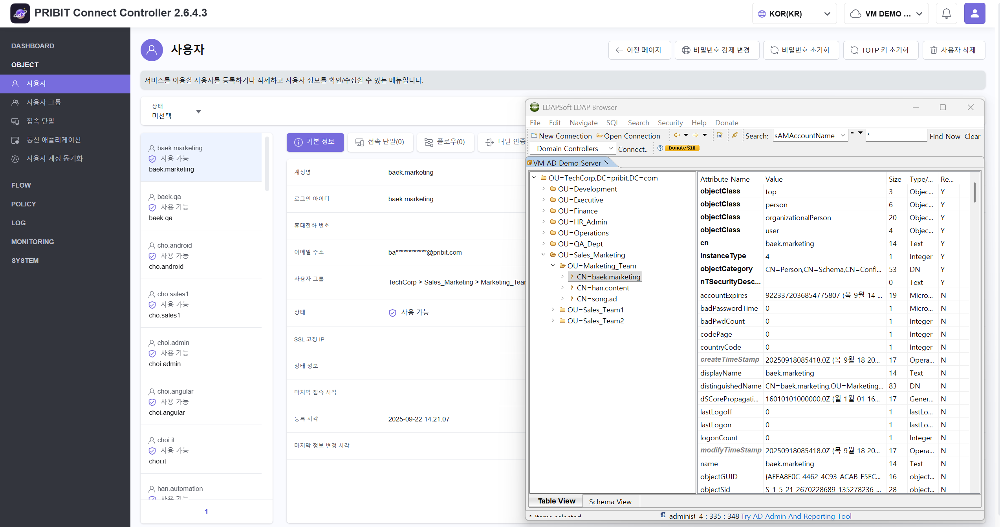  

<br>

사용자 그룹 동기화 완료  
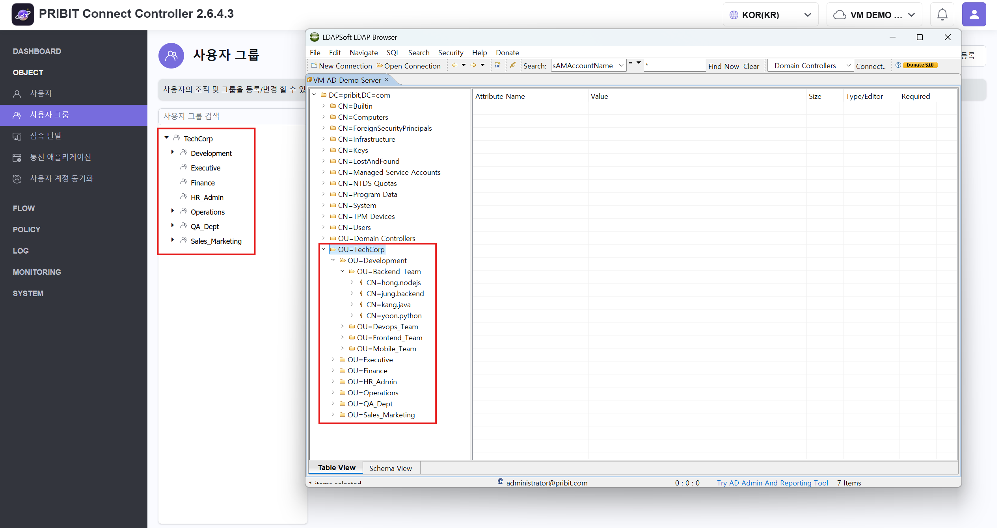  

<br>

## 사용자 그룹 관리 

PCC 에서 사용자 그룹은 일반적인 그룹관리 기능을 갖고 있습니다.   
그룹 관리에서 `상태 변경` 을 통해 그룹을 `사용 가능`, `사용 불가` 상태로 제어 할 수 있습니다.  
그룹의 상태가 `사용 불가` 상태로 변경 시, 그룹에 포함되어 있는 사용자의 로그인 처리는 다음과 같은 원리로 동작합니다.  

```
[동작 원리]
그룹에 포함되어 있는 사용자가 하나라도 '사용 가능' 상태인 그룹에 속해 있으면 로그인이 가능 

예시) 로그인 가능 여부
현재 상황:
그룹 A (사용 가능) → User01 포함
그룹 B (사용 가능) → User01, User02 포함
그룹 C (사용 불가) → User01, User02, User03 포함

로그인 결과:
User01: 로그인 가능 (그룹 A, B가 사용 가능 상태이므로)
User02: 로그인 가능 (그룹 B가 사용 가능 상태이므로)
User03: 로그인 불가 (오직 그룹 C에만 속해 있고, 그룹 C는 사용 불가)

특정 사용자 그룹의 로그인을 완전히 막으려면:

해당 사용자를 모든 '사용 가능' 그룹에서 제거하거나
해당 사용자가 속한 모든 그룹을 '사용 불가' 상태로 변경 

즉, '사용 불가' 그룹에 사용자를 추가하는 것만으로는 접근 제어가 되지 않으며, 다른 사용 가능 그룹 멤버도 함께 제어  
또는 사용자 그룹에 속해있는 모든 사용자 자체를 사용 불가 상태로 변경  
``` 

<br>

*** 

## 사용자 인증 

PCA 사용자 로그인 화면  

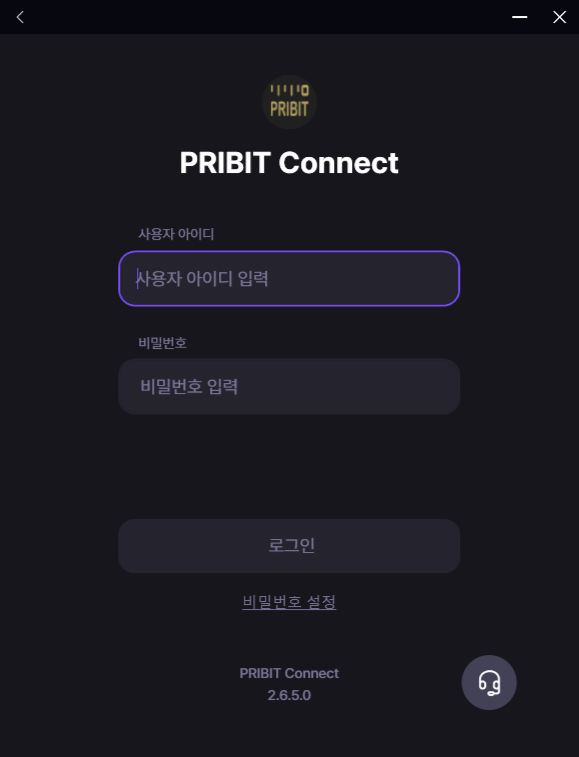

- 사용자 아이디 : 
  - ex) *pribit*
- 비밀번호 : 
  - ex) \*\*\*\*\*\*\*\*\* 
  
<br>

### 사용자 임시 비밀번호 로그인 

임시 비밀번호로 로그인하게 되면 에이전트를 사용할 수 없고, 반드시 임시 비밀번호를 변경해야 에이전트를 사용 가능합니다.  

비밀번호 변경 안내 화면  


`지금 변경` 버튼을 누르면 시스템에 설정되어 있는 **인증 번호 제공 방법**으로 OTP 가 발송됩니다. 

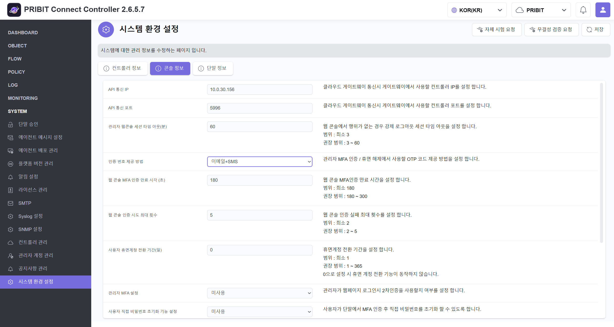
- [ ] 이메일 + SMS  
- [ ] SMS  
- [x] 이메일  

> [!NOTE]  
> `이메일 + SMS` 로 설정 시 사용자가 직접 이메일 또는 SMS를 선택할 수 있고, 단일 선택(`SMS` 나 `이메일` 둘 중 하나)인 경우 해당 설정으로 OTP가 전송됩니다.  

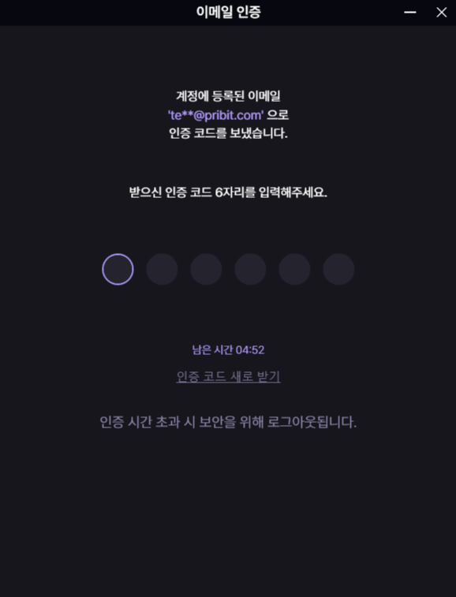  

이메일로 전송된 OTP 코드 
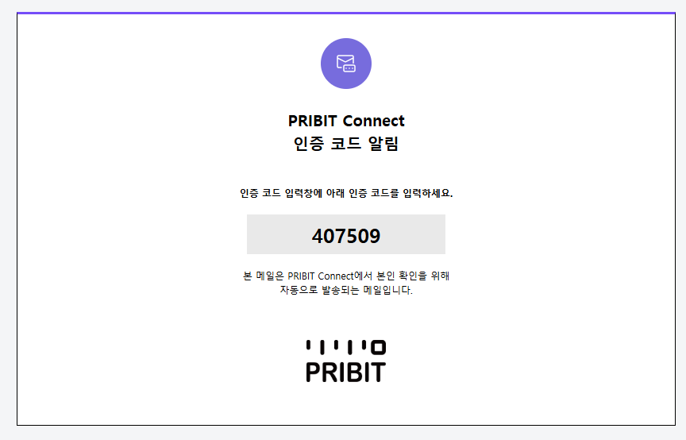

OTP 인증이 완료되면 다음과 같이 비밀번호를 변경합니다.  

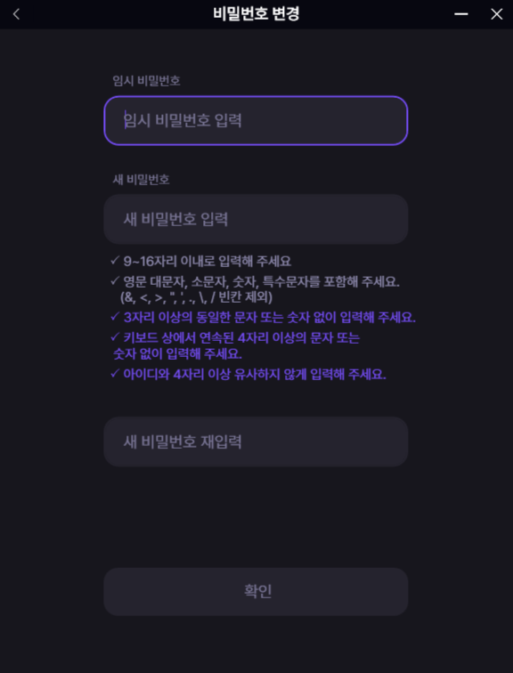  

> [!NOTE]   
> 비밀번호 변경을 수행한 후에는 재로그인을 해야 합니다.  

<br>

### 사용자 MFA 로그인  

`단말 상태 확인 행위 제어` 에서 [로그인 시 MFA 인증 요구](./SecuriyPolicy.md#로그인-시-mfa-인증-요구-require-mfa-at-login) 정책을 설정하면, 사용자 인증 시 MFA 로그인을 수행할 수 있습니다.  

사용자 MFA 인증 방식 선택 화면 
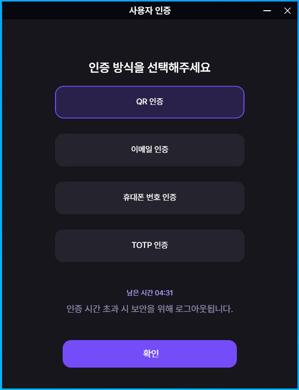  

- QR 인증 
QR 인증은 카메라가 있는 디바이스(모바일)에 설치되어 있는 PCA 앱에서 로그인 완료 후, 오른쪽 상단에 보이는 스캐너를 통해 QR을 스캔해야 로그인할 수 있습니다.  

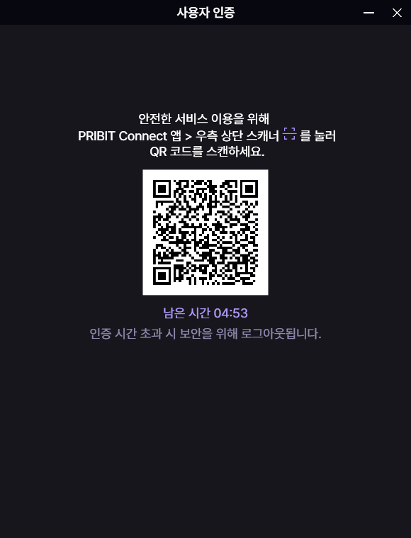

`모바일 선 인증 필요`

모바일 단말에서 해당 사용자 로그인 완료 
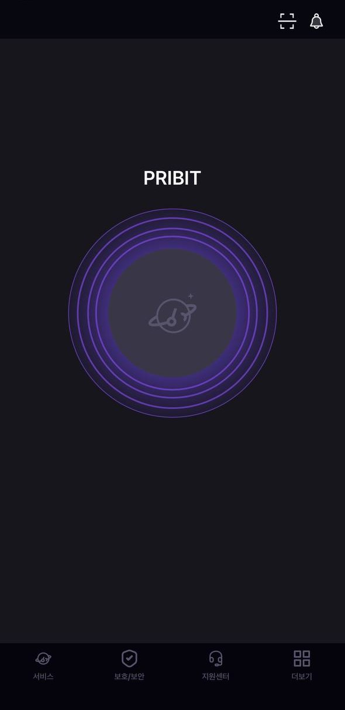  

오른쪽 상단 스캐너 모양 클릭  

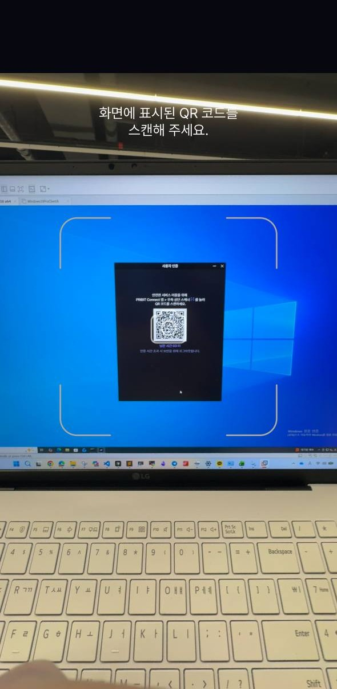  

PC에 보여지는 QR 코드를 모바일 앱으로 스캔합니다. 

QR 인증이 완료되었습니다 메시지 확인  


> [!NOTE] 
> 모바일에서 접속한 사용자와 PC에서 접속한 사용자가 다를경우 QR 인증에 실패합니다.  

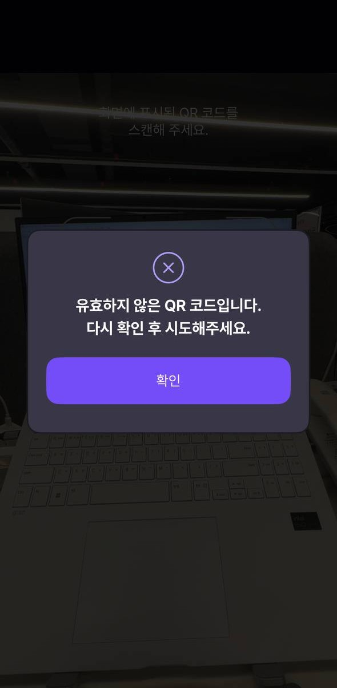

- 이메일 인증 
이메일 인증은 사용자 정보에 입력된 이메일 정보로 OTP가 발송되고, 이 코드를 입력하는 방식입니다. 

  

- 휴대폰 번호 인증  
휴대폰 번호 인증은 사용자 정보에 입력된 휴대폰 번호로 OTP 코드가 발송되고, 이 코드를 입력하는 방식입니다.  

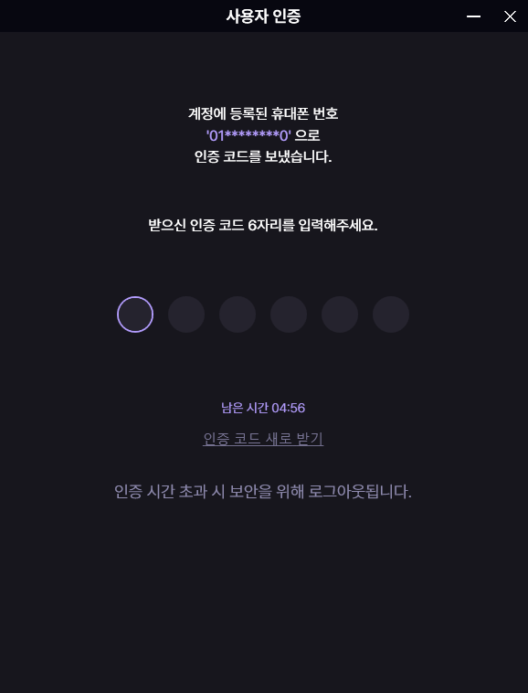  

- TOTP 인증 
TOTP 인증은 OTP 인증 앱(`Google Authenticator` 또는 `MS Authenticator` 등)으로 에이전트에서 보여지는 QR 코드를 스캔(또는 키 입력)하여 OTP를 등록하고, 발급되는 OTP를 입력하는 방식입니다.  

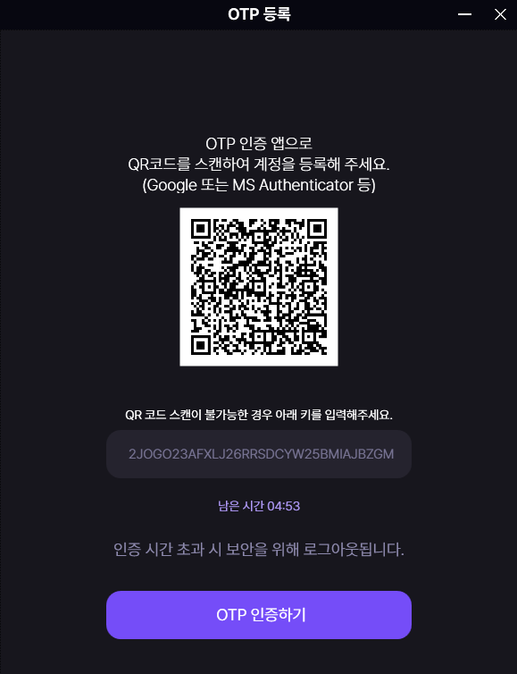  

`OTP 인증하기` 를 눌러 등록한 OTP 를 검증합니다.  

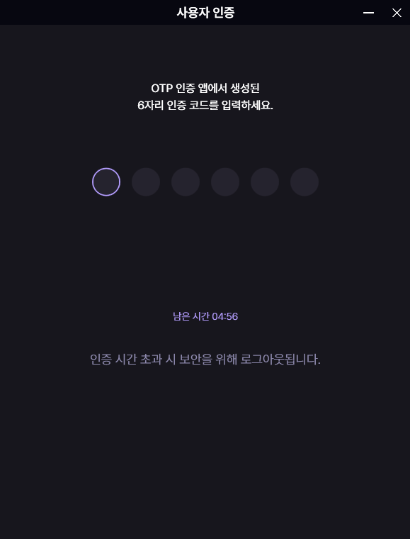  

> [!NOTE]   
> TOTP 등록 후에는 사용자 재로그인을 수행해야 합니다.    

<br>

### 사용자 Internal DB 인증 

사용자 계정 생성 또는 사용자 동기화로 생성된 계정으로 인증처리를 수행합니다. 
PCC 자체 계정(Internal DB) 로 인증을 수행할 때는 AD(LDAP) 인증과 같이 별도의 정책을 지정할 필요는 없습니다. 


### 사용자 AD(LDAP) 인증 

> [!NOTE] 
> 사용자 AD 인증  
>   
> 사용자 로그인 처리를 AD(LDAP) 으로 수행(정책 지정)할 경우, 반드시 동기화가 먼저 진행되어야 합니다.   
> 즉, 사용자 계정이 PCC에 이미 존재해야 인증을 수행 할 수 있습니다.  
> 동기화되지 않은 상태(계정이 생성되지 않은 상태)에서는 인증을 수행 할 수 없습니다.  

<br>

#### AD(LDAP) 인증 정책 생성  
POLICY > 단말 상태 확인 및 행위 제어 
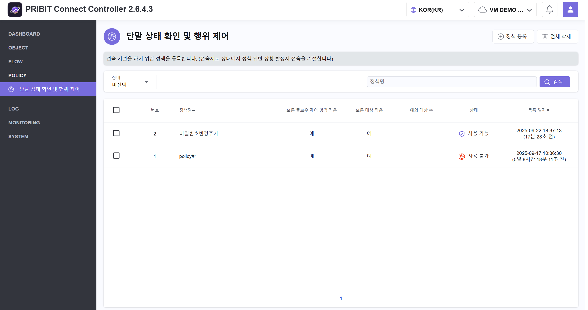  

AD(LDAP) 인증 수행을 위해서는 POLICY 에서 단말 인증 수행에 대한 정책을 생성해주고 적용해야 합니다. 
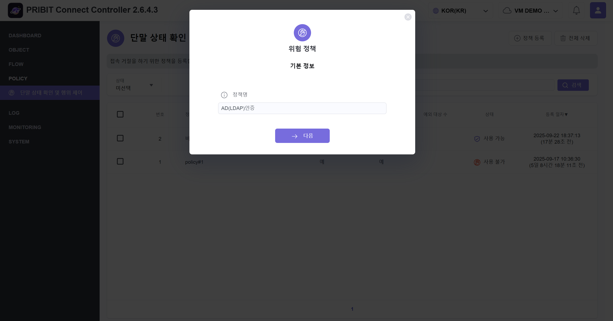

적용한 플랫폼(다중 선택 가능)  
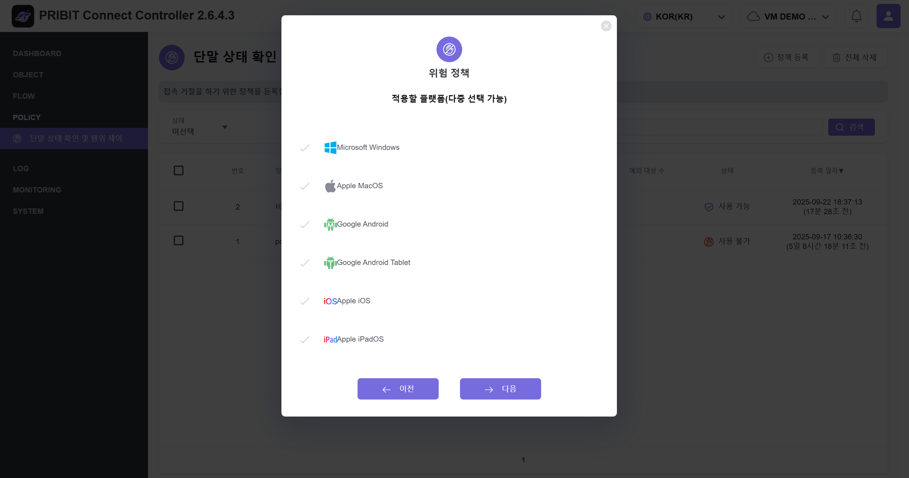  
- ex) 
  - [x] Microsoft Windows 

`LDAP` 으로 검색합니다. 
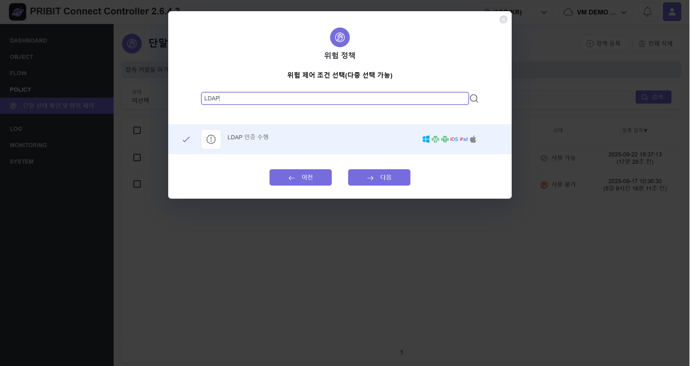
`LDAP 인증 수행` 을 선택합니다. 

> [!Note] LDAP 인증 시 제약 사항  
> Ldap 인증 수행 정책 사용 시, 아래의 기능 및 정책 사용이 제한됩니다.   
> - 기능: 사용자 비밀번호 초기화, 사용자 비밀번호 강제 변경, 간편 인증 사용  
> - 정책: 비밀번호 마지막 변경 기간 초과 시 비밀번호 변경  

적용 대상  
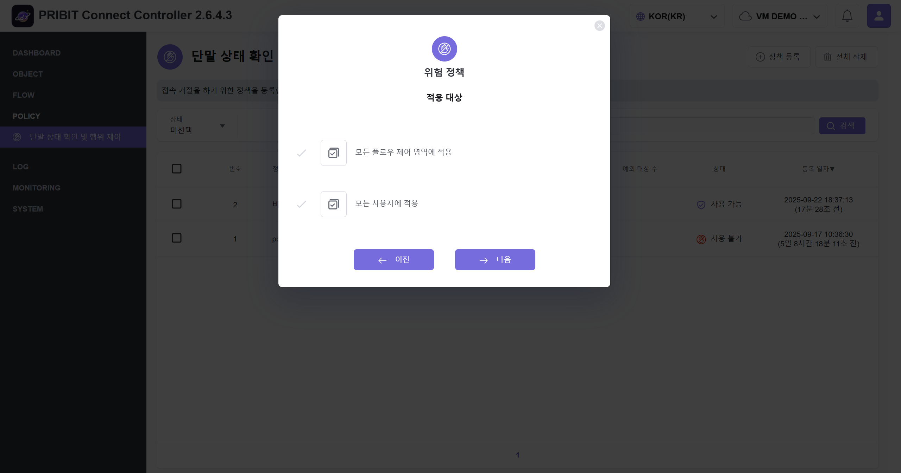  
- ex) 
  - [x] 모든 플로우 제어 영역에 적용  
  - [x] 모든 사용자에 적용  

상태 
- ex) 
  - [x] 사용 가능 

<br>

#### AD(LDAP) 인증을 위한 서버 정보 입력

단말 상태 확인 및 행위 제어 목록에서 상세 조건의 LDAP 인증 수행 설정정보를 추가로 입력해야 합니다. 

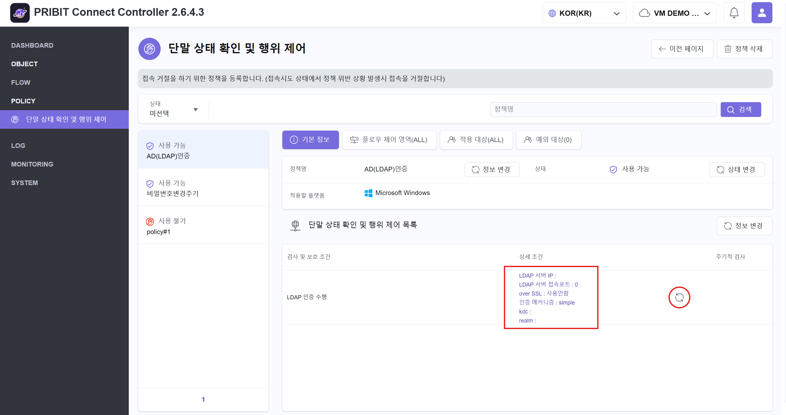  


🔄 모양의 아이콘을 눌러 인증정보를 추가합니다. 
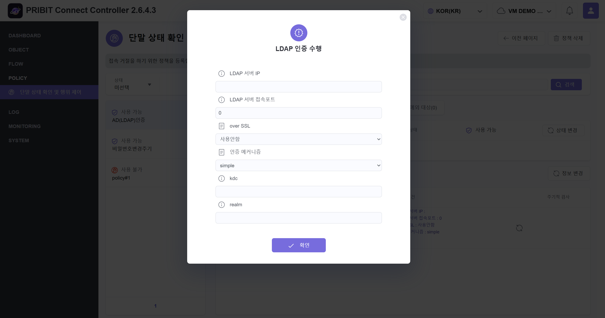  
- LDAP 서버 IP 
  - ex) *`10.0.30.158`*  
- LDAP 서버 접속 포트
  - ex) *`389`*  
- over SSL 
  - ex) 
    - [x] 사용 안함  
- 인증 메커니즘  
  - ex)  
    - [x] sample  
- kdc  
  - ex) (blank)  
- realm  
  - ex) (blank)  

<br> 


<br><br>

# PCA 배포 관리 

<br>

## PCA 관리 버전 등록 
에이전트를 사용하기 위해서는 PCC 관리 콘솔의 에이전트 배포 관리에 등록하여야 사용할 수 있습니다. 

Error Message: `배포 되지 않은 에이전트 버전 입니다.`

<br>

SYSTEM > 에이전트 배포 관리

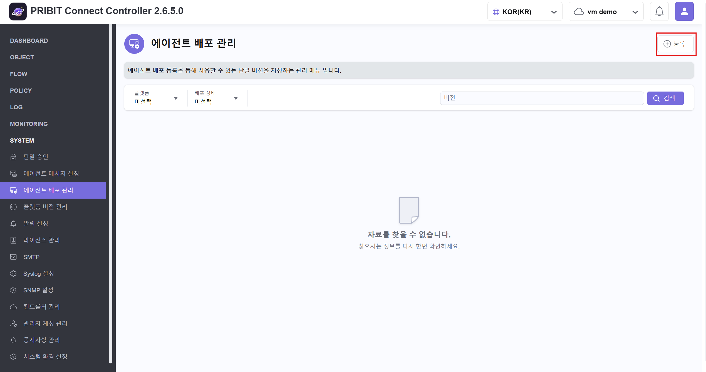  

등록버튼을 눌러 에이전트 등록을 진행합니다. 

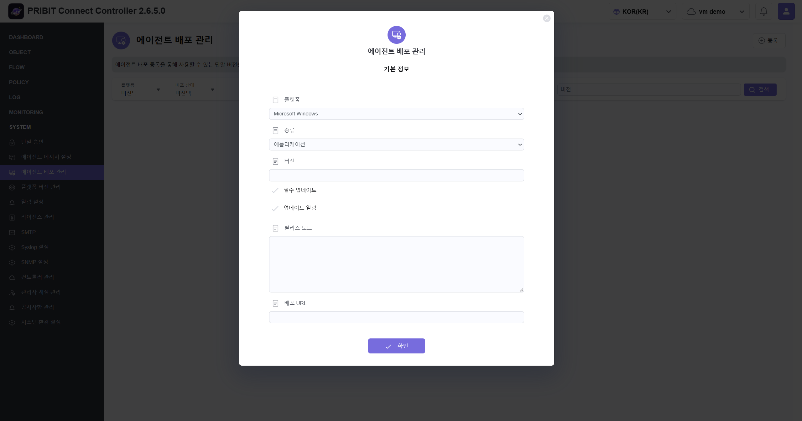  
- 플랫폼 : Agent 의 플랫폼의 종류를 선택합니다. (단일 선택)
  - ex) 
  - [x] Microsoft Windows 

- 종류 : 플랫폼에 설치될 형태를 선택합니다. (단일 선택) 
  - ex)  
  - [x] 애플리케이션 

- 버전 : 등록할 PCA 의 버전을 입력합니다. 
  - ex) *`2.6.4.18`* 

- [ ] 필수 업데이트 : 필수로 업데이트를 진행합니다. 

- [ ] 업데이트 알림 : 업데이트 시 알림을 받습니다. 
  
- 릴리즈 노트 : 배포 할 에이전트 버전에 대한 릴리즈 노트입니다. (필수입력)
  - ex) *1. Ubuntu 24.04.02 지원<br>2. Gateway 오프라인 설치 지원<br>...<br>17. 그 외 UI/UX 개선 버전* 

- 배포 URL : 에이전트를 다운받거나 설치 할 수 있는 URL을 입력합니다. (필수입력)
  - ex) *`https://pribit.packetgo.com/agent/distribution`* 

에이전트 등록을 완료하면 `대기` 상태로 생성됩니다. 

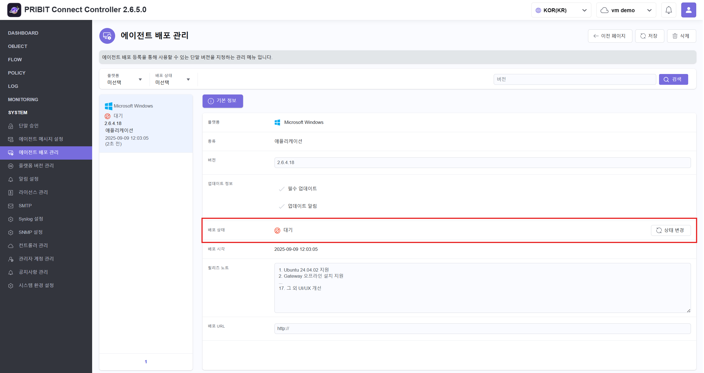  

`상태 변경`을 눌러 Agent 상태를 `배포`로 변경합니다. 

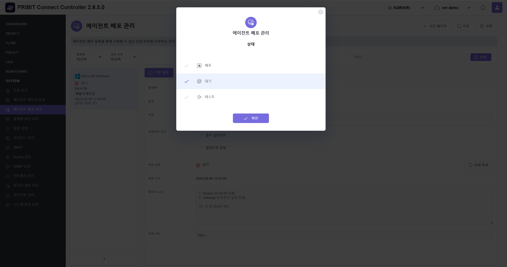 

- 배포 : 등록했던 Agent 를 배포(사용)로 변경합니다. 
- 대기 : 등록했던 Agent 를 대기 상태로 변경합니다. 
- 테스트 : 등록했던 Agent 를 테스트 상태로 변경합니다.

<br>

## PCA 필수 업데이트 
최신 에이전트 버전 사용 여부를 확인하여 모든 단말이 최신 보안 패치를 적용하도록 관리할 수 있습니다. 
에이전트는 자동 업데이트를 통해 최신 버전으로 전환할 수 있습니다. 이를 통해 구버전의 보안 취약점을 악용한 공격을 방지하고 모든 단말에 일관된 보안 수준을 유지할 수 있습니다. 

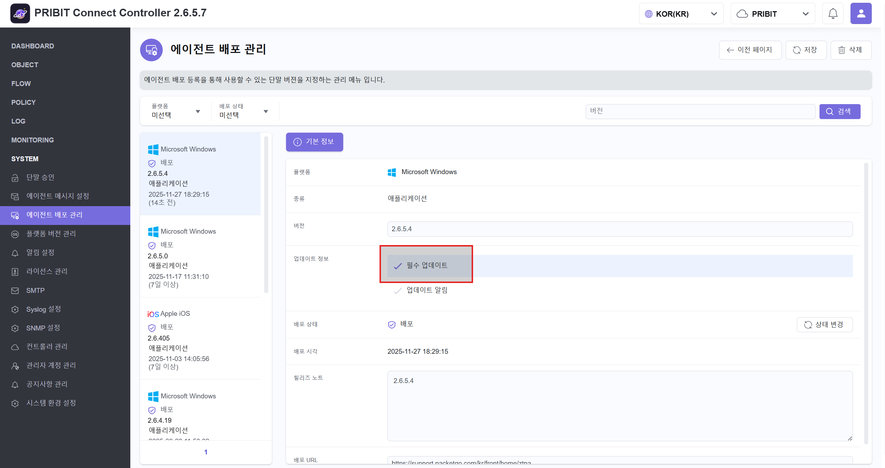

> [!NOTE]  
> PCA 필수 업데이트를 사용하려면 `단말 상태 확인 및 행위 제어` 에서 '에이전트 버전 최신 버전 미사용 시 접속 차단' 정책을 추가해야 합니다.  
> [에이전트 버전 최신 버전 미사용 시 접속 차단](./SecuriyPolicy.md#에이전트-버전-최신-버전-미사용-시-접속-차단-block-access-if-agent-version-is-outdated) 정책을 설정을 확인하세요.  
> 

<br><br>


# 통신 어플리케이션  

<br>

## 통신 애플리케이션 등록  
애플리케이션 플로우 정책에 적용할 통신(용) 애플리케이션을 생성하고 관리합니다. 

<br>

### 업무용 Web Server 에 접속하는 서비스를 msedge.exe 으로 실행하도록 Agent 에 등록 

Agent 에서 서비스 목록에 표시하기 위해서는 애플리케이션 플로우에서 `별칭` 으로 서비스를 등록해야 합니다. 
그리고, `별칭` 에 서비스로 등록하기 위해서는 통신 애플리케이션이 생성되어 있어야 합니다.  

OBJECT > 통신 애플리케이션 
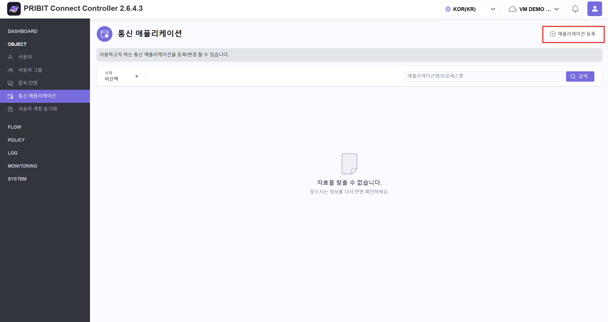

애플리케이션을 등록하기 위해 `애플리케이션 등록` 버튼을 눌러 등록 절차를 시작합니다. 

애플리케이션 등록 

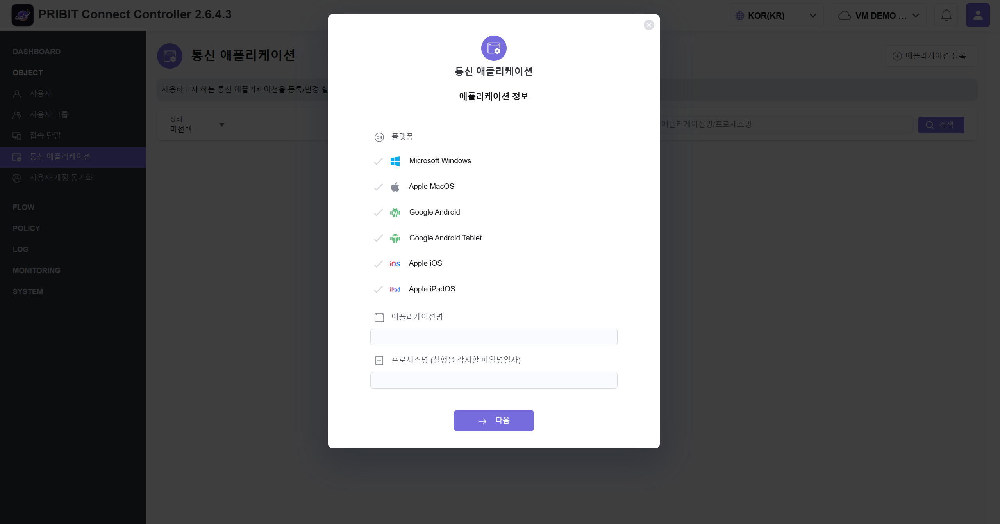  

애플리케이션 정보를 입력합니다.  

- 플랫폼 : *플랫폼 종류를 선택합니다.*
  - ex) 
  - [x] Microsoft Windows 

- 애플리케이션 명 : *통신 애플리케이션의 이름 입니다.식별을 위한 명칭으로 임의지정이 가능합니다. * 
  - ex) `윈도우 엣지` 

- 프로세스 명 : *통신 애플리케이션의 프로세스명 입니다.실제 단말의 프로세스명을 입력해야 정상적인 애플리케이션 통신 제어가 가능합니다.*  
  - ex) `msedge.exe`  

<br>

애플리케이션 유효성 검사 정보 (`다중 선택 가능`)  
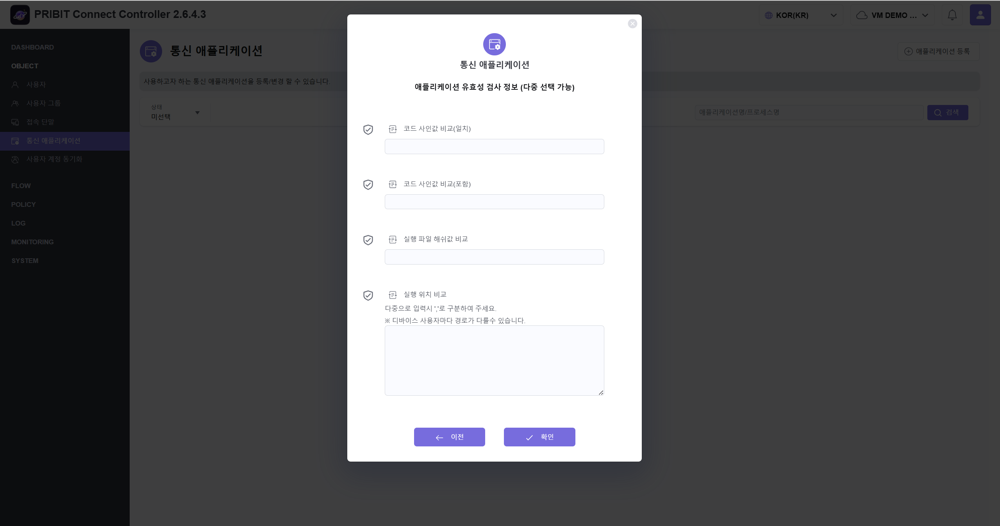

- 코드 사인값 비교(일치) : 
  - ex) `선택 안함`

- 코드 사인값 비교(포함) : 
  - ex) `선택 안함`  

- 실행 파일 해쉬값 비교 : 
  - ex) `선택 안함` 

- 실행 위치 비교 : *실행 될 애플리케이션의 위치를 입력합니다. 해당 위치에 실행 파일이 없을 경우 정상 동작하지 않을 수 있습니다.*  
  - ex) C:\Program Files (x86)\Microsoft\Edge\Application\msedge.exe

<br>

OBJECT > 통신 애플리케이션  
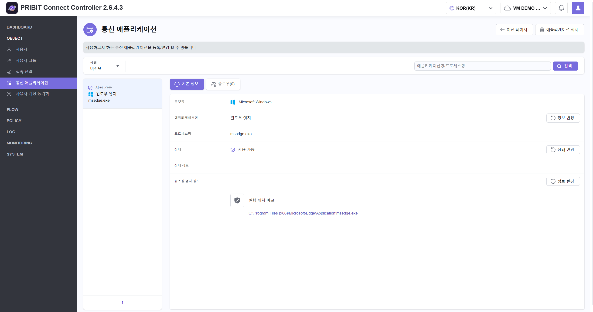

생성된 정보를 확인 할 수 있습니다. 

<br>

FLOW > 애플리케이션 플로우 > 통신 애플리케이션   
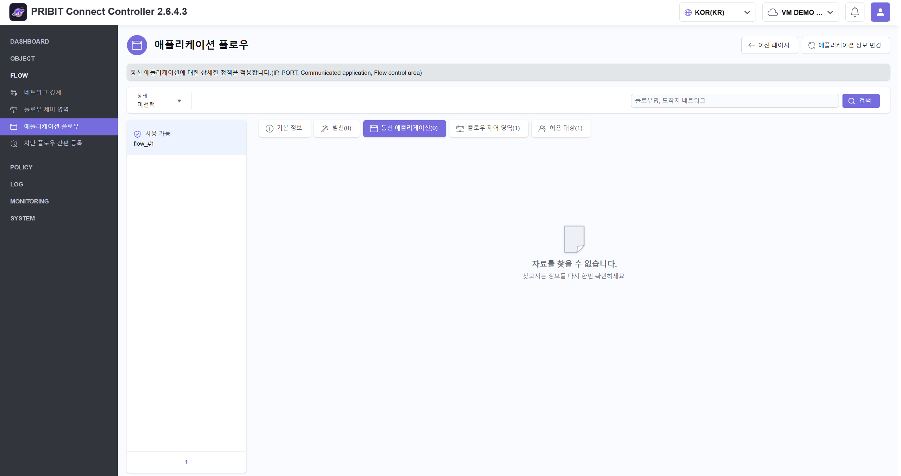

`애플리케이션 정보 변경` 으로 통신 애플리케이션을 등록해줍니다. 

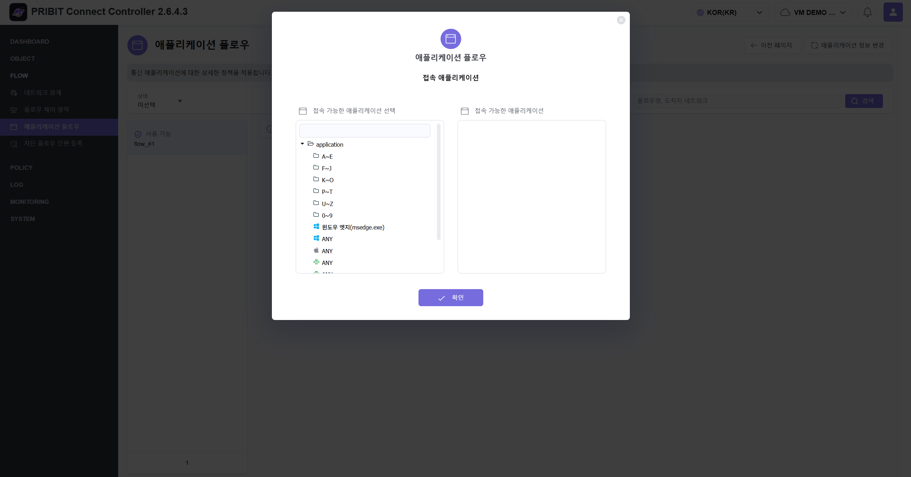

`접속 가능한 애플리케이션 선택` 목록에서 통신 애플리케이션 에서 생성한 `윈도우 엣지(msedge.exe)` 를 추가합니다. 

<br>  

FLOW > 애플리케이션 플로우 > 별칭 

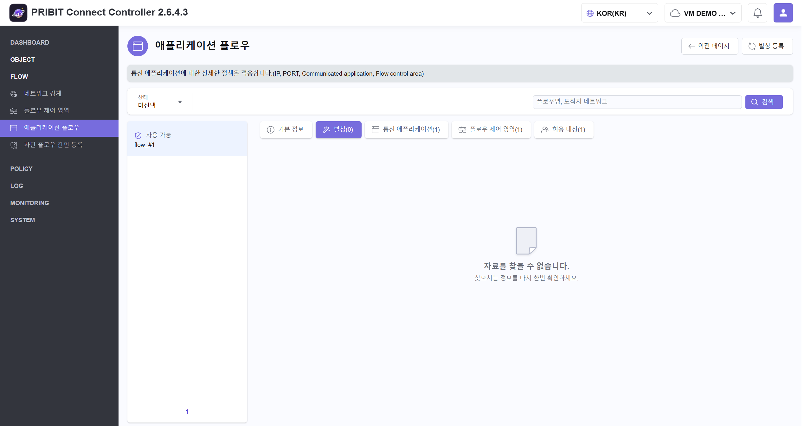  

`별칭 등록` 으로 별칭을 등록해줍니다. 

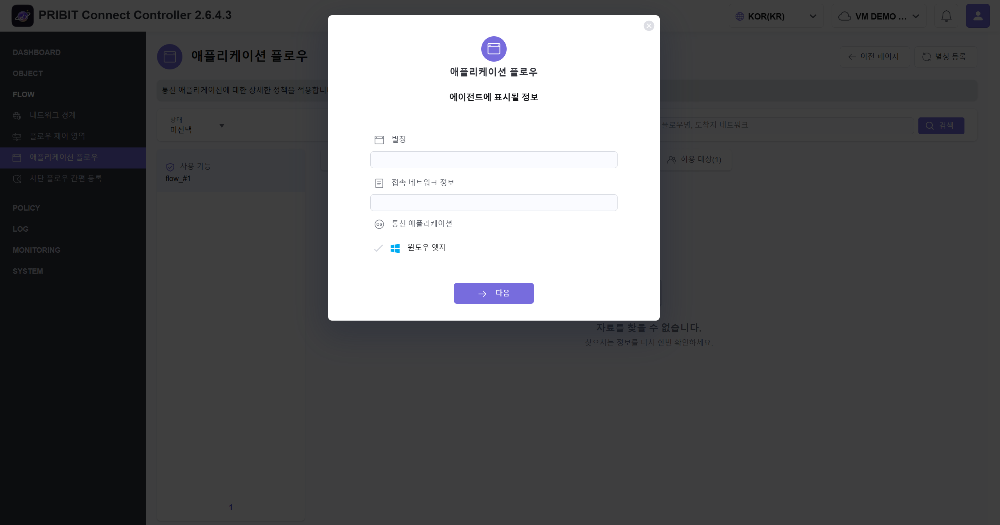  

- 별칭 : 
  - ex) 업무 서비스(Naver.com) 
- 접속 네트워크 정보 : 
  - ex) https://www.naver.com 
- 통신 애플리케이션 : 
  - ex) 
  - [x] 윈도우 엣지  

<br>  

에이전트에 표시 될 애플리케이션 종류  
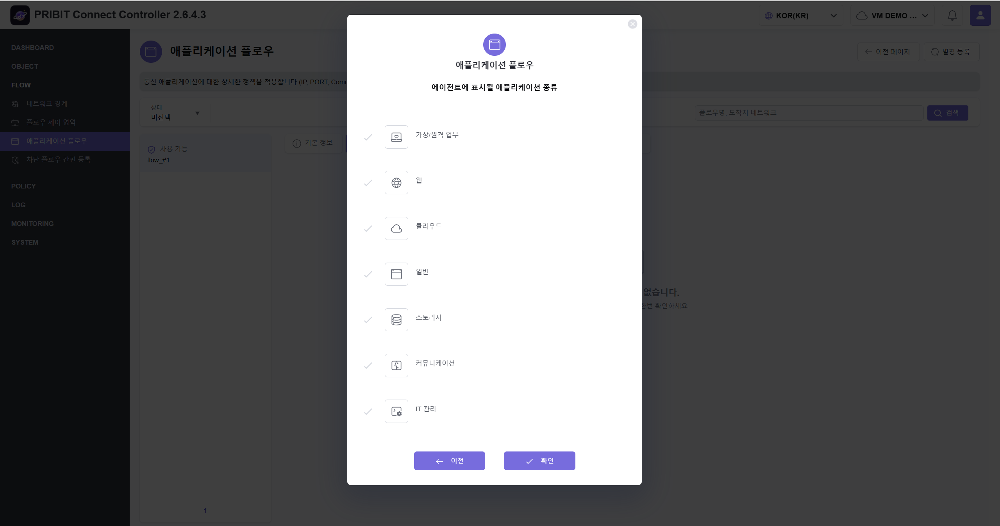

- ex) *서비스에 맞는 종류를 선택합니다.*
- [x] 웹 

<br> 

등록한 별칭을 확인합니다. 
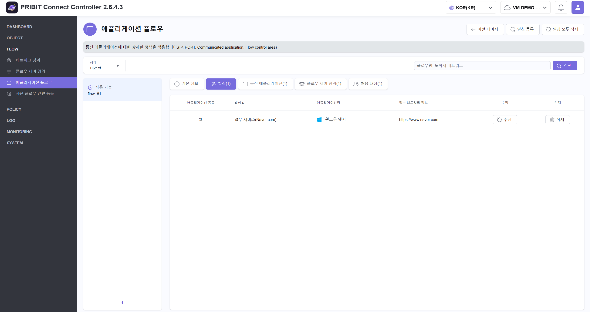 

<br>

에이전트에서 접속하여 서비스 목록을 확인하고 해당 서비스에 접속합니다.  

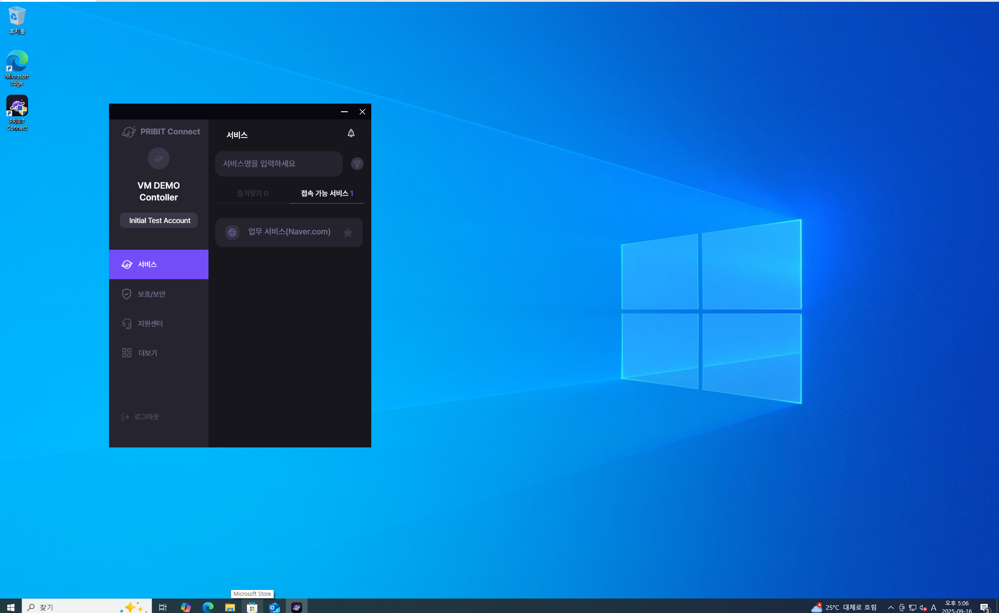

<br>

접속된 업무 서비스(www.naver.com)  

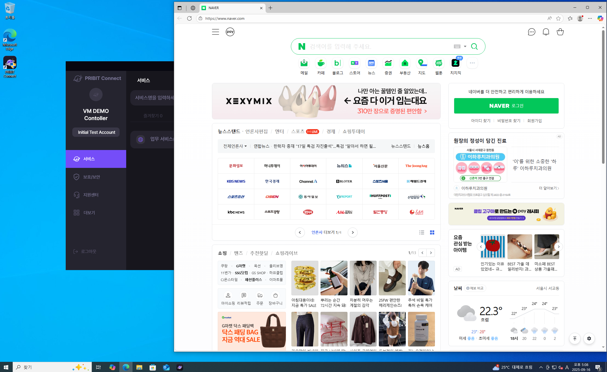

<br><br>

### Window File Server Explorer 등록 
윈도우 탐색기를 이용하여 파일 서버에 접속하는 서비스를 등록할 때, 해당 절차로 등록을 수행해야 합니다.  

Object > 통신 애플리케이션에서 애플리케이션 등록 시 아래 두 가지를 모두 등록해주어야 합니다. 

- 윈도우 탐색기 (explorer.exe)
- System (윈도우 시스템 인증)

먼저 윈도우 탐색기를 등록해줍니다. 

[통신 애플리케이션 등록](#통신-애플리케이션-등록) 과정과 동일하게 아래 정보로 통신 애플리케이션을 등록합니다. 

<br>

#### 윈도우 탐색기 등록 

애플리케이션 정보 선택 및 입력
- 플랫폼 : 
  - [x] Microsoft Windows 
- 애플리케이션 명 : *어플리케이션 명은 변경 가능합니다.*
  - Windows File Explorer
- 프로세스 명(실행을 감시할 파일명일자) : 
  - explorer.exe

애플리케이션 유효성 검사 정보 (다중 선택 가능)  

- 코드 사인값 비교(일치) : 
  - `선택 안함`  
- 코드 사인값 비교(포함) : 
  - `선택 안함`  
- 실행 파일 해쉬값 비교 : 
  - `선택 안함`  
- 실행 위치 비교 : 
  - `C:\Windows\explorer.exe` 

<br>

#### System (윈도우 시스템 인증) 등록 

애플리케이션 정보 선택 및 입력
- 플랫폼 : 
  - [x] Microsoft Windows 
- 애플리케이션 명 : *어플리케이션 명은 변경 가능합니다.*
  - `Windows File Server`
- 프로세스 명(실행을 감시할 파일명일자) : 
  - `System`  

애플리케이션 유효성 검사 정보 (다중 선택 가능)  

- 코드 사인값 비교(일치) :  
  - `선택 안함`   
- 코드 사인값 비교(포함) :  
  - `선택 안함`   
- 실행 파일 해쉬값 비교 :  
  - `선택 안함`   
- 실행 위치 비교 :  
  - `C:\Windows\System32\config\SYSTEM`   

<br> 

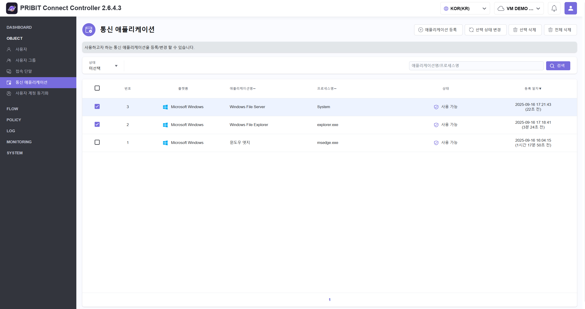

프로세스 `System`, `explorer.exe` 두 설정이 생성되어야 합니다. 

이제, 생성된 설정들을 애플리케이션 플로우의 설정에 적용시킵니다. 

<br>

FLOW > 애플리케이션 플로우  

별칭으로 등록하려면 통신 애플리케이션을 먼저 등록해주어야 별칭으로 등록 가능합니다.  
통신 애플리케이션 > 애플리케이션 정보 변경 클릭해줍니다.  

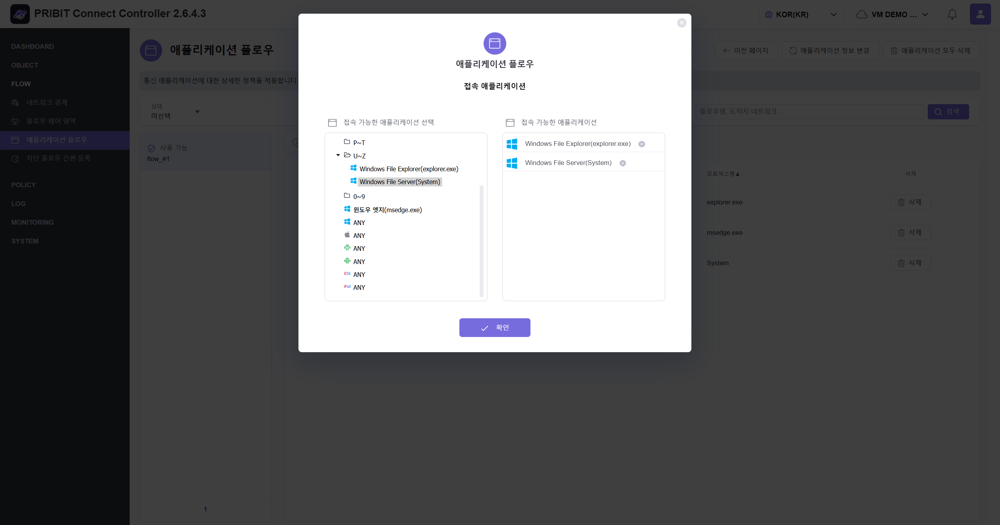  
접속 가능한 애플리케이션 선택 목록에서 앞서 만든 통신 애플리케이션들(Windows File Explorer, Windows File Server)들을 등록해줍니다.  

<br> 

다시, 별칭 탭으로 넘어가서 별칭 등록합니다.  

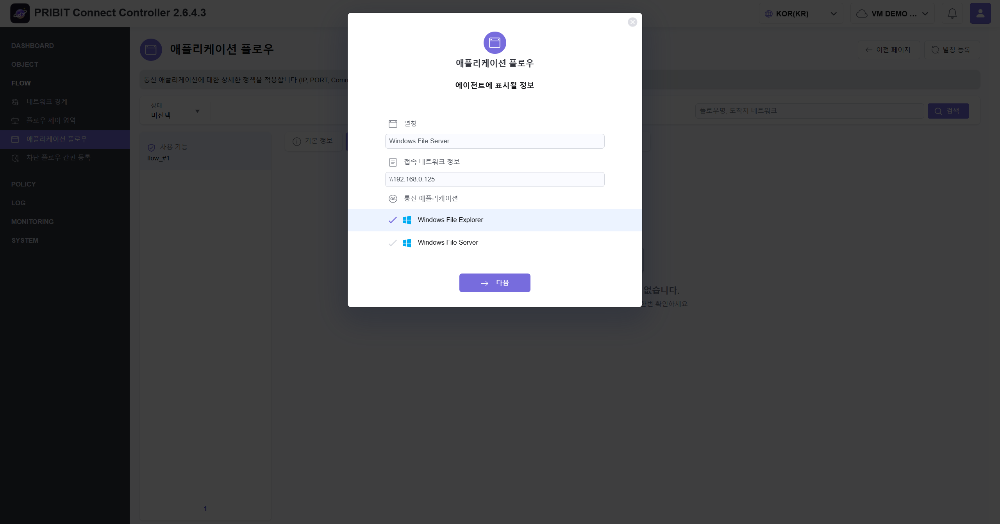

- 별칭 : *에이전트 앱에서 서비스로 노출 될 서비스명입니다.*  
  - `Windows File Server`   

- 접속 네트워크 정보 : *접속할 윈도우 파일 서버 주소를 입력합니다.*
  - `\\192.168.0.125`   

- 에이전트에 표실될 애플리케이션 종류 : 
  - [x] 일반  

<br>

에이전트에서 아래와 같이 접속하여 Windows File Server 에 접속합니다.  

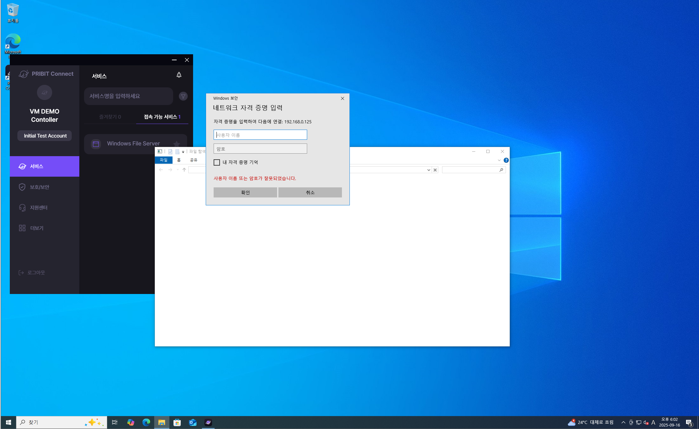

<br><br> 


# 보안 정책 

## 보안 정책 > 사용자 인증 정책  

## 보안 정책 > 단말 인증 정책 

## 보안 정책 > 단말 관리 정책 

# 로깅 


# Admin 보안 정책 (SYSTEM)
