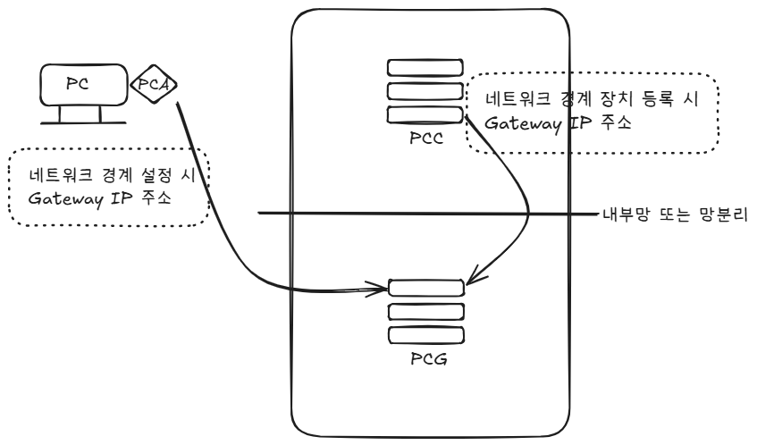

# System Architecture Guide

이 파일은 시스템 구성도에 대한 모든 내용을 안내합니다.

## 목차
1. 시스템 개요
2. 주요 구성 요소
3. 데이터 흐름
4. 네트워크 구조
5. 보안 및 접근 제어
6. 확장성 및 유지보수

---
각 항목에 대한 상세 내용을 추가해 주세요.

### 네트워크 경계 설정에서 게이트웨이 IP 주소 지정 

