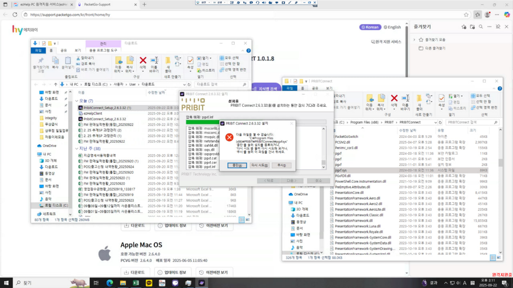
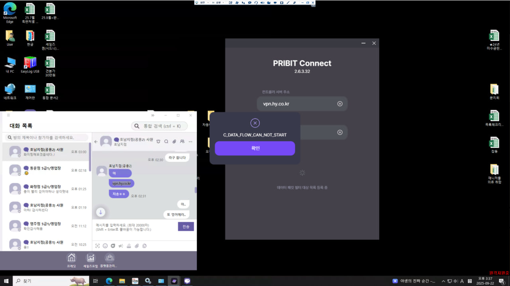
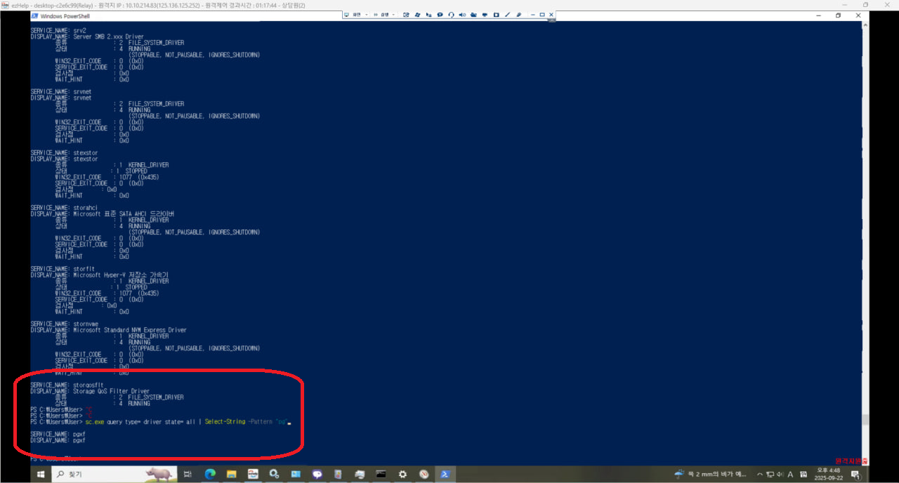
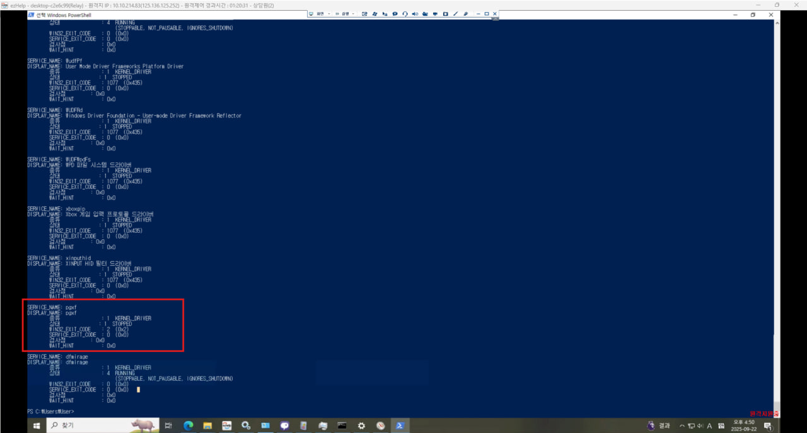

# "pgxf.sys" 파일을 열 수 없습니다.

발생 고객사: HY(한국야쿠르트) 

일시: 2025. 09. 24 

접수: 사내 전화로 문의 접수 

대응: 원격 지원으로 사용자 PC 확인 

프로그램 설치 시 아래 캡쳐 화면과 같이 에러 발생하여, 사용 불가 상태



pgxf.sys 파일을 강제로 삭제하려고 하면 삭제 불가

다음 파일을 열 수 없습니다.
"C:\Program Files(x86)\PRIBIT\PRIBITConnect\pgxf.sys" '중단'을 눌러 설치를 종료하거나, '다시 시도'를 눌러 다시 시도해 보거나, '무시'를 눌러 이 파일을 건너 뛰세요.

[Check Point by Step]

1. 에이전트 신규 설치인지 기존 설치되어 있는데 다시 설치인지 여부 확인
2. 기존 설치 후 다시 설치 시 에이전트 삭제 > 해당 PRIBIT 디렉토리 전체 삭제 후 다시 설치 시도 
    1. 기존 설치되어 있고, 에이전트 삭제 후 다시 시도 → 증상 동일 

[설치 시 '무시'를 눌러 진행 완료 후 접속 시 에러 발생 화면] 



서비스에 드라이버 관련 'pgxf' 내용이 있는지 확인

CMD 열어서

```jsx
C:\> sc query type= driver | findstr /i pgxf

C:\> sc.exe query type= driver state= all | Select-String -Pattern "pg"
```

→ 출력 없음 



SERVICE_NAME: pgxf

DISPLAY_NAME: pgxf



Service 를 삭제 진행

Windows PowerShell

```jsx
C:\> sc.exe stop pgxf
C:\> sc.exe delete pgxf
```

PC 재기동 후 다시 pgxf.sys 파일 삭제 시도 => 성공

이 후 설치 진행했을 때 정상 처리 됨